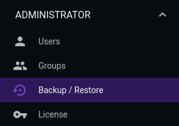
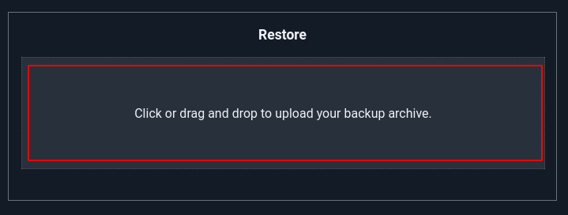
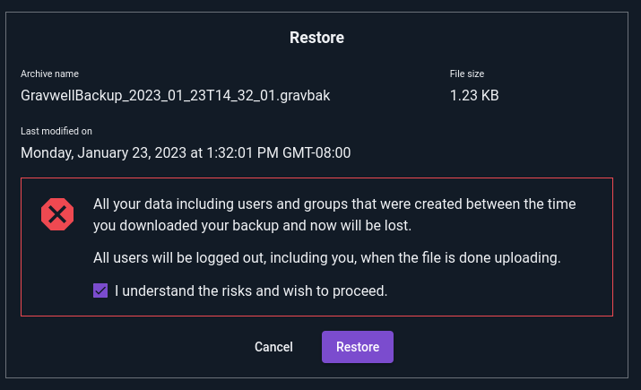

# Backup/Restore

The Gravwell UI provides a simple method for administrators to fully back-up the system and restore from previous backups. The backups include dashboards, saved searches, users, groups, essentially everything which can be created and accessed through the Gravwell UI.

```{note}
This functionality backs up everything *except* your actual data; because you may have many terabytes of data on the indexers, we provide separate tools to help protect the data. Refer to the [replication documentation](/configuration/replication) for more information.
```

## Backing Up

To create a backup, expand the "Administrator" section of the main menu and select "Backup/Restore"



Then, click the "Download Archive" button to immediately download a backup of all assets on the system.


Note the "Include persistent searches and saved results". If checked, the archive will include all saved searches owned by all users on the system, with results. Depending on the number of users and their use patterns, these search results could total up to multiple gigabytes! If you have a large Gravwell cluster with many active users, consider un-checking this option for efficiency.

## Restoring

```{attention}
Be aware that restoring from a backup will wipe *everything* which currently exists on the system (except for the data stored on indexers) and replace it with the contents of the backup.
```

To restore a previously-made backup, click in the Restore pane of the Backup/Restore page and select your backup file for upload. You can also drag and drop into the area.



You will be prompted for confirmation before the restoration process begins. Note that this will *completely* replace everything on your Gravwell system with the contents of the archive. Any users added since the backup will be deleted, etc.



Once you click the checkbox and select "Restore", your user and all other users on the system will be *logged out*. When you log in again, the system should now be in the same state as it was when the backup was made.
