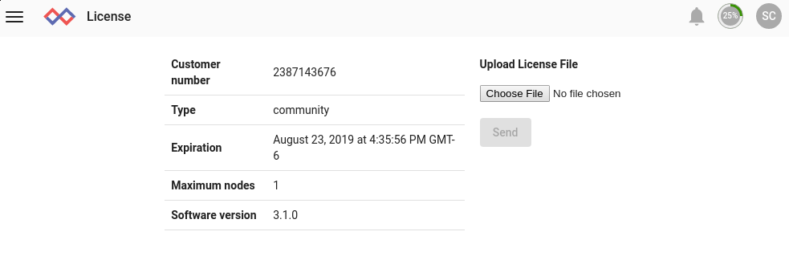

# ライセンスの更新
Gravwellライセンスは限られた有効期間です。ライセンスの有効期限が切れそうになると、Gravwell GUIで通知されます。 Community Editionユーザーは、[https://www.gravwell.io/download](https://www.gravwell.io/download)で情報を再入力するだけで、新しいライセンスをメールで受け取ることができます。 有料のお客様はGravwellサポート（support@gravwell.io）に連絡して契約を更新してください。

新しいライセンスファイルを取得したら、単にGravwellメニューの[管理者]セクションから[ライセンス]ページを選択し、新しいライセンスをアップロードします。

ファイルの名前をウェブサーバーノードの`/opt/gravwell/etc/license`に変更してGravwellプロセスを再起動することにより、新しいライセンスをデプロイすることもできます。 これにより、新しいライセンスがインデクサーにプッシュされます。
