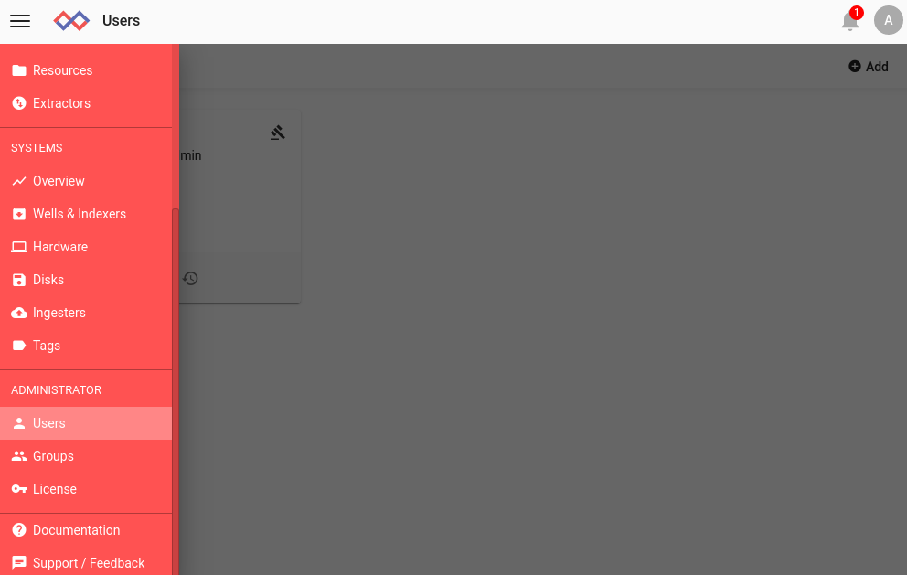
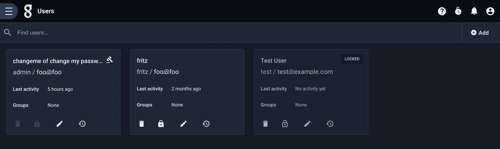
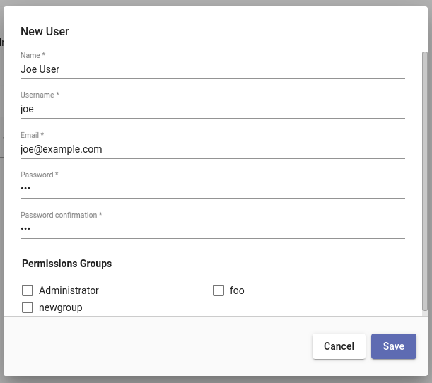
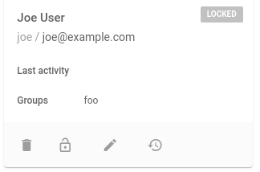
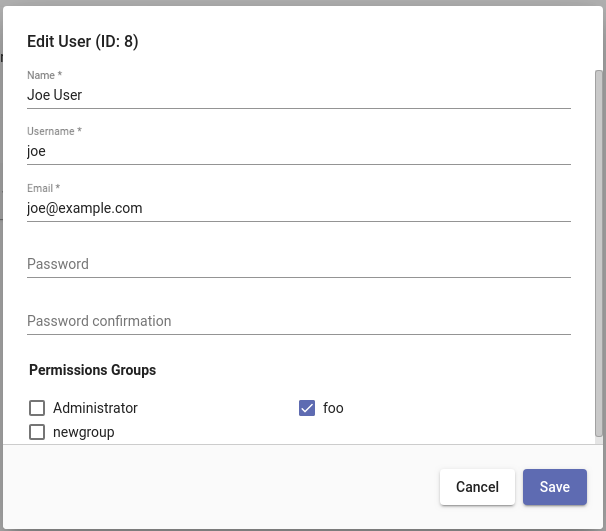
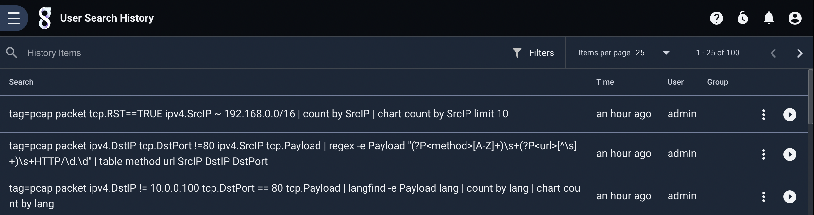
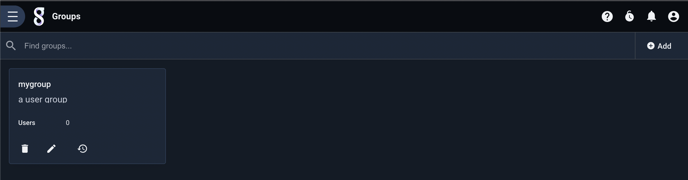
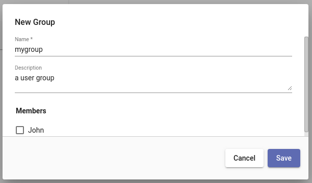
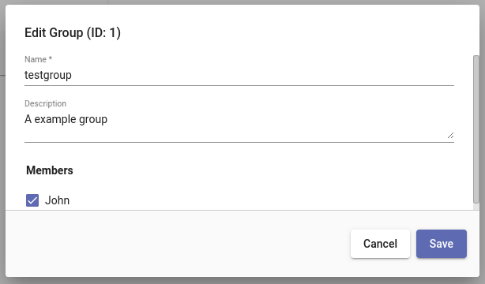

# ユーザーとグループの管理

Gravwellは、UNIXに非常によく似たユーザーとグループのシステムを実装しています。 各ユーザーには一意のユーザーID番号（UID）が割り当てられ、各グループには一意のグループID番号（GID）があります。 特定のユーザーは、0個以上のグループに属する場合があります。

Gravwell内のリソース、ダッシュボード、検索結果などは通常、ユーザーが所有し、オプションでグループのリストと共有されます。 たとえば、リソースはUID 3によって所有され、複数のグループと共有されます。グループのメンバーは、そのリソースを読み取りますが、変更はできません。 管理者ユーザーは、何でも読み取り、変更、または削除できます。

ユーザーおよびグループ管理ページは、メインメニューの下部近くにある管理セクションにあります。

## ユーザーの管理

新しくインストールしたシステムでは、[ユーザー]ページを選択すると、管理者という1人のユーザーのみが表示されます。

### ユーザーを追加する

[追加]ボタンをクリックすると、新しいユーザーを定義するフィールドを含むダイアログボックスが表示されます。

下部の「許可グループ」セクションに注意してください。 これにより、作成時にユーザーをグループに追加できます。 [管理者]ボックスをオンにすると、ユーザーに[管理者]ユーザーと同等の権限が付与されます。 ユーザーを管理者にする場合は細心の注意を払ってください！

### ユーザーアカウントのロック/ロック解除

管理者は、ユーザーのカードのロックアイコンを選択して、ユーザーのアカウントを一時的に無効にすることができます。

ユーザーは「ロック済み」とマークされ、ロックアイコンは上記のようにロック解除アイコンに変わります。

ユーザーアカウントがロックされると、ユーザーはすべてのセッションから直ちにログアウトされ、アカウントがロック解除されるまでログインできません。

### ユーザーアカウントの編集

ユーザーの鉛筆アイコンを選択すると、アカウント属性を変更できるダイアログが開きます。

### ユーザーの検索履歴を表示する

ユーザーの時計アイコン（ユーザーのタイルの右下隅）をクリックすると、そのユーザーの検索履歴が表示されます。

このページから、管理者は必要に応じて特定のクエリを再実行できます。 これは、ユーザーの問題をデバッグするときに役立ちます。

### ユーザーを削除する

ユーザーを削除するには、ユーザータイルのゴミ箱アイコンをクリックします。 システムは、削除する前に確認を求めます。 削除は永続的であるため、削除の代わりにユーザーアカウントのロックを検討する必要があることに注意してください。 アカウントをロックすると、そのアカウントに関連付けられている有用なデータが保持されます。

## グループを管理する

「グループ」ページを選択すると、既存のグループがリストされます。 デフォルトでは、Gravwellにはグループが含まれていません。 このスクリーンショットは、単一のグループを示しています。

### グループを追加する

[追加]ボタンをクリックし、フィールドに入力してグループを追加します。

作成時に既存のユーザーをこのグループに追加できることに注意してください。

### グループを編集する

グループの鉛筆アイコンをクリックすると、グループを編集するためのダイアログが開きます。 グループ名と説明はいつでも変更できることに注意してください。 グループはGIDによってのみ内部的に参照されます。

### グループを削除する

グループを削除するには、ごみ箱アイコンをクリックします。 システムは、削除する前に確認を求めます。 グループが削除された後、そのGIDは再利用されないことに注意してください。