# Alerts

Alerts are a Gravwell feature which allow the user to tie sources of intelligence (such as periodic [scheduled searches](/scripting/scheduledsearch)) to actions (such as a [flow](/flows/flows) that files a ticket). This can make it much simpler to take automatic action when something of interest occurs; rather than defining multiple flows which each run a query and send an email if there are results, you can define a single flow which sends an email, then trigger it with any one of many scheduled searches.

Some basic terminology:

* *Events* are the actual bits of actionable information, for instance "A user signed in from outside the US".
* *Dispatchers* generate events. A typical dispatcher would be a scheduled search that runs every hour looking for "bad" activity; every result returned by a scheduled search is considered an *event*.
* *Consumers* process and respond to events. A typical consumer would be a flow that sends an email to an administrator, or opens a ticket in the ticketing system. Each consumer runs once per *event*.
* *Alerts* tie dispatchers to consumers, ensuring that when a dispatcher generates an event, all associated consumers are executed to process it.

In brief, _dispatchers_ send _events_, which are then processed by _consumers_. Events are also ingested into Gravwell in a user-defined tag as a permanent record.

This page will show how to create and configure alerts, using as an example an alert which sends notifications whenever an admin-level account logs in, for instance when `root` logs in via ssh or `admin` logs in to Gravwell.

## Creating an Alert

Alerts are defined in the Alerts page, found under the Automation sub-menu. Clicking "Create an alert" on this page will open a wizard to define a new alert:

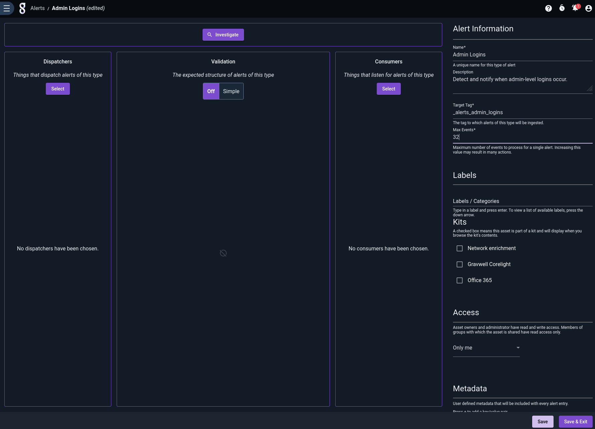

Note that we have populated the Name, Description, Target Tag, and Max Events fields, but nothing else yet -- we need to go define our dispatchers and consumers before we can add them to the alert.

Also notice that there are some optional toggles. The first one will allow us to enable the Alert once it is properly configured. The second one allows us to enable Search Retention. 


### Selecting a Tag

Every event generated by your dispatchers will be ingested into the Target Tag in JSON format. In general, we recommend the following:

* Pick a unique tag for each alert you define, and make sure your user has [permission to ingest to that tag](/cbac/cbac).
* Use a prefix, such as `_alerts_`, for all your target tags. This makes it easier to define a separate well to store alerts in, if desired.

In this example, we have chosen the tag `_alerts_admin_logins`.

```{note}
If the owner of the *alert* does not have permission to ingest (either via the `Webserver-Ingest-Groups` configuration in `gravwell.conf` or through [CBAC](/cbac/cbac), no events will be ingested.
```

### Max Events

The "Max Events" configuration option is an important safeguard against accidentally sending yourself thousands of emails. Basically, when a dispatcher fires, Gravwell will only process *up to* Max Events results from the search. Suppose you have a scheduled search dispatcher which normally generates one or two results, which are emailed out via a flow consumer. If a new data source is added and the scheduled search suddenly returns thousands of results each time, you could be getting thousands of emails -- unless you've been cautious and set Max Events to a low value!

Gravwell sets a very low default for Max Events, because it is extremely easy to misjudge your dispatchers and generate too many events! The option can go up to 8192, which should be more than enough; if you need more events per dispatcher trigger, alerts might not be the right solution for that particular use case.

```{note}
Setting Max Events to 0 is equivalent to setting it to 8192, the max value
```

### Search Retention

The search retention option will allow any search that dispatches the Alert to be saved as a Persistent Search for a specified period of time. The retention time is configurable with a default of 7 days. After that time, the Persistent Search will be automatically deleted.

## Adding Dispatchers

The next step is to define dispatchers. These are [scheduled searches](/scripting/scheduledsearch) whose results will be used as events to trigger the alert. For this example, we'll define one scheduled search to detect root SSH logins in the system auth logs:

```
tag=auth syslog Message Hostname Appname==sshd | regex -e Message "Accepted publickey for root from (?P<remotehost>\S+)"
| enrich service "sshd"
| table Hostname remotehost service
```

And another to detect when the admin user logs in to Gravwell:

```
tag=gravwell syslog Message=="User logged in" Hostname host as remotehost 
| enrich service "gravwell"
| table Hostname remotehost service
```

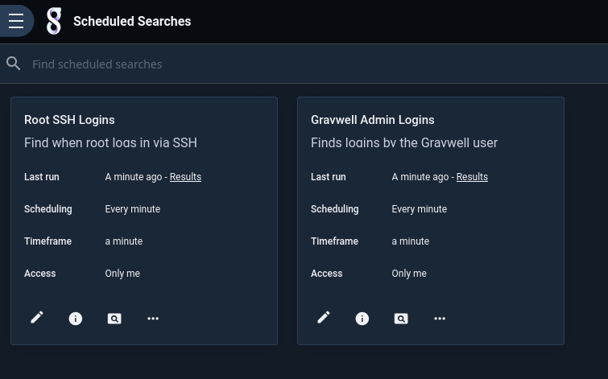

Having created the scheduled searches, we go back into the alert definition and add them as dispatchers by clicking "Select" in the Dispatchers column and picking the searches:

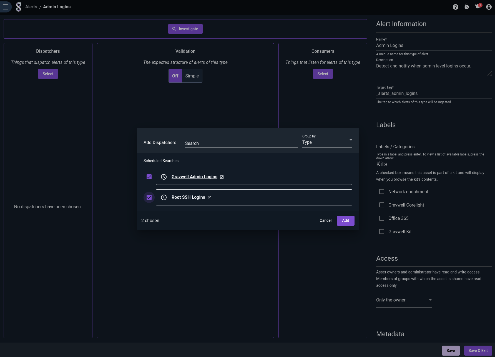

If we click "Save and Exit", then log in as root over SSH, the next run of the SSH scheduled search will detect the login and fire the event. We can check this by querying the `_alerts_admin_logins` tag:

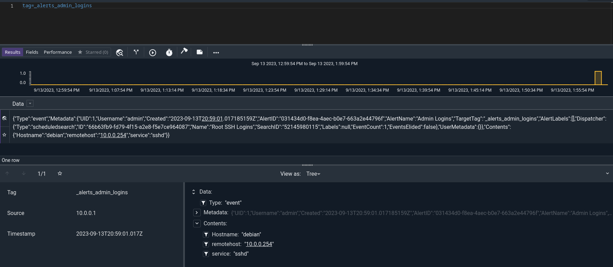

Having verified that events are being detected and logged, we can now move on to defining consumers to actually take action on these events -- but first, we'll take steps to make sure the events all have the right format.

```{note}
Dispatcher searches should use either `table`, `text`, or `raw` as their renderer. If table is used, the alert will use the columns of the table as the "fields" of each event. If text or raw are used, the alert will use the enumerated values attached to each entry as fields.
```

```{warning}
You can select scheduled searches belonging to other users as dispatchers, but be aware that if the owner of the search decides to change it, your alert may stop working!
```

## Setting a Validation Schema

If you refer back to the queries used in our dispatchers, you'll note that we were careful to emit the same three field names in both: Hostname, remotehost, and service.

Because events from *any* dispatcher will be consumed by *all* consumers, it's useful to make sure all dispatchers are outputting the expected set of fields. Validation schemas help with this. By defining a schema on an alert, you declare that all dispatchers *should* output those fields, and all consumers should reasonably *expect* to see those fields in the events.

Now's a good time to define such a schema, using the Validation column of the Alert editor. Note how we define three string fields whose names match the three fields output by our queries:

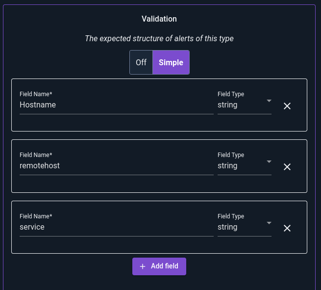

If we were to add another field, "foobar", which is *not* output by the dispatchers, we'll see warnings:

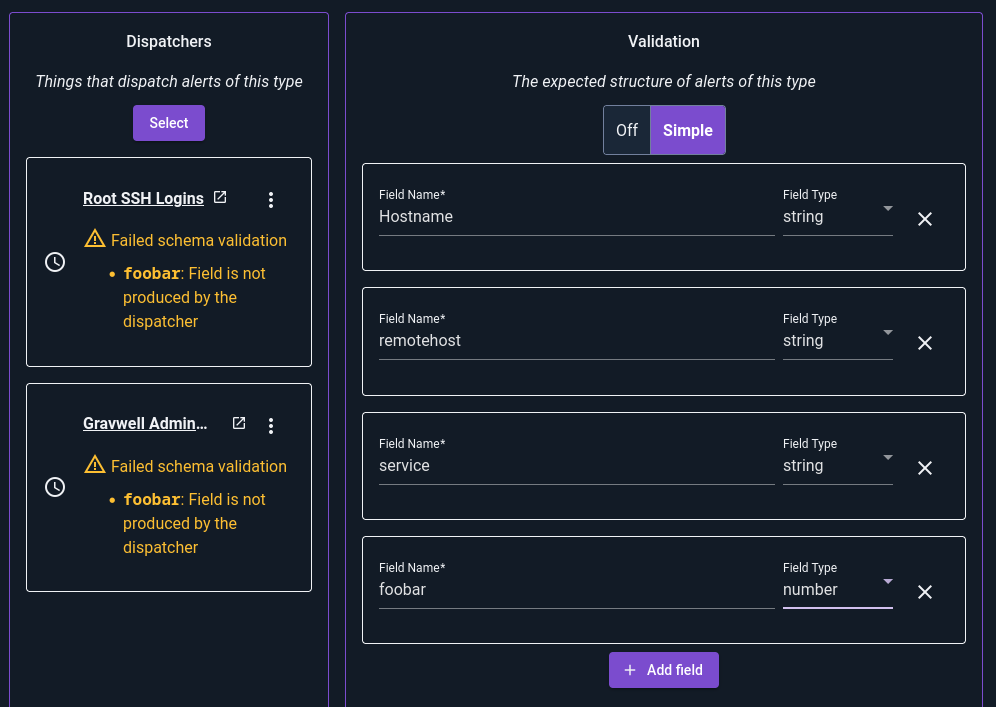

Schemas are entirely optional, but highly recommended. They make it easier to define dispatchers and to test/debug consumers.

## Defining a Consumer

Currently, [flows](/flows/flows) are the only type of consumer supported for alerts. When a flow executes as a consumer, the incoming payload contains an additional item named `event` which contains the event sent by the dispatcher. 

### Building a Consumer Flow

We can test our flow in development as though it were triggered by an alert by selecting the alert from the Alert Context dropdown:

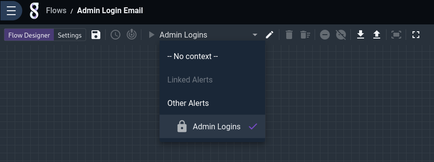

Note that when *testing* a flow, Gravwell uses random generated data, which will almost certainly look funny. We can edit the sample data by clicking the pencil to the right of the context dropdown and modifying the appropriate fields. In the image below, we have already set "Hostname" and "remotehost" to more sensible values, and are about to replace the auto-generated value of "service" with "sshd":

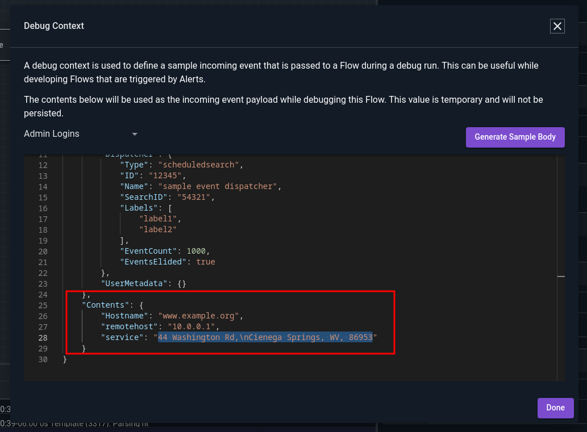

For our example, we'll use the Text Template node twice, to generate a subject line and a message body, then use the Email node to send the message. We can first check what fields are available in the event by viewing the "Incoming Payload":

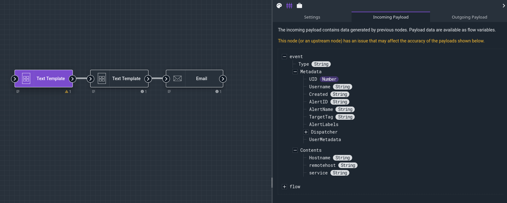

Based on that, we'll define one Text Template node to make a subject line:

```
{{.event.Contents.service}} admin login!
```

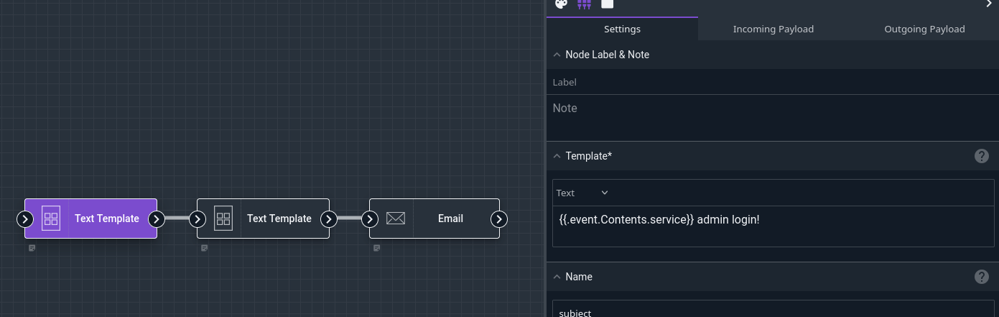

And one to make the body:

```
The {{.event.Contents.service}} service on host {{.event.Contents.Hostname}} received an admin-level login from {{.event.Contents.remotehost}}.
```

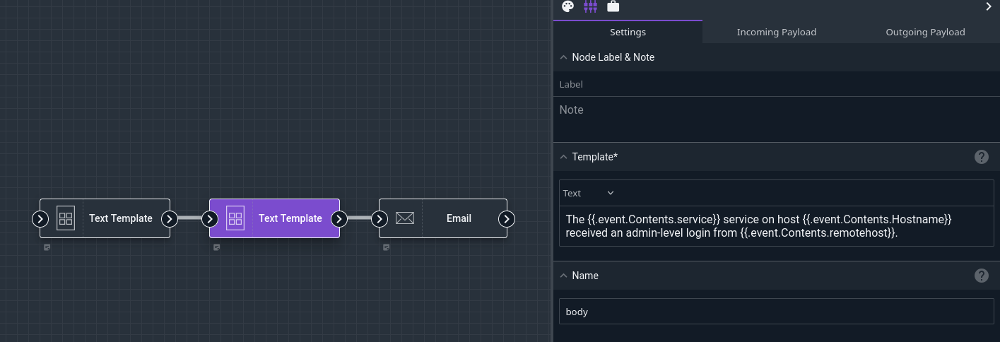

And finally we'll configure the Email node to send out a message using the generated subject and body:

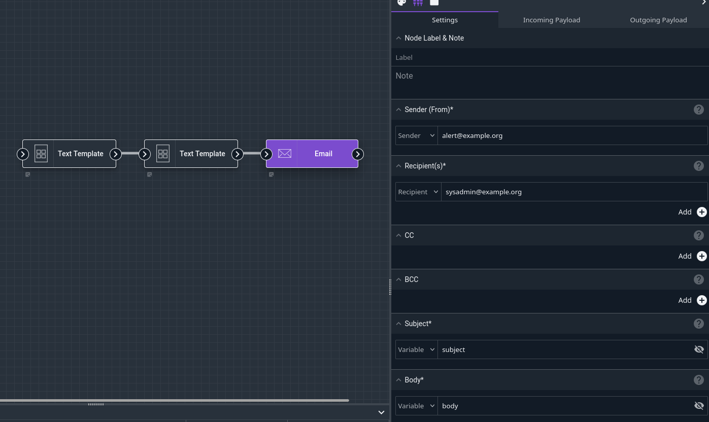

When we click the Debug button in the Flows editor, we should shortly receive an email containing our sample data:

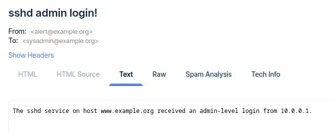

### Adding a Flow Consumer

Once the flow is defined, we can add it to our alert either through the Alert editor, or from the Settings tab of the Flow editor:

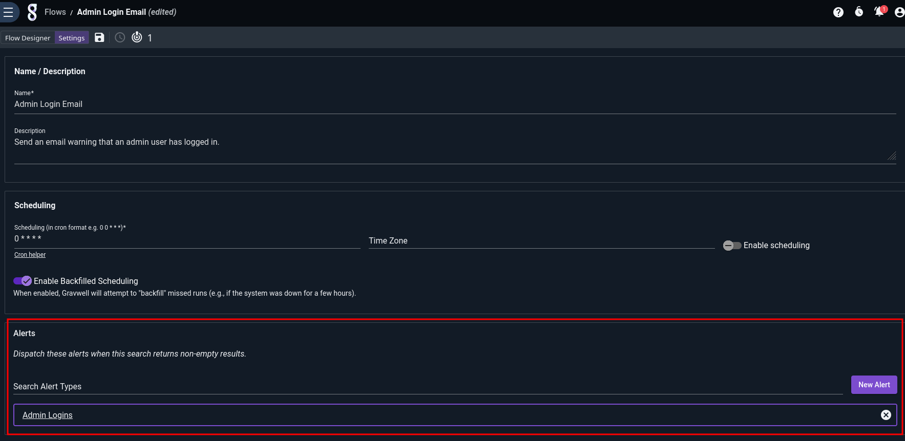

Having attached the flow to the alert, we should start getting real email notifications whenever root logs in via ssh or admin logs in to Gravwell:

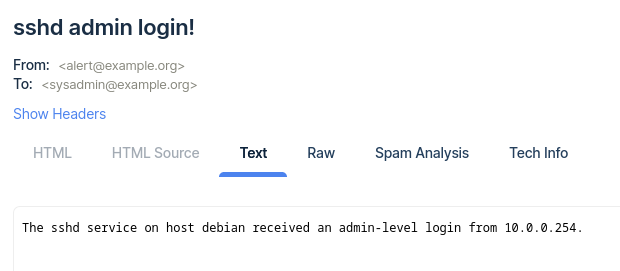

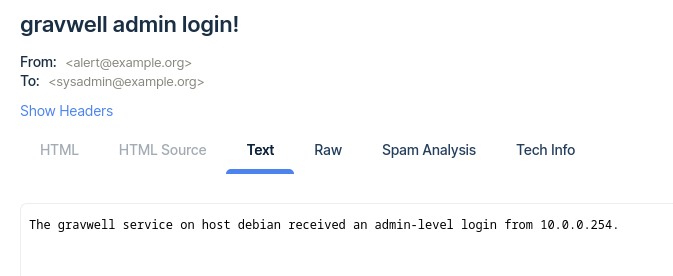


