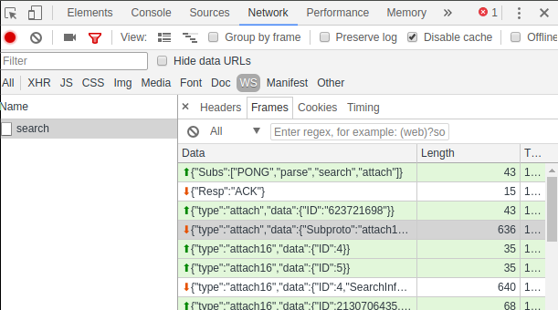

# The render module API

The render modules provide an API for retrieving information about a search, the actual entries of the search, and statistics about the search. API commands are sent as JSON over the websocket subprotocol established when the search is launched; see the [search API documentation](#!api/websocket-search.md) for information on subprotocols and launching searches.

Beyond the contents of these articles, the easiest way to see how the render module commands work is via a web browser's console (F12 in Chrome). Find the section which shows Websocket traffic and browse the messages sent/received:



Another way to observe websocket traffic is by running the [Gravwell CLI client](#!cli/cli.md) with the `-debug` flag. The flag takes a filename as an argument; JSON messages sent to and read from the websocket will be written to that file.

## Operation IDs universal to all render modules

All render modules will respond to the following requests:

| Request name | Hex value | Decimal value | Description |
|--------------|-----------|---------------|-------------|
| REQ_CLOSE				| 0x1			| 1			| Close the channel |
| REQ_ENTRY_COUNT		| 0x3			| 3			| Get the number of entries seen|
| REQ_SEARCH_DETAILS	| 0x4			| 4			| Get detailed info about the search |
| REQ_SEARCH_TAGS		| 0x5			| 5			| Get the tag map used in the search |
| REQ_GET_ENTRIES		| 0x10			| 16		| Request a block of search entries by index |
| REQ_STREAMING			| 0x11			| 17		| Request that search entries be sent as they come in |
| REQ_TS_RANGE			| 0x12			| 18		| Request a block of entries by time range |
| REQ_STATS_SIZE		| 0x7F000001	| 2130706433| Request the size of the statistics data |
| REQ_STATS_RANGE		| 0x7F000002	| 2130706434| Request the time range of available stats |
| REQ_STATS_GET			| 0x7F000003	| 2130706435| Request stats |
| REQ_STATS_GET_RANGE	| 0x7F000004	| 2130706436| Request stats from a particular time range |
| REQ_STATS_GET_SUMMARY	| 0x7F000005	| 2130706437| Request a summary of statistics |

Response values are the same as the request, with the addition of the special response code `RESP_ERROR` (0xFFFFFFFF)

| Response name | Hex value | Decimal value | Description |
|--------------|-----------|---------------|-------------|
| RESP_ERROR				| 0xFFFFFFFF	| 4294967295| (error) |
| RESP_CLOSE				| 0x1			| 1			| Socket will be closed |
| RESP_ENTRY_COUNT			| 0x3			| 3			| Returning # of entries |
| RESP_SEARCH_DETAILS		| 0x4			| 4			| Returning info about search |
| RESP_SEARCH_TAGS			| 0x5			| 5			| Returning tag map for search |
| RESP_GET_ENTRIES			| 0x10			| 16		| Returning search entries|
| RESP_STREAMING			| 0x11			| 17		| Search entries will be streamed|
| RESP_TS_RANGE				| 0x12			| 18		| Returning a block of entries for a time range |
| RESP_STATS_SIZE			| 0x7F000001	| 2130706433| Returning size of stats data |
| RESP_STATS_RANGE			| 0x7F000002	| 2130706434| Returning the time range for stats |
| RESP_STATS_GET			| 0x7F000003	| 2130706435| Returning stats |
| RESP_STATS_GET_RANGE		| 0x7F000004	| 2130706436| Returning stats for a time range |
| RESP_STATS_GET_SUMMARY	| 0x7F000005	| 2130706437| Returning stats summary |


API requests should be sent as JSON over the search subprotocol established during search creation.

## Response formats

Although all modules respond to the same commands, the format in which they return entries differs due to the differing nature of the data types involved. The [Renderer API Response Formats document](websocket-render-responses.md) describes the response formats used by each render module. Examples shown in the rest of this article show responses from the text and table renderers.

## Closing the channel (request 0x1)

To close the current connection to a search, send the following structure to the websocket:

```
{
        "ID": 1
}
```

The socket should respond:

```
{
        "ID": 1,
        "EntryCount": 0,
        "AdditionalEntries": false,
        "Finished": false,
        "Entries": []
}
```

## Get entry count (request 0x3)

The REQ_ENTRY_COUNT command requests the total number of entries that reached the render module:

```
{
        "ID": 3
}
```

In this example, the module responded that it had 41 entries:

```
{
        "ID": 3,
        "EntryCount": 41,
        "AdditionalEntries": false,
        "Finished": true
}
```

Attention: The number reported here is the **total number of entries the renderer has received**. When using other commands such as REQ_GET_ENTRIES, fewer entries may be returned; this is because some renderers (such as table and chart) are *condensing* renderers.

## Get search details (request 0x4)

The REQ_SEARCH_DETAILS command (0x4) requests information about the search itself:

```
{
        "ID": 4
}
```

The response contains stats information and information about the search itself:

```
{
	"ID": 4,
	"Stats": {
		"Size": 0,
		"Set": [
			{
				"TS": "2018-04-02T07:56:47.422345249-06:00",
				"Stats": []
			},
<some entries elided for brevity>
			{
				"TS": "2018-04-02T10:17:24.922345249-06:00",
				"Stats": [
					{
						"Name": "packet",
						"Args": "packet ipv4.SrcIP",
						"InputCount": 1619,
						"OutputCount": 1619,
						"InputBytes": 2034920,
						"OutputBytes": 2052729,
						"Duration": 54936015
					},
					{
						"Name": "count",
						"Args": "count by SrcIP",
						"InputCount": 1619,
						"OutputCount": 88,
						"InputBytes": 2052729,
						"OutputBytes": 28931,
						"Duration": 129787584
					}
				]
			},
<some entries elided for brevity>
			{
				"TS": "2018-04-02T12:47:24.922345249-06:00",
				"Stats": []
			},
			{
				"TS": "2018-04-02T12:52:06.172345249-06:00",
				"Stats": [
					{
						"Name": "packet",
						"Args": "packet ipv4.SrcIP",
						"InputCount": 1,
						"OutputCount": 1,
						"InputBytes": 99,
						"OutputBytes": 110,
						"Duration": 14480829
					},
					{
						"Name": "count",
						"Args": "count by SrcIP",
						"InputCount": 1,
						"OutputCount": 1,
						"InputBytes": 110,
						"OutputBytes": 110,
						"Duration": 52235061
					}
				]
			}
		],
		"RangeStart": "2018-04-02T07:56:47.422345249-06:00",
		"RangeEnd": "2018-04-02T12:56:47.422345249-06:00",
		"Current": "2018-04-02T07:56:47.422345249-06:00"
	},
	"SearchInfo": {
		"ID": "677124412",
		"UID": 1,
		"UserQuery": "tag=pcap packet ipv4.SrcIP | count by SrcIP | table SrcIP count",
		"EffectiveQuery": "tag=pcap packet ipv4.SrcIP | count by SrcIP | table SrcIP count",
		"StartRange": "2018-04-02T07:56:47.422345249-06:00",
		"EndRange": "2018-04-02T12:56:47.422345249-06:00",
		"Descending": true,
		"Started": "2018-04-02T12:56:47.430572676-06:00",
		"LastUpdate": "0001-01-01T00:00:00Z",
		"StoreSize": 75960,
		"IndexSize": 32,
		"ItemCount": 1575,
		"TimeZoomDisabled": false,
		"RenderDownloadFormats": [
			"json",
			"csv",
			"lookupdata"
		],
		"Duration": "0s"
	},
	"EntryCount": 1575,
	"AdditionalEntries": false,
	"Finished": true
}
```

## Getting the tag map (request 0x5)

To ask for the tag map, send request ID 0x5 down the standard websocket subprotocol:

```
{
        "ID": 0x5,
}
```

The response should look like this, showing a map of tag names to numeric tag indexes:

```
{
        "ID": 0x5,
        "Tags": {
                "default": 0,
				"tagmctaggy": 1,
				"apache": 2,
				"syslog: 3,
				"gravwell": 4
			},
}
```

## Fetching entries (request 0x10)

Request 0x10 (decimal 16) requests a block of entries from the renderer. Use the `First` and `Last` fields to specify which entries are desired. The renderer will report how many entries there are in response to a REQ_ENTRY_COUNT (0x3) request.

This command requests the first 1024 entries (`First` defaults to 0 if not specified):

```
{
	"ID": 16,
	"EntryRange": {
		"Last": 1024
	}
}
```

The server responds with an array of entries and additional information.

```
{
	"ID": 16,
	"EntryCount": 1575,
	"AdditionalEntries": false,
	"Finished": true,
	"Entries": {
		"Rows": [
			{
				"TS": "2018-04-02T10:30:29-06:00",
				"Row": [
					"10.144.162.236",
					"9410"
				]
			},
<67 similar entries elided>
			{
				"TS": "2018-04-02T10:28:51-06:00",
				"Row": [
					"192.168.1.1",
					"2"
				]
			}
		],
		"Columns": [
			"SrcIP",
			"count"
		]
	}
}
```

Note the `"AdditionalEntries": false` field; this means that there are no further entries to be read. If this field had come back set to true, more entries could be read by re-issuing the command with `First` set to 1024 and `Last` set to 2048, repeating until no more entries are available.

## Request streamed results (request 0x11)

By sending a request ID 0x11, a client can request that the renderer send entries as quickly as possible via the websocket. This is generally not recommended unless the entries will be immediately written to a disk or other simple operation; the render module can frequently output results faster than the client can process them. We recommend using the REQ_GET_ENTRIES command to fetch results block-by-block.

To request streaming:

```
{
	"ID": 17
}
```

The renderer will begin send large blocks of entries as quickly as it can:

```
{
	"ID": 17,
	"EntryCount": 1000,
	"AdditionalEntries": false,
	"Finished": false,
	"Entries": [
<1000 entries elided>
	]
}
<many other entry blocks elided>
{
	"ID": 17,
	"EntryCount": 861,
	"AdditionalEntries": false,
	"Finished": false,
	"Entries": [
<861 entries elided>
	]
}
{
	"ID": 17,
	"EntryCount": 0,
	"AdditionalEntries": false,
	"Finished": true,
	"Entries": []
}
```

In this case, the renderer sent many blocks of 1000 entries, then a block containing the 861 remaining blocks, and a final block containing 0 entries. This final block of 0 entries signals that no further entries will be sent.

Attention: Please use great care when enabling streaming results.

## Requesting entries from a particular time range (request 0x12)

Use request 0x12 (REQ_TS_RANGE) to fetch entries for a particular portion of the search range. Because there may also be a large number of entries, use the `First` and `Last` fields as with REQ_GET_ENTRIES to fetch a block at a time, in this case the first 100 entries:

```
{
	"ID":18,
	"EntryRange": {
		"First":0,
		"Last":100,
		"StartTS":"2018-04-02T16:19:51.579Z",
		"EndTS":"2018-04-02T16:42:28.649Z"
	}
}
```

The server responds with entries which fall within the requested time:

```
{
	"ID":18,
	"EntryCount":1575,
	"AdditionalEntries":false,
	"Finished":true,
	"Entries": {
		"Rows": [
			{
				"TS":"2018-04-02T10:30:29-06:00",
				"Row":["10.194.162.236","9410"]
			},
			{
				"TS":"2018-04-02T10:30:36-06:00",
				"Row":["192.168.1.101","8212"]
			},
<entries elided>
			{
				"TS":"2018-04-02T10:28:51-06:00",
				"Row":["192.168.1.1","2"]
			}
		],
		"Columns":["SrcIP","count"]
	}
}
```

In this case, there were fewer than 100 entries. If there were more, the `AdditionalEntries` field would have been set to `true`; more entries could be fetched by sending another request with the same timestamps but changing the `First` field to 100 and the `Last` field to 200 to fetch the next block of 100 entries.

## Get current stats entry count (request 0x7F000001)

As a search runs, statistics entries are generated. The number of entries can be retrieved using the 0x7F000001 (REQ_STATS_SIZE) request:

```
{
        "ID": 2130706433,
}
```

The server will respond with the number of stats entries:

```
{
        "ID": 2130706433,
        "Stats": {
			"Size": 466
		}
}
```

## Get current time range covered by stats (request 0x7F000002)

This command returns the time range for which search stats are available. Send the command:

```
{
        "ID": 2130706434,
}
```

The server responds:

```
{
        "ID": 2130706434,
        "Stats": {
                "RangeStart": "2016-09-02T08:59:37.943271552-06:00",
                "RangeEnd": "2016-09-02T08:59:37.943271552-06:00",
                "Size": 2
        },
        "EntryCount": 510000
}
```

The Size parameter handed back tells us the maximum granularity available.  In this example the issued search only covered 2 seconds, so the client can ask for a maximum granularity of 2 (or one stat entry for each second worth of data).  The webserver has a maximum count of 65k stat entries held, unless the search is issued with "full resolution stats" which allows for unlimited granularity (as permitted by memory and storage)

## Asking for stats sets (request 0x7F000003)

Stat sets are requested by providing how many "chunks" you want.  For example, there may be 65k stats sets if a search was run over a months worth of data, but for display you may want those stats in increments of 10, 100, or 1000 to show different granularities.

To get different granularities, you send a SetCount in your StatsRequest.  In this example we ask for a set of size 1 (summarize all modules):

```
{
        "ID": 2130706435,
        "Stats": {
                "SetCount": 1
        }
}
```

The response contains only a single Stats entry:

```
{
        "ID": 2130706435,
        "Stats": {
                "RangeStart": "0001-01-01T00:00:00Z",
                "RangeEnd": "0001-01-01T00:00:00Z",
                "Set": [
                        {
                                "Stats": [
                                        {
                                                "Name": "grep",
                                                "Args": "grep HEE",
                                                "InputCount": 510000,
                                                "OutputCount": 510000,
                                                "InputBytes": 52363340,
                                                "OutputBytes": 52363340,
                                                "Duration": 0
                                        },
                                        {
                                                "Name": "sort",
                                                "Args": "sort by time",
                                                "InputCount": 510000,
                                                "OutputCount": 500000,
                                                "InputBytes": 52363340,
                                                "OutputBytes": 51344450,
                                                "Duration": 0
                                        }
                                ],
                                "TS": "2016-09-02T08:59:37.943271552-06:00"
                        }
                ],
                "Size": 2
        },
        "EntryCount": 510000
}
```

## Asking for stats sets over a specific time range (request 0x7F000006)

In this example we ask for a set of size 1 (summarize all modules) between 2016-09-09T06:02:14Z and 2016-09-09T06:02:16Z.  It is important to note that the SetCount number is used to generate a "ChunkSize" that is uniform across the requested range.  For example if your search has data from 2016-01-09T06:02:16Z to 2016-12-09T06:02:16Z (11ish months) but you gave a range of 1901-01-01T06:02:16Z to 2016-01-01T06:02:16Z and a SetSize of 100, you will only get one stats size, because the "ChunkSize" for that range and size is much larger than the span of time you actually have data for.

```
{
        "ID": 2130706436,
        "Stats": {
                "SetCount": 1,
				"SetStart": "2016-09-09T06:02:14Z",
				"SetEnd": "2016-09-09T06:02:16Z",
        }
}
```

Response:

```
{
        "ID": 2130706436,
        "Stats": {
                "RangeStart": "0001-01-01T00:00:00Z",
                "RangeEnd": "0001-01-01T00:00:00Z",
                "Set": [
                        {
                                "Stats": [
                                        {
                                                "Name": "grep",
                                                "Args": "grep HEE",
                                                "InputCount": 510000,
                                                "OutputCount": 510000,
                                                "InputBytes": 52363340,
                                                "OutputBytes": 52363340,
                                                "Duration": 0
                                        },
                                        {
                                                "Name": "sort",
                                                "Args": "sort by time",
                                                "InputCount": 510000,
                                                "OutputCount": 500000,
                                                "InputBytes": 52363340,
                                                "OutputBytes": 51344450,
                                                "Duration": 0
                                        }
                                ],
                                "TS": "2016-09-09T06:02:14.943271552-06:00"
                        }
                ],
                "Size": 100
        },
        "EntryCount": 500000
}
```

## Asking for stats set summary (request 0x7F000005)

Requesting a stats set summary is equivalent to requesting a stats set of size 1:

```
{
	"ID":2130706437
}
```

Response:

```
{
    "AdditionalEntries": false,
    "EntryCount": 1575,
    "Finished": true,
    "ID": 2130706437,
    "Stats": {
        "Set": [
            {
                "Stats": [
                    {
                        "Args": "packet ipv4.SrcIP",
                        "Duration": 61425123,
                        "InputBytes": 27364970,
                        "InputCount": 24886,
                        "Name": "packet",
                        "OutputBytes": 27636389,
                        "OutputCount": 24861
                    },
                    {
                        "Args": "count by SrcIP",
                        "Duration": 215555286,
                        "InputBytes": 27636389,
                        "InputCount": 24861,
                        "Name": "count",
                        "OutputBytes": 541861,
                        "OutputCount": 1575
                    }
                ],
                "TS": "2018-04-02T09:06:41.441-06:00"
            }
        ],
        "Size": 0
    }
}
```
