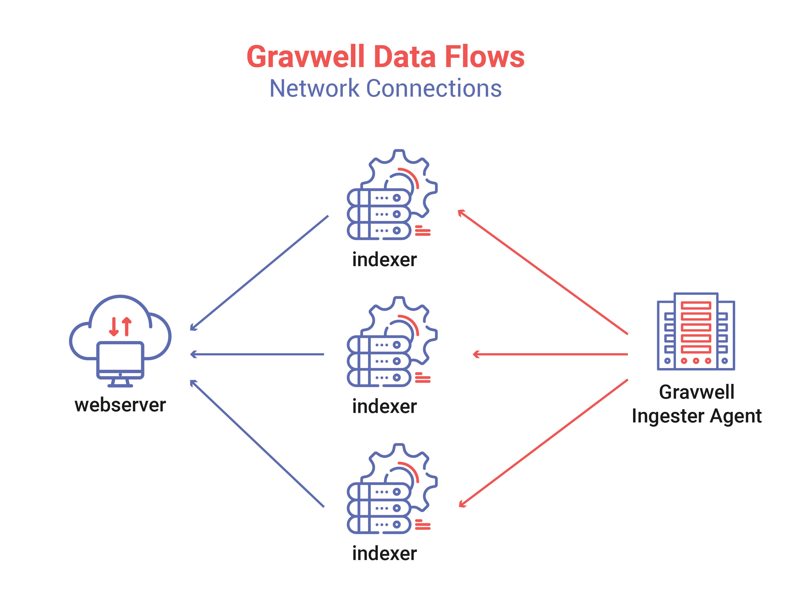
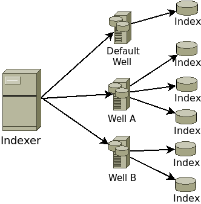
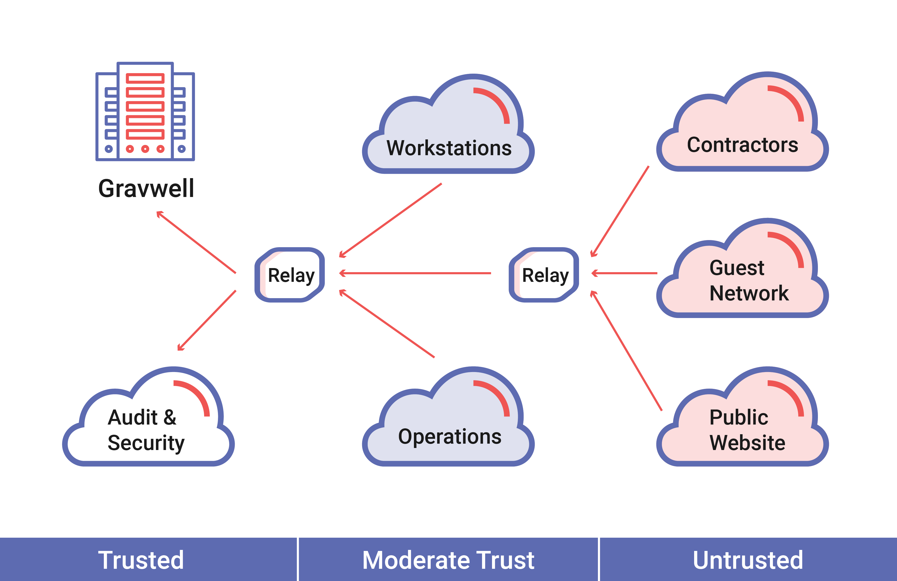

# Gravwell System Architecture

The Gravwell system architecture section is designed to provide information about how Gravwell is is deployed and operated from an architecture perspective.  Anyone wishing to run a simple single node instance of Gravwell with all ingesters pointed directly at the single indexer can safely ignore this section.  The system architecture section is for system administrators, DevOps engineers, and cloud architects that need to understand more about the underlying topology and architecture of Gravwell in order to deploy larger more complicated instances.

## Cluster Topology

Gravwell is a highly concurrent distributed storage and search system designed to move fast and reduce the cognitive overhead required to effectively extract information from data streams.  Effectively storing, searching, and managing volumes of data that may approach hundreds of terabytes per day requires multiple machines utilizing a large array of storage devices.  It simply isn’t possible to stand up one machine with one disk and deal with enterprise throughput requirements.

Gravwell’s base architecture is designed around indexers, ingesters, and webservers.  None of the relationships are one to one and every component (sans the webserver) is designed to load balance, be fault tolerant, and maximize usage of the available hardware. For illustrative purposes, the assumption is that this is a very simple organization monitoring data from a single point; perhaps, a small ISP with Bro running on their edge router that is capturing flows and sending them to Gravwell.

The base installation shown above uses a single ingester that is distributing entries across three indexers.  The ingester in question (lets say FileFollower) is watching various data sources on the machine, deriving timestamps, and sending them to the Gravwell cluster.  The ingester will load balance across the three indexers and will reconnect if any of the indexer disappears.  For example, if one indexer went down (due to hardware failure, or system upgrade) the other two would pick up the slack temporarily and the ingester would reconnect to the failed indexer when it came back online.  The ingester is a consumption queue, meaning that if one ingester is faster it can naturally consume more, where a slower or overloaded indexer will naturally consume less.

Ingesters come in all shapes and sizes, and the ingest API is open source.  Gravwell has open sourced several of the base ingesters, and as the community grows, more and more ingesters are popping up to get data from a very wide variety of sources; and because Gravwell supports binary ingest and processing, there is no limit to what you can ingest.  As long as your data can be encapsulated into an atomic item and a timestamp associated with it, Gravwell will consume and search it.

A very flexible ingest framework allows for extremely complex and secure topologies.  Customers often wish to segment their data analysis platform from the rest of the infrastructure.  The segmentation means that allowing all the workstations in a network to directly talk to the indexers is not desired.   Here, Gravwell supports arbitrarily deep ingester federation, meaning that if you have multiple tiers of network classification you can dual home Gravwell ingesters to safely relay data from public networks to a private analysis network.  As an example, the assumption is that a modest Gravwell topology is gathering data from a more complex enterprise.  This enterprise has public facing webservers, private file servers, domain controllers, firewalls, workstations, and private switching gear; and the network engineers and I.T. security folks are responsible for it all.

Being a well thought out and secure enterprise the engineers and I.T. people have segmented resources and isolated areas of the business.  Public facing webservers are on different network segments than the Windows workstations.  Switching gear has private management LANs and each segment has a stateful firewall ensuring no one slips through.  This topology will not allow all data sources to directly talk to the Gravwell cluster.  Instead, we deploy ingester relays that can be dual-homed and heavily fortified to relay from untrusted networks such as the public webserver to more trusted networks like the Gravwell analytics cluster.  The Windows domain machines are all pushing their logs into the domain controller, and the domain controller is pushing everything into Gravwell.  Switches are pushing port activity logs and sflow records, firewalls are pushing alerts, and the fileserver is pushing file access logs.

This slightly more complicated setup shows how an enterprise can push logs of all shapes and sizes into Gravwell and achieve much greater visibility into the total enterprise.  Pulling wildly disparate log sources will allow staff to access and search large amounts of data from a single place, reducing the time required to diagnose and fix problems.  IT operations can debug webserver problems by correlating sflow logs from the core switch to firewall logs and webserver access records to identify why a user can’t get to a page.  Security operations groups can track thumbdrives moving between domain boxes, or correlate port activity with logins to identify employees attaching unauthorized equipment.  Gravwell will monitor and correlate any and all types of data sources, we even have a video ingester which can feed raw video into indexers, have you ever wanted to use facial recognition to correlate badge reader swipes with the number of faces at a door?  Gravwell can do that.

## Indexer Storage Topology

Gravwell embraces the theme of concurrency throughout the entire stack, including storage.  An indexer is not a single storage system with a single storage array, it is storage orchestrator.  A single indexer can contain up to 65 thousand wells, each of which can contain many storage arrays.  Wells do not have to be uniform, Gravwell architects can estimate throughput requirements for various data sources and allocate storage resources accordingly.  Each storage array operates concurrently, feeding the search pipeline and consuming from ingesters asynchronously.  The asynchronous and distributed nature of storage means that throughput can be ramped up by striping wells across multiple storage arrays.  As an example, if a Gravwell instance is feeding from syslog, sflow, and raw PCAP ingesters a system designer might allocate three wells.  The default well might be capturing syslog and some basic windows logging could point to a single large spinning disk array where throughput is not critical and data is kept long term.  The sflow well may have slightly higher throughput requirements but lower retention requirements; so we point it at a single moderately sized SSD.  The well dedicated to PCAP however must be extremely fast and spinning disks or a single SSD just won’t do.  The very high throughput ingest and search requirements might drive use to take advantage of multiple storage arrays.

The storage array concurrency and configurability of Gravwell allows for exceptionally high throughput.  A high end NVME drive can sustain upwards of 2GB/s read rates and striping across a few of these with a single well means that Gravwell can store and read at many gigabytes per second.  High end storage might just shift the bottleneck from storage speed to memory bandwidth.  Some of the test instances on semi-modern hardware with quad-channel memory and two NVME based SSD storage arrays have seen search speeds in excess of 3GB/s per node.  A moderately sized cluster with AMD Epic or Intel E5 v4 CPUs could easily see 10GB/s per node with well crafted queries.

## Ingester Topology

The Gravwell ingest API is designed to be fast and simple.  The API and many of Gravwell’s ingesters are open sourced to encourage users to go after and ingest data that was previously unavailable in other tools.  The Gravwell team comes from a mix of backgrounds, ranging from academic research, private security consulting, and high security research and development.  That broad diversity has shaped the vision on ingest and applicability of Gravwell and the team has strived to make it easy for small instances to be deployed quickly while still making it possible for use in extremely large multilevel security installations.

The core ingest mechanic requires only three data items: a byte array, timestamp, and a tag (which is provided by the API).  Simple installations might have a few ingesters talking directly to indexers where more complicated ingesters might have multiple levels of federation as data is shuffled up from untrusted enclaves to high security enclaves.  Visibility is key to security, analytics, and hunt operations.  Segregating data or forcing multiple installations where operators must manually correlate data is not acceptable.  Gravwell achieves federation via ingest relay ingesters, which speak the ingest API on both sides and allow dual homed machines to aggregate and relay data.

