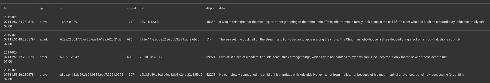
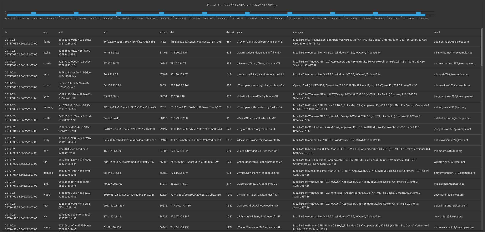
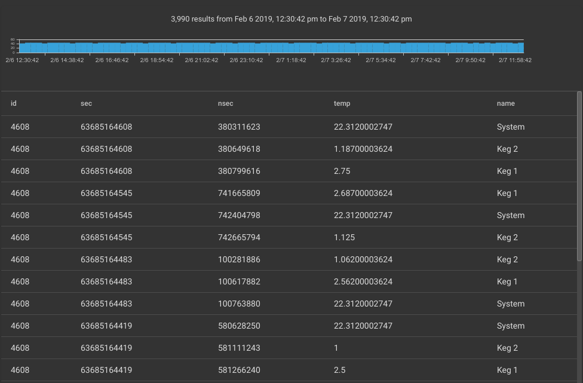
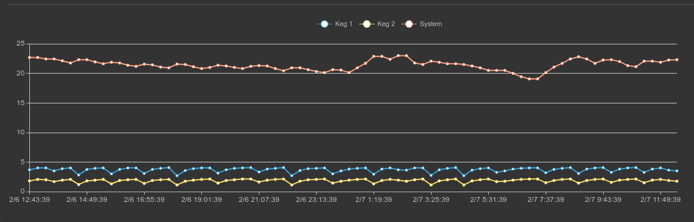
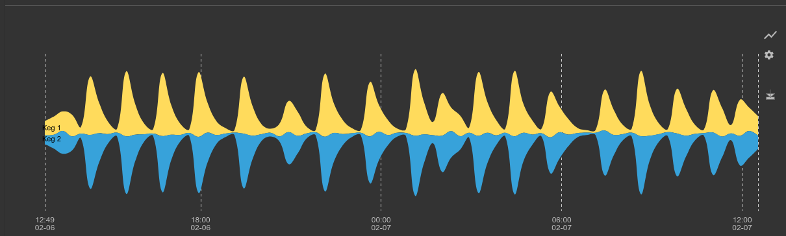

# Gravwell Auto-Extractors

Gravwell enables per-tag extraction definitions that can ease the complexity of interacting with unstructured data and data formats that are not self-describing.  Unstructured data often requires complicated regular expressions to extract desired data fields, which can be time consuming to produce and prone to errors.

Auto-extractors are simply definitions that can be applied to tags and describe how to correctly extract fields from the data in a given tag. The "ax" module then automatically invokes the appropriate functionality of other modules.  The auto-extractor system supports the following extraction methods:

* [CSV](../search/csv/csv.md)
* [Fields](../search/fields/fields.md)
* [Regex](../search/regex/regex.md)
* [Slice](../search/slice/slice.md)

Auto-extractor definitions are used by the [AX](../search/ax/ax.md) module which transparently references the correct extraction based on tags.

## Auto-Extractor Configuration

Auto-extractors are defined by creating ax files and installing them in the "extractions" directory of each Gravwell node. The filenames used do not matter; any file placed in the extractions directory with an extension of "ax" will be parsed as an auto-extractor file. By default the extractions directory is `/opt/gravwell/extractions` but it can be configured by setting/modifying the "Autoextract-Definition-Path" configuration variable in your `gravwell.conf` file.  Gravwell services must be restarted after changes to any auto-extractor "ax" files.

Auto-extractor files follow the [TOML V4](https://github.com/toml-lang/toml) format which allows comments using the "#" character.  Each "ax" file can contain multiple auto-extraction definitions and there can be multiple files in the extractions directory.

Note: Only a single extraction can be defined per tag

Note: Auto-extractors always operate on the full underlying data of an entry.  They cannot be used to perform extractions on Enumerated Values (the "-e" argument is disallowed)

Note: The auto-extractor file extension is "ax", only files that have the ".ax" suffix will be read as auto-extractor definitions.

Each extractor contains a header and the following parameters:

* tag - The tag associated with the extraction
* name - A human-friendly name for the extraction
* desc - A human-friendly string that describes the extraction
* module - The processing module used for extraction (regex, slice, csv, fields, etc.)
* args - Module-specific arguments used to change the behavior of the extracton module
* params - The extraction definition

Here is a sample auto-extraction file designed to pull some basic data from an Apache 2.0 access log using the regex module:

```
#Simple extraction to pull ip, method, url, proto, and status from apache access logs
[[extraction]]
	tag="apache"
	name="apacheaccess"
	desc="Apache 2.0 access log extraction to pull requester items"
	module="regex"
	args="" #empty values can be completely ommited, the regex processor does not support args
	params='^(?P<ip>\d+\.\d+\.\d+\.\d+)[^\"]+\"(?P<method>\S+)\s(?P<url>\S+)\s(?P<proto>\S+)\"\s(?P<status>\d+)'
```

There are a few important notes about how the extraction parameters are defined.

1. Each extraction parameter's value must be defined as a string and double or single quoted.
2. Double quoted strings are subject to string escape rules (pay attention when using regex).
  a.  "\b" would be the backspace command (character 0x08) not the literal "\b".
3. Single quoted strings are raw and not subjected to string escape rules.
  a. '\b' is literally the backslash character followed by the 'b' character, not a backspace.

The ability to ignore string escape rules is especially handy for the "regex" processor as it makes heavy use of backslash.

Multiple extractions can be specified in a single file by simply establishing a new "[[extraction]]" header and a new specification.  Here is an example with two extractions in a single file:

```
#Simple extraction to pull ip, method, url, proto, and status from apache access logs
[[extraction]]
	tag="apache"
	name="apacheaccess"
	desc="Apache 2.0 access log extraction to pull requester items"
	module="regex"
	args="" #empty values can be completely ommited, the regex processor does not support args
	params='^(?P<ip>\d+\.\d+\.\d+\.\d+)[^\"]+\"(?P<method>\S+)\s(?P<url>\S+)\s(?P<proto>\S+)\"\s(?P<status>\d+)'

#Extraction to apply names to CSV data
[[extraction]]
	tag="locs"
	name="locationrecords"
	desc="AX extraction for CSV location data"
	module="csv"
	params="date, name, country, city, hash, a comma ,\"field with comma,\""
```

The second extraction for the "locs" tag demonstrates the ommission of non-essential parameters (here we don't specify args) and using backslashes to allow double quotes in strings.  Extractions only have 3 essential parameters:

* module
* params
* tag

## Filtering

The AX module supports integrated filtering at time of *search*.  Filtering cannot, however, be applied to any auto-extracton *definition*.

#### Filtering Operators

| Operator | Name | Description |
|----------|------|-------------|
| == | Equal | Field must be equal
| != | Not equal | Field must not be equal
| ~  | Subset | Field contains the value
| !~ | Not Subset | Field does NOT contain the value

#### Filtering Examples

```
ax foo=="bar" baz~"stuff"
ax foo != bar baz !~ "stuff and things"
```

## Processor Examples

We will demonstrate a few auto-extraction definitions and compare and contrast queries which accomplish the same task with and without auto-extractors.  We will also show how to use filters within AX.

### CSV

CSV or "Comma Separated Values" can be a relatively efficient text transport and storage system.  However, CSV data is not self-describing, meaning that if all we have is a bunch fo CSV data it can be difficult to tell what columns actually are.  Auto-extractors can be used to predefine column names and make it dramatically easier to work with CSV data.

Here is an example data entry that is encoded using CSV:

```
2019-02-07T10:52:49.741926-07:00,fuschia,275,68d04d32-6ea1-453f-886b-fe87d3d0e0fe,174.74.125.81,58579,191.17.155.8,1406,"It is no doubt an optimistic enterprise. But it is good for awhile to be free from the carping note that must needs be audible when we discuss our present imperfections, to release ourselves from practical difficulties and the tangle of ways and means. It is good to stop by the track for a space, put aside the knapsack, wipe the brows, and talk a little of the upper slopes of the mountain we think we are climbing, would but the trees let us see it Benjamin", "TL",Bury,396632323a643862633a653733343a643166383a643762333a373032353a653839633a62333361
```

There is a lot of data in there with no indication of which fields are what.  To make matters worse, CSV data can contain commas and surrounding spaces which makes identifying columns with the naked eye very difficult.  Auto-extractors allow us to identify column names and types *once*, then transparently leverage them using the "ax" module.

If we were to manually extract and name each element, our query would be the following:

```
tag=csvdata csv [0] as ts [1] as name [2] as id [3] as guid [4] as src [5] as srcport [6] as dst [7] as dstport [8] as data [9] as country [10] as city [11] as hash | table
```

With the following auto-extractor configuration declaration:

```
[[extraction]]
	name="testcsv"
	desc="CSV auto-extraction for the super ugly CSV data"
	module="csv"
	tag="csvdata"
	params="ts, name, id, guid, src, srcport, dst, dstport, data, country, city, hash"
```

That same query becomes:

```
tag=csvdata ax | table
```

Note: The CSV auto-extraction processor does not support any arguments

Note: The position of the names in the `params` variable indicates the field name. Treat it as a CSV header

### Fields

The fields module is an extremely flexible processing module that allows us to define arbitrary delimiters and field rules in order to extract data.  Many popular security applications like Bro/Zeek default to TSV (tab seperated values) for data export.  Other custom applications may use weird separators like "|" or a series of bytes like "//".  With the fields extractor you can handle it all, and when combined with auto-extractors users don't have to worry about the details of the data format.

Unlike other auto-extractor processors, the fields module has a variety of configuration arguments.  The list of arguments is fully documented in the [fields module documentation](/#!search/fields/fields.md).  Only the "-e" flag is unsupported.

Let's start with some tab delimited data:

```
2019-02-07T11:27:14.308769-07:00	green	21.41.53.11	1212	57.27.200.146	40348	Have I come to Utopia to hear this sort of thing?
```

Using the fields module to extract each data item our query would be:

```
tag=tabfields fields -d "\t" [0] as ts [1] as app [2] as src [3] as srcport [4] as dst [5] as dstport [6] as data | table
```

An auto-extraction configuration to accomplish the same thing is:

```
[[extraction]]
	tag="tagfields"
	name="tabfields"
	desc="Tab delimited fields"
	module="fields"
	args='-d "\t"'
	params="ts, app, src, srcport, dst, dstport, data"
```

Using the ax module and the configuration above, the query becomes:

```
tag=tagfields ax | table
```

Lets look at some data with a slightly stranger delimiter "|":

```
2019-02-07T11:57:24.230578-07:00|brave|164.5.0.239|1212|179.15.183.3|40348|"In C the OR operator is ||."
```

Note that the last field contains the delimiter. The system that generated this data knew that it needed to include the delimiter in a data item, so it encapsulated that data item in double quotes.  The fields module knows how to deal with quoted data; specifying the "-q" flag will make the module respect quoted fields.  The quotes are kept on the extracted data unless the "-clean" flag is also specified.

Using the fields module our query would be:

```
tag=barfields fields -d "|" -q -clean [0] as ts [1] as app [2] as src [3] as srcport [4] as dst [5] as dstport [6] as data 
```

But with an appropriate auto-extraction configuration (shown below) the query can still be the extremely simple `tag=barfields ax | table`:

```
[[extraction]]
	tag="barfields"
	name="barfields"
	desc="bar | delimited fields with quotes and cleaning"
	module="fields"
	args='-d "|" -q -clean'
	params="ts, app, src, srcport, dst, dstport, data"
```

The results are properly cleaned with quotes removed:



### Regex

Regex may be the most common use for auto-extractors.  Regular expressions are hard to get right, easy to mistype, and difficult to optimize.  If you have a regular expression guru available, they can help you build a blazing fast regular expression that does all manner of efficient and flexible extractions, then you can simply deploy it in an auto-extraction and forget all about it.

Here is an example entry set that is frankly a mess (which is not uncommon in custom application logs):

```
2019-02-06T16:57:52.826388-07:00 [fir] <6f21dc22-9fd6-41ee-ae72-a4a6ea8df767> 783b:926c:f019:5de1:b4e0:9b1a:c777:7bea 4462 c34c:2e88:e508:55bf:553b:daa8:59b9:2715 557 /White/Alexander/Abigail/leg.en-BZ Mozilla/5.0 (Linux; Android 8.0.0; Pixel XL Build/OPR6.170623.012) AppleWebKit/537.36 (KHTML, like Gecko) Chrome/60.0.3112.107 Mobile Safari/537.36 {natalieanderson001@test.org}
```

The data is a really ugly access log for some custom application. We are trying to get at a few fields which we will name as follows:

* ts - the timestamp at the beginning of each entry
* app - a string representing the handling application
* uuid - a unique identifier
* src - source address, both IPv4 and IPv6
* srcport - source port
* dst - destination address, both IPv4 and IPv6
* dstport - destination port
* path - URL like path
* useragent - useragent
* email - email address associated with the request

Here is our example extractor definition:

```
[[extraction]]
	module="regex"
	tag="test"
	params='(?P<ts>\S+)\s\[(?P<app>\S+)\]\s<(?P<uuid>\S+)>\s(?P<src>\S+)\s(?P<srcport>\d+)\s(?P<dst>\S+)\s(?P<dstport>\d+)\s(?P<path>\S+)\s(?P<useragent>.+)\s\{(?P<email>\S+)\}$'
```

Lets assume we want to extract every single data item and put them into a table.

If we were to use regex, our query would be:

```
tag=test regex "(?P<ts>\S+)\s\[(?P<app>\S+)\]\s<(?P<uuid>\S+)>\s(?P<src>\S+)\s(?P<srcport>\d+)\s(?P<dst>\S+)\s(?P<dstport>\d+)\s(?P<path>\S+)\s(?P<useragent>.+)\s\{(?P<email>\S+)\}$" | table
```

However, with the auto-extractor and the ax module it can be:

```
tag=test ax | table
```

The results are the same:



If we want to filter on a field using the ax module, we can simply attach a filter directive to the named field on the ax module.  In this example we want to show all entries that have "test.org" in the email address while still rendering a table with all extracted fields.

```
tag=test ax email~"test.org" | table
```

If we only want specific fields, we can specify those fields which directs the ax module to only extract those specific fields, rather than extracting all fields by default.

```
tag=test ax email~"test.org" app path | table
```

### Slice

The [Slice](/search/slice/slice.md) module is a powerful binary-slicing system that can extract data directly from binary data streams.  Gravwell engineers have developed entire protocol dissectors using nothing but the slice module.  However, cutting up binary streams of data and interpreting the data is not for the faint of heart, and once you have built up a beautiful query that slices and dices a proprietary data stream no one wants to remember it or even copy & paste it.

Showing binary data in text form is difficult, so in this document we will show the data in hex encoding.  We will be cutting up a binary data stream coming from a small control system that regulates a refrigerant compressor to maintain precise temperature control in a brewing system.  The control system ships strings, integers, and some floating point values, and as is often the case in control systems all the data is in [Big Endian](https://en.wikipedia.org/wiki/Endianness) order.

Note: The slice AX processor does not support any arguments (e.g. no "-e" allowed)

#### Filtering

The slice AX processor is designed to cast data to specific types.  As such its filtering options are a little more nuanced than other modules.  Each extracted value has a specific set of filter operators based on its type.  For a full description of filtering operators and types, see the [slice module documentation](../search/slice/slice.md).

#### Examples

To start, lets look at our data in hex format using the [hexlify](#!search/hexlify/hexlify.md) module:

```
tag=keg hexlify
```

Which results in entries that look like this:

```
12000000000ed3ee7d4300000000014de536401800004b65672031
```

With some sleuthing we were able to identify that the packed binary structure contains the following:

| ID | Timestamp Seconds | Timestamp Nanoseconds | Temperature as 32bit float | ASCII name |
|----|-------------------|-----------------------|----------------------------|------------|
|bits 0:2 | bits 2:10              | bits 10:18                 | bits 18:22                      | bits 22:        |

Which we were able to use to generate the following slice query to extract each data item:

```
tag=keg slice uint16be([0:2]) as id int64be([2:10]) as sec uint64be([10:18]) as nsec float32be([18:22]) as temp [22:] as name | table
```



From our manual query we can then generate the following auto-extraction configuration:

```
[[extraction]]
	tag="keg"
	name="kegdata"
	desc="binary temperature control extractions"
	module="slice"
	params="uint16be([0:2]) as id int64be([2:10]) as sec uint64be([10:18]) as nsec float32be([18:22]) as temp [22:] as name"
```

The complicated slice query now becomes:

```
tag=keg ax | table
```

Using filtering and some math modules we can take it a step further and generate a cool graph showing the maximum temperature for each of the probes:

```
tag=keg ax id==0x1200 temp name | max temp by name | chart max by name
```



We can use additional filtering to select only the keg temperatures and examine the temperature variance to see how well the control system is maintaining a constant temperature:

```
tag=keg ax id==0x1200 temp name~Keg | stddev temp by name | chart stddev by name
```



Using our auto-extractor and some basic math we can dissect the binary data and clearly see a periodic engagement of the compressor, which causes an oscillation of temperature over time.  If we were running a brewery we might call the head brewer and suggest that the control system logic be tweaked to tighten the temperature tolerances, or we might use this data to figure out the best time to pour a frosty beverage.
