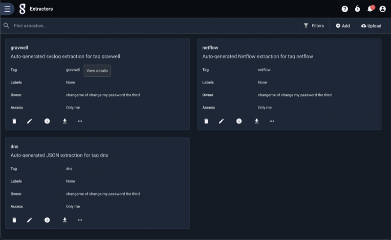
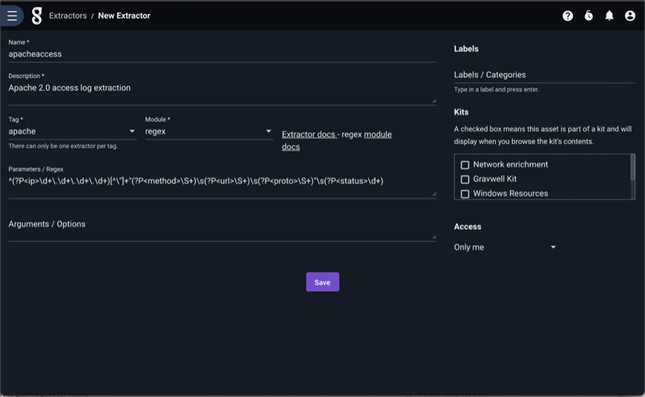

# Gravwell 自動抽出

Gravwellでは、タグ毎の抽出方法が設定可能で、そのことにより構造化されていないデータや自己記述型ではないデータ形式の取り扱いの複雑さを軽減することができます。構造化されていないデータについて、正規表現で目的のデータフィールドを抽出しようとすると、複雑な表現を必要とすることが多く、作成に時間がかかり、エラーが発生しやすくなってしまいます。

自動抽出は、タグ別に適用される設定記述があり、与えられたタグ内のデータからフィールドを正しく抽出する方法が記述されています。"ax"モジュールにより、他のモジュールから適切な機能を自動的に呼び出されます。自動抽出システムでは以下の抽出方法をサポートされています:

* [CSV](../search/csv/csv.md)
* [Fields](../search/fields/fields.md)
* [Regex](../search/regex/regex.md)
* [Slice](../search/slice/slice.md)

自動抽出の設定記述は、タグに基づいて正しい抽出を透過的に参照する [AX](../search/ax/ax.md) モジュールによって使用されます。

## 自動抽出の設定

抽出は、Gravwell メインメニューの下の "ツールとリソース"サブメニューにある "抽出設定"ページで管理できます。このページでは、設定済の抽出の設定記述一覧が表示できます:




新しい自動抽出は、右上の "追加"ボタンをクリックして表示されるフォームに記入することで新設できます:




以下のフィールドに入力する必要があります:

* 名前 - ユーザー自身に分かりやすくなるような抽出の名前
* 説明 - ユーザー自身に分かりやすくなるような抽出の説明
* タグ - 抽出に関連付けられたタグ; 既に用いられているタグはドロップダウンで一覧表示されます
* モジュール - 抽出に使用する処理モジュール (regex（正規表現）, slice, csv, fields, など)
* パラメーター/正規表現 - 抽出の設定記述
* 引数/オプション - 抽出モジュールの動作を変更するために使用されるモジュール固有の引数 (オプション)

抽出は、作成後にタイル上の鉛筆（編集）アイコンをクリックして編集することができます。

注：抽出は、一つのタグ、一人のユーザー毎に、毎回設定記述する必要があります

注：自動抽出は、常にエントリの完全な基礎となるデータに対して動作します。つまり、自動抽出は、列挙された値の抽出を実行するためには使用できません (引数 "-e" は使用できません)。

### 自動抽出ファイルの設定記述

自動抽出は、テキストファイルに設定記述し、「抽出設定」ページの右上隅にある「アップロード」ボタンをクリックして、Gravwellにアップロードすることもできます。各ファイルには複数の抽出設定を含むことができ、ファイルを再アップロードすると既存の抽出設定が更新されるので、抽出ファイルアップロードのやり方は自動抽出の設定を共有したり、大量に更新したりするのに便利です。自動抽出ファイルは、"#"の文字を使ってコメントすることができる[TOML V4](https://github.com/toml-lang/toml)形式に従っています。

ご注意ください：Gravwell の古いバージョンでは、自動抽出器は `/opt/gravwell/extractions` におかれたファイルとして管理されていました。これはもはやサポートされていませんが、そのディレクトリにある既存のファイルは、Gravwellが更新されたときに自動的にインポートされます。*すべての*抽出設定の管理は、GravwellのUIを通じてのみ操作できるようになりました。

抽出設定毎に、ヘッダと以下のパラメーターが含まれています:

* tag - 抽出に関連付けられたタグ
* name - ユーザー自身に分かりやすくなるよう名付けられた抽出名
* desc - ユーザー自身に分かりやすくなるような抽出の説明
* module - 抽出に使用する処理モジュール (regex, slice, csv, fields, など)
* args - 抽出モジュールの動作を変更するために使用されるモジュール固有の引数
* params - 抽出の設定記述

以下は、正規表現モジュールを使って Apache 2.0 のアクセスログから基本的なデータを取得するために設計された自動抽出ファイルのサンプルです:

```
#apache のアクセスログから ip, method, url, proto, status を抜き出すための簡単な抽出
[[extraction]]
	tag="apache"
	name="apacheaccess"
	desc="Apache 2.0 のアクセスログから、要求を出してきたものを抜き出す抽出"
	module="regex"
	args="" #空文字は完全に省略することができますが、正規表現プロセッサは空文字の省略をサポートしていません
	params='^(?P<ip>\d+\.\d+\.\d+\.\d+)[^\"]+\"(?P<method>\S+)\s(?P<url>\S+)\s(?P<proto>\S+)\"\s(?P<status>\d+)'
```

抽出パラメーターの記述の仕方について、いくつかの重要な注意点があります。

1. 各抽出パラメーターの値は、二重引用符か一重引用符で囲って文字列として記述する必要があります
2. 二重引用符で囲まれた文字列は、文字列エスケープルールの対象となります（正規表現を使用する場合は注意してください）
  a. "\b"は、文字が表すそのままの"\b"ではなく、バックスペースコマンド(文字0x08)になります
3. 一重引用符で囲まれた文字列は、生の文字列であり、文字列エスケープルールの対象にはなりません
  a. 'b'は文字表記通りに、バックスラッシュの後に'b'が続く文字列で、バックスペースではありません

文字列のエスケープルールを無視できる機能は、バックスラッシュを多用する "regex "プロセッサにとって特に便利です

1つのファイルに複数の抽出を記述するには、新しい"[[extraction]]"ヘッダに続いて新しい抽出設定を記述をするだけです。1つのファイルに2つの抽出を記述した例を次に示します:

```
#apache のアクセスログから ip, method, url, proto, status を抜き出すための簡単な抽出
[[extraction]]
	tag="apache"
	name="apacheaccess"
	desc="Apache 2.0 のアクセスログから、要求を出してきたものを抜き出す抽出"
	module="regex"
	args="" #空文字は完全に省略することができますが、正規表現プロセッサは空文字の省略をサポートしていません
	params='^(?P<ip>\d+\.\d+\.\d+\.\d+)[^\"]+\"(?P<method>\S+)\s(?P<url>\S+)\s(?P<proto>\S+)\"\s(?P<status>\d+)'

#CSVデータに名前を適用するための抽出
[[extraction]]
	tag="locs"
	name="locationrecords"
	desc="csv形式位置情報データのAX抽出"
	module="csv"
	params="date, name, country, city, hash, a comma ,\"field with comma,\""
```

"locs"タグ用の2番目の抽出では、重要でないパラメーターを省略し(ここではargsを指定していません)、バックスラッシュを使用して文字列中の二重引用符を許可しています。抽出に必須のパラメーターは3つだけです:

* module
* params
* tag

## フィルタリング

AXモジュールは、*検索*の時に統合されたフィルタリングをサポートしています。しかし、フィルタリングは自動抽出*設定記述*には適用できません。

#### フィルタリング演算子

| 演算子 | 名称 | 意味 |
|----------|------|-------------|
| == | 等価  | フィールドは等しい
| != | 不等価 | フィールドは等しくない
| ~  | 含む | フィールドはその値を含む
| !~ | 含まない | フィールドはその値を含まない

#### フィルタリングの例

```
ax foo=="bar" baz~"stuff"
ax foo != bar baz !~ "stuff and things"
```

## プロセッサーの例

いくつかの自動抽出の設定記述の例を挙げ、同じタスクを自動抽出なしで実行する場合のクエリを比較対照します。また、AX内でフィルタを使用する方法も紹介します。

### CSV

CSV、すなわち「カンマ区切りデータ」は、比較的効率的なテキスト転送と保存の仕組みとして使えます。しかし、CSVデータは自己記述的ではありません。つまり、CSVデータの束だけを持っていると、どの列が実際には何の項目であるかを見分けるのが難しくなりがちです。自動抽出機能を使えば、カラム名をあらかじめ定義しておくことができ、CSVデータの作業を劇的に楽にすることができます。

以下はCSVでエンコードされたデータ入力例です:

```
2019-02-07T10:52:49.741926-07:00,fuschia,275,68d04d32-6ea1-453f-886b-fe87d3d0e0fe,174.74.125.81,58579,191.17.155.8,1406,"これは楽観的な事業であることは間違いありません. しかし，自分たちの現在の不完全さについて話し合うときに必要に迫られて聞こえてきそうな，気難しい言葉から解放され，現実的な困難や方法や手段のもつれから解放されるのは、しばらくの間は良いことです.  広場によって道が途切れ，ナップザックを脇に置いて，額を拭い，我々が登っていると思う山の上の斜面について少し話すのは良いことですが，木々が私たちにそれを見させてくれるだろうか、ベンジャミン？ ", "TL",Bury,396632323a643862633a653733343a643166383a643762333a373032353a653839633a62333361
```

どのフィールドが何なのかわからないデータがたくさんあります。さらに悪いことに、CSVデータにはカンマや周囲のスペースが含まれていることがあり、肉眼で列を識別することは非常に困難です。自動抽出機能を使えば、カラム名と型を一度に識別し、"ax"モジュールを使って透過的に活用することができます。

各要素を手動で抽出して名前を付けると、クエリは以下のようになります:

```
tag=csvdata csv [0] as ts [1] as name [2] as id [3] as guid [4] as src [5] as srcport [6] as dst [7] as dstport [8] as data [9] as country [10] as city [11] as hash | table
```

自動抽出設定での記述は次のようになります:

```
[[extraction]]
	name="testcsv"
	desc="超絶難儀なCSVデータからCSV自動抽出する"
	module="csv"
	tag="csvdata"
	params="ts, name, id, guid, src, srcport, dst, dstport, data, country, city, hash"
```

そして同じ結果表示のためのクエリは次のようになります:

```
tag=csvdata ax | table
```

特定のフィールドを抽出する必要がない場合は、単に名前を空白のままにしておくことができます。例えば、上の例でGUIDを抽出する必要がない場合、paramsフィールドを `params="ts, name, id,, src, srcport, dst, dstport, data, country, city, hash"` に変更することができます。

注: CSV自動抽出プロセッサは引数をサポートしていません

注: 変数 `params` の中の各名前の位置がフィールド名を示します。CSVヘッダと同様に扱われます。

### fields

fieldsモジュールは非常に柔軟な処理モジュールで、データを抽出するために任意の区切り文字やフィールドルールを記述することができます。Bro/Zeekのような多くの一般的なセキュリティアプリケーションでは、データのエクスポートにTSV(タブ区切りデータ)をデフォルトで使用しています。その他のカスタムアプリケーションでは、"|"や"//"のような一般的でない区切り文字を使用している場合があります。フィールド抽出機能を使用することで、どのような区切り文字の場合も処理することができ、自動抽出機能と組み合わせることで、ユーザーはデータ形式の詳細について心配する必要はありません。

他の自動抽出プロセッサとは異なり、fieldsモジュールは様々な設定引数を持っています。引数のリストは [fieldsモジュールのドキュメント](/#!search/fields/fields.md) に詳しく説明されています。"e"フラグだけがサポートされていません。

最初にタブ区切りデータについて示してみましょう:

```
2019-02-07T11:27:14.308769-07:00	green	21.41.53.11	1212	57.27.200.146	40348	Have I come to Utopia to hear this sort of thing?
```

fieldsモジュールを使用して各データ項目を抽出するクエリは次のようになります:

```
tag=tabfields fields -d "\t" [0] as ts [1] as app [2] as src [3] as srcport [4] as dst [5] as dstport [6] as data | table
```

同じことを達成するための自動抽出の設定は:

```
[[extraction]]
	tag="tagfields"
	name="tabfields"
	desc="Tab delimited fields"
	module="fields"
	args='-d "\t"'
	params="ts, app, src, srcport, dst, dstport, data"
```

axモジュールと上記の設定を使用すると、クエリは次のようになります:

```
tag=tagfields ax | table
```

あまり使われることの無い "|" で区切られたデータを見てみましょう:

```
2019-02-07T11:57:24.230578-07:00|brave|164.5.0.239|1212|179.15.183.3|40348|"In C the OR operator is ||."
```

この例において、最後のフィールドには区切り文字が含まれていることに注目してください。このデータを生成したシステムでは、データ項目にデリミタを含める必要があることを想定されていて、そのデータ項目を二重引用符で囲んでいました。fieldsモジュールには引用符で囲まれたデータの扱いルールを組み込まれていますので、"-q "フラグを指定すると、引用符で囲まれたフィールド内容を尊重します。"-clean"フラグが指定されていない限り、引用符は抽出されたデータをそのまま維持します。

fieldsモジュールを使用すると、クエリは次のようになります:

```
tag=barfields fields -d "|" -q -clean [0] as ts [1] as app [2] as src [3] as srcport [4] as dst [5] as dstport [6] as data 
```

しかし、以下のような適切な自動抽出の設定では、クエリは非常にシンプルな `tag=barfields ax | table` となります。:

```
[[extraction]]
	tag="barfields"
	name="barfields"
	desc="bar | delimited fields with quotes and cleaning"
	module="fields"
	args='-d "|" -q -clean'
	params="ts, app, src, srcport, dst, dstport, data"
```

引用符を削除して、結果を適切にクリーンアップしています:


### regex（正規表現）

自動抽出で最も一般的に使用されるモジュールは、正規表現法かもしれません。正規表現は、正しく理解するのが難しく、誤入力しやすく、最適化するのが難しいものです。もし正規表現の達人が手助けしてくれるのであれば、効率的で柔軟な抽出を行う高速な正規表現を構築できます。

ここでは、遠慮なしの言い方をすれば「めちゃくちゃな」エントリーセットの例を紹介します（カスタムアプリケーションのログでは珍しくありません）:

```
2019-02-06T16:57:52.826388-07:00 [fir] <6f21dc22-9fd6-41ee-ae72-a4a6ea8df767> 783b:926c:f019:5de1:b4e0:9b1a:c777:7bea 4462 c34c:2e88:e508:55bf:553b:daa8:59b9:2715 557 /White/Alexander/Abigail/leg.en-BZ Mozilla/5.0 (Linux; Android 8.0.0; Pixel XL Build/OPR6.170623.012) AppleWebKit/537.36 (KHTML, like Gecko) Chrome/60.0.3112.107 Mobile Safari/537.36 {natalieanderson001@test.org}
```

The data is a really ugly access log for some custom application. We are trying to get at a few fields which we will name as followsデータは、あるカスタムアプリケーションのための本当に醜いアクセスログです。その中から私たちは次のように名付けたフィールドを取得しようとしています:

* ts - 各エントリの先頭のタイムスタンプ
* app - 処理アプリケーションを表す文字列
* uuid - 固有識別ID
* src - ソースアドレス（IPv4とIPv6の両方）
* srcport - ソースポート
* dst - 宛先アドレス（IPv4とIPv6の両方）
* dstport - 宛先ポート
* path - パスのようなURL
* useragent - ユーザーエージェント
* email - リクエストに付随しているメールアドレス

ここでは、抽出の設定記述の例を示します:

```
[[extraction]]
	module="regex"
	tag="test"
	params='(?P<ts>\S+)\s\[(?P<app>\S+)\]\s<(?P<uuid>\S+)>\s(?P<src>\S+)\s(?P<srcport>\d+)\s(?P<dst>\S+)\s(?P<dstport>\d+)\s(?P<path>\S+)\s(?P<useragent>.+)\s\{(?P<email>\S+)\}$'
```

一つ一つのデータ項目を抽出してテーブルに入れようとしてる場合を考えます。

正規表現を使用する場合、クエリは次のようになります:

```
tag=test regex "(?P<ts>\S+)\s\[(?P<app>\S+)\]\s<(?P<uuid>\S+)>\s(?P<src>\S+)\s(?P<srcport>\d+)\s(?P<dst>\S+)\s(?P<dstport>\d+)\s(?P<path>\S+)\s(?P<useragent>.+)\s\{(?P<email>\S+)\}$" | table
```

しかし、自動抽出とaxモジュールを使用すると、クエリは次のようになります:

```
tag=test ax | table
```

得られる結果は同じです:


axモジュールを使ってフィールドをフィルタリングしたい場合は、 フィールド名にfilter指示したものをaxモジュールに付け加えるだけです。次の例では、メールアドレスに "test.org "が含まれるエントリをすべて表示し、抽出されたすべてのフィールドを含むテーブルを表示させようとしています。

```
tag=test ax email~"test.org" | table
```

If we only want specific fields, we can specify those fields which directs the ax module to only extract those specific fields, rather than extracting all fields by default.
特定のフィールドのみを抽出したい場合は、デフォルトのまま全フィールドを抽出するのではなく、求めるフィールドのみを抽出するように、axモジュールにフィールドを特定して指示することができます。

```
tag=test ax email~"test.org" app path | table
```

### slice

[slice](/search/slice/slice.md)モジュールは、バイナリデータストリームから直接データを抽出できる強力なバイナリスライスシステムです。Gravwellのエンジニアは、sliceモジュールだけを活用してプロトコル全体を解析・分割するツールを開発してきました。データのバイナリストリームを切断してデータを解釈することは軟弱にはできうようなことではありませんが、一度プロプライエタリなデータストリームをスライスして切り刻む美しいクエリを構築してしまえば、それ以降はそれを覚えようとしたり、コピー＆ペーストしようとさえしたりする必要はありません。

バイナリデータをテキスト形式で表示するのは難しいので、このドキュメントではデータを16進数で表示します。例として、醸造システムで正確な温度制御を維持するために冷媒コンプレッサを制御する小型の制御システムから送られてくるバイナリデータストリームを切り分けてみましょう。制御システムには文字列、整数、浮動小数点値が含まれており、制御システムではよくあることですが、すべてのデータは[Big Endian](https://en.wikipedia.org/wiki/Endianness)の順に並んでいます。

注: slice AXプロセッサは引数をサポートしません(例えば、"-e "は許可されていません)

#### フィルタリング

slice AXプロセッサは、データを特定のタイプにキャストするように設計されています。そのため、フィルタリングオプションは他のモジュールに比べて少し具合が違います。抽出された各値には、その型に応じた特定のフィルタ演算子との組み合わせがあります。フィルタリング演算子と型の完全な説明については、[sliceモジュールのドキュメント](../search/slice/slice.md)を参照してください。

#### 例

まず、[hexlify](#!search/hexlify/hexlify.md)モジュールを使って、データを16進数形式で見てみましょう:

```
tag=keg hexlify
```

その結果、以下のようなエントリが生成されます。:

```
12000000000ed3ee7d4300000000014de536401800004b65672031
```

いくつかの調査で、パックされたバイナリ構造には以下のようなものが含まれていることがわかったとします:

| ID | Timestamp Seconds | Timestamp Nanoseconds | Temperature as 32bit float | ASCII name |
|----|-------------------|-----------------------|----------------------------|------------|
|bits 0:2 | bits 2:10              | bits 10:18                 | bits 18:22                      | bits 22:        |

この情報を使用して、以下のようなsliceクエリを生成して各データ項目を抽出することができます:

```
tag=keg slice uint16be([0:2]) as id int64be([2:10]) as sec uint64be([10:18]) as nsec float32be([18:22]) as temp [22:] as name | table
```


手動で求めたクエリから、次のような自動抽出設定を生成することができます:

```
[[extraction]]
	tag="keg"
	name="kegdata"
	desc="binary温度制御データの抽出"
	module="slice"
	params="uint16be([0:2]) as id int64be([2:10]) as sec uint64be([10:18]) as nsec float32be([18:22]) as temp [22:] as name"
```

複雑だったsliceクエリは、次のようになります。:

```
tag=keg ax | table
```

フィルタリングとmathモジュールをいくつか使用すると、さらに一歩進んで、各プローブの最高温度を示すクールなグラフを生成することができます:

```
tag=keg ax id==0x1200 temp name | max temp by name | chart max by name
```


追加のフィルタリングを使用してKeg（樽）の温度だけを選択し、温度の変動を調べて、制御システムがどの程度一定に温度を維持しているかを確認することができます:

```
tag=keg ax id==0x1200 temp name~Keg | stddev temp by name | chart stddev by name
```


自動抽出とベーシックなmathモジュールをいくつか使用すると、バイナリデータを分解して、時間の経過とともに温度の振動を引き起こすコンプレッサーの周期的な噛み合わせを明確に確認することができます。もし私たちが醸造所を運営していたら、醸造責任者に連絡して、温度の許容範囲を狭くするために制御システムのロジックを微調整することを提案したり、このデータを使用して冷え冷えの飲みものを開栓する最適な時間を把握したりするかもしれません。