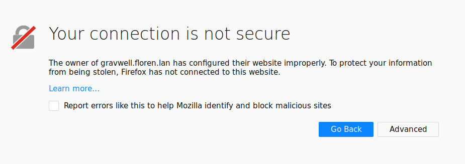
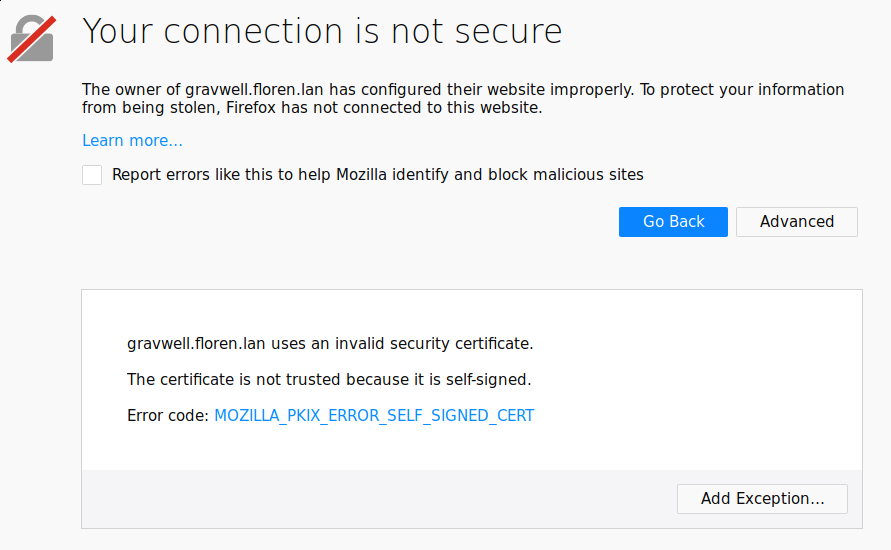
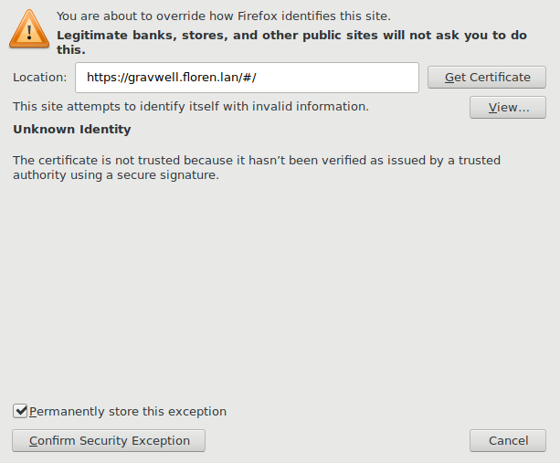
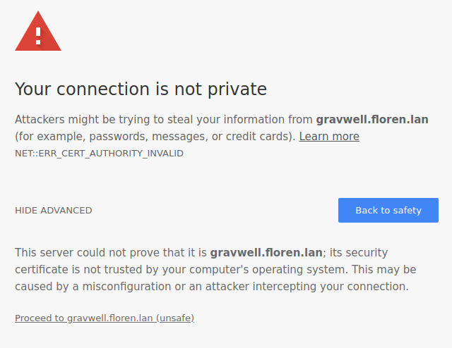
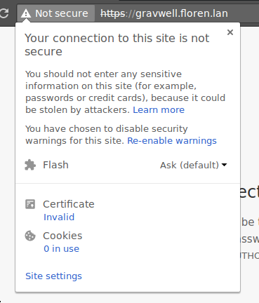
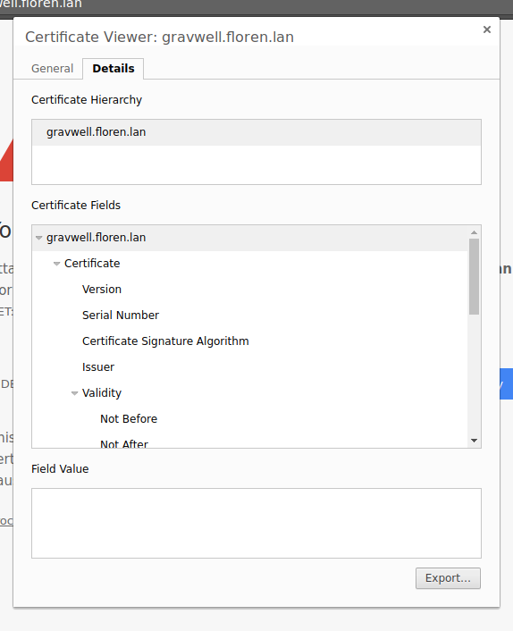
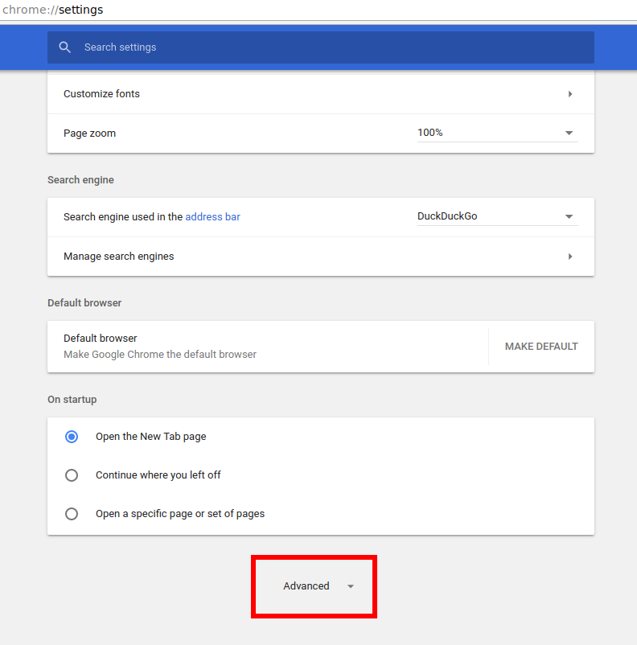
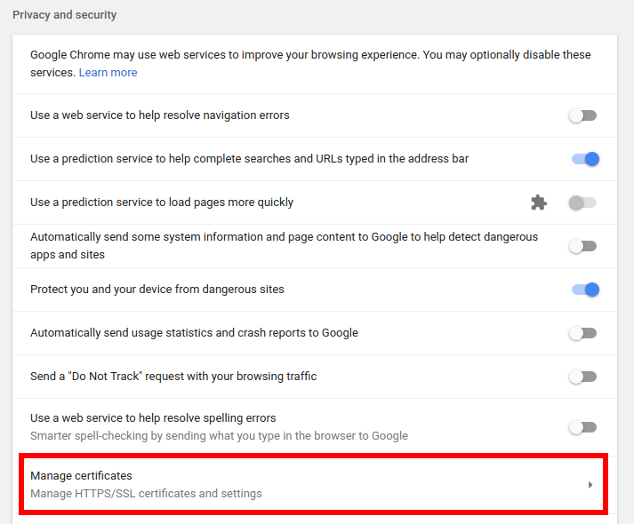
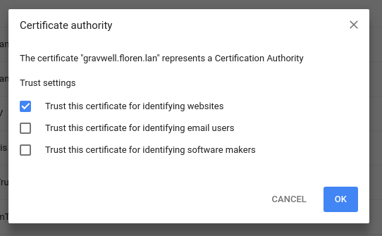

# Configuring TLS certificates

Gravwell ships without TLS certificates by default, meaning all communications will be unencrypted until you set up certificates. We did this because using auto-generated self-signed certificates tends to both frighten users with the browser's warnings and provide a false sense of security. It is difficult to properly validate a self-signed certificate and there is a real risk of training users to simply accept potentially impersonated certificates.  This is compounded by the extremely fickle behavior of Chromium-based browsers, which timeout certificate exceptions in unpredictable ways (you are often forced to close EVERY Chromium/Chrome zygote process in order to re-accept the certificate).

We strongly reccomend that you acquire fully validated certificates from a trusted provider if you plan to expose the Gravwell system to the Internet.  The folks at [LetsEncrypt](https://letsencrypt.org) are a great resource for learning about proper certificate validation, and they provide free certificates that are trusted by every major browser.

The Gravwell administrator has three options for certificates:

* Continue to use unencrypted HTTP only. This is suitable for installations that will only be accessed on a trusted private network, or where Gravwell will be fronted by an HTTP proxy such as nginx.
* Install a properly-signed TLS certificate. This is the ideal configuration, but typically requires the Gravwell instance to have a publicly-accessible hostname.
* Install a self-signed certificate. This makes sense when you want to encrypt traffic to Gravwell but for one reason or another cannot get a properly signed certificate.

## Using HTTP only

This is the default configuration for Gravwell, and no changes are needed to use it. It is suitable for someone experimenting with Gravwell on a home network, or evaluating it on an experimental network for work. It is also an acceptable configuration when the Gravwell webserver will be accessed through a load balancer/reverse proxy such as nginx; this allows the proxy to perform HTTPS encryption/decryption, taking load off the Gravwell system.

Please note that without a certificate, ingesters will be unable to encrypt their traffic to the indexer. If you wish to encrypt ingester traffic but leave the webserver in HTTP-only mode, you may install a certificate as described in either of the other sections, but only uncomment the `Certificate-File`, `Key-File`, and `TLS-Ingest-Port` options in gravwell.conf. This will enable TLS for the indexer but not the webserver.

Note: If you configure distributed webservers and a datastore with HTTPS disabled, you must set the `Datastore-Insecure-Disable-TLS` flag in gravwell.conf for both the datastore and the webservers.

## Install a properly-signed TLS certificate

A properly-signed TLS certificate is the most secure way to access Gravwell. Browsers will automatically accept the certificate without complaint.

Obtaining a certificate is outside the scope of this documentation; consider either purchasing a certificate through one of the traditional providers or using [LetsEncrypt](https://letsencrypt.org) to obtain a free one.

To use the certificate, Gravwell must be told where the certificate and key files are. Assuming the files are at `/etc/certs/cert.pem` and `/etc/certs/key.pem`, edit gravwell.conf to uncomment and populate the `Certificate-File` and `Key-File` options:

```
Certificate-File=/etc/certs/cert.pem
Key-File=/etc/certs/key.pem
```

Note: These files must be readable by the "gravwell" user. However, take care to protect the key file from other users; if it is made world-readable, any user on the system can access the secret key.

To enable HTTPS on the webserver, change the `Web-Port` directive from 80 to 443, then comment out the `Insecure-Disable-HTTPS` directive.

To enable TLS-encrypted ingester connections, find and uncomment the line `TLS-Ingest-Port=4024`.

To enable HTTPS for the search agent, open /opt/gravwell/etc/searchagent.conf and comment out the `Insecure-Use-HTTP=true` line and change the port in the `Webserver-Address` line from 80 to 443.

Finally, restart the webserver, indexer, and search agent:

```
systemctl restart gravwell_webserver.service
systemctl restart gravwell_indexer.service
systemctl restart gravwell_searchagent.service
```

Note: If using the datastore and multiple webservers, you must set the `Search-Forwarding-Insecure-Skip-TLS-Verify parameter` to `true` to enable webservers to communicate with each other using self-signed certs. If the datastore also uses self-signed certificates, set `Datastore-Insecure-Skip-TLS-Verify` on the webservers to enable them to communicate with the datastore.

## Install a self-signed certificate

Although it is not as secure as a proper TLS certificate, a self-signed certificate will ensure encrypted communication between users and Gravwell. By instructing browsers to trust the self-signed cert, it is also possible to avoid recurring warning screens.

First, we will generate a 1-year certificate in `/opt/gravwell/etc` using `gencert`, a program we ship with the Gravwell install:

```
cd /opt/gravwell/etc
sudo -u gravwell ../bin/gencert -h HOSTNAME
```

Make sure to replace HOSTNAME with either the hostname or the IP address of your Gravwell system. You can specify multiple hostnames or IPs by separating them with commas, e.g. `gencert -h gravwell.floren.lan,10.0.0.1,192.168.0.3`

Now, open gravwell.conf and uncomment the `Certificate-File` and `Key-File` directives. The defaults should point correctly to the two files we just created.

To enable HTTPS on the webserver, change the `Web-Port` directive from 80 to 443, then comment out the `Insecure-Disable-HTTPS` directive.

To enable TLS-encrypted ingester connections, find and uncomment the line `TLS-Ingest-Port=4024`.

To enable HTTPS for the search agent, open /opt/gravwell/etc/searchagent.conf and comment out the `Insecure-Use-HTTP=true` line and change the port in the `Webserver-Address` line from 80 to 443.

Finally, restart the webserver, indexer, and search agent:

```
systemctl restart gravwell_webserver.service
systemctl restart gravwell_indexer.service
systemctl restart gravwell_searchagent.service
```

### Making browsers trust the self-signed certificate

Browsers will throw up a warning if a certificate is not signed by a recognized root CA. However, we can make the browser trust our certificate by installing it manually.

#### Firefox

Installing the cert in Firefox is quite easy. First, navigate to your Gravwell instance via HTTPS. Firefox should display a screen similar to this:



Click the 'Advanced' button:



Then click 'Add Exception...':



The defaults should be appropriate, but make sure 'Permanently store this exception' is checked. Click 'Confirm Security Exception'.

Firefox should now accept your self-signed certificate until the certificate expires.

#### Chrome

Installing a certificate in a Chrome browser is slightly more complicated. First, navigate to your Gravwell instance via HTTPS. Chrome will display a warning screen:



Click the 'Not Secure' label in the address bar:



Then click the 'Invalid' link under 'Certificate'. A Certificate Viewer window should open; click the 'Details' tab:



Select the 'Export' button. Chrome will display a file dialog to save the certificate; save it somewhere and remember the location.

Now, enter [chrome://settings](chrome://settings) in your address bar or open Settings from the Chrome browser menu. Scroll to the bottom and click the Advanced button:



Within the 'Privacy and Security' section, find and click 'Manage certificates':



Now select the 'Authorities' tab and click 'IMPORT':


A file dialog will open; select the certificate file you saved earlier. Then, in the next dialog, check 'Trust this certificate for identifying websites' and click Ok:



Now you should be able to refresh the Gravwell tab without further SSL warnings.
