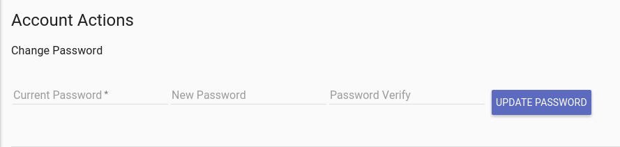

# Installation

## Installer Options

The Gravwell backend installer supports several flags to make automated installation or deployment easier.  The following flags are supported:

| Flag | Description |
|------|-------------|
| `--help` | Display installer help menu |
| `--no-certs` | Installer will not generate self-signed certificates
| `--no-questions` | Assume all defaults and automatically accept EULA
| `--no-random-passwords` | Do not generate random ingest and control secrets
| `--no-indexer` | Do not install Gravwell indexer component
| `--no-webserver` | Do not install the Gravwell webserver component
| `--no-start` | Do not start the components after installation
| `--no-crash-report` | Do not install the automated debug report component
| `--use-config` | Use a specific config file

### Common use-case examples of advanced installation requirements

If you are deploying Gravwell to a cluster with multiple indexers, you would not want to install the webserver component on your indexer nodes.

If you are using an automated deployment tool you don’t want the installer stopping and asking a questions.

If you already have your list of indexers with ingest and control shared secrets, specifying a configuration file at install time can greatly speed up the process.

An example argument list for installing the indexer component without installing the webserver or randomizing passwords is:

```
root@gravserver ~ #bash gravwell_8675309_0.2.sh --no-questions --no-random-passwords --no-webserver
```

If you choose to randomize passwords, you will need to go back through your indexers and webserver and ensure the Control-Auth parameter in the gravwell.conf file matches for the webserver and each indexer.

## Gravwell Indexer and Webserver

Gravwell is optionally a distributed system, allowing for multiple indexers which comprise a Gravwell cluster.  The default installation will install both the webserver and indexer on the same machine, but with an appropriate license configuration, running a cluster is just as simple as running a single instance.

## Post Installation

After installing Gravwell, open a web browser and navigate to the server (e.g. https://gravwell.mycompany.com). You should be met with a login screen. The default username and password are “admin” and “changeme”. Needless to say, your first action after logging in should be changing the admin password. This can be done by choosing “Account Settings” from the navigation sidebar or clicking the “user” icon in the upper right.




Passwords and virtually all administrative actions can also be accomplished via the command line interface (CLI).  To login and change a password via the CLI, execute the Gravwell client command with the -s flag pointing at your webserver.  Login with the default admin/changeme username and password combo and enter the admin command section.  From within the admin command section, execute the change_user_pwd command to select which users will have their passwords changed.

```
bash$ ./client -s 127.0.0.1:8080 admin
admin> change_user_pwd
+--------+-----------+--------------------+---------------------+-----------------------+-------------+
| UID    | Username  |               Name |               Email |         Default Group |      Locked |
+========+===========+====================+=====================+=======================+=============+
|      1 |    admin  |       Sir changeme |                     |                       |             |
+------+-------------+--------------------+---------------------+------------------------+-----------+
UID> 1
Current Password>
New Password>
Password Confirm>
admin>
```

After changing the password (or creating a new user via the “Admin Controls” page), navigate to “System Stats” to view stats and information about the Gravwell Server.  We recommend that after changing the administrator password you create a new non-admin user for day to day searching.

## General Configuration

Configuration of a Gravwell cluster is designed to be simple and efficient right from the start.  However, there are knobs to twist that can allow the system to better take advantage of extremely large systems or smaller embedded and industrial devices with memory constraints.  The core configuration file is designed to be shared by both the webserver and indexer, and is located by default at `/opt/gravwell/etc/gravwell.conf`

For a detailed listing of configuration options see [this page](parameters.md)

For a complete example indexer configuration see our [example default config](indexer-default-config.md)

A default configuration file installed by the installer might look like the following:

```
[global]
	Web-Port=443
	Control-Port=9404
	Ingest-Port=4023
	TLS-Ingest-Port=4024
	Log-Level=INFO
	Ingest-Auth=IngestSecrets
	Control-Auth=ControlSecrets
	Remote-Indexers=net:10.0.0.2:9404
	Remote-Indexers=net:10.0.0.3:9404
	Persist-Web-Logins=True
	Session-Timeout-Minutes=1440
	Login-Fail-Lock-Count=4
	Login-Fail-Lock-Duration=5
	Search-Pipeline-Buffer-Size=1024
	Web-Port=443
	Pipe-Ingest-Path=/opt/gravwell/comms/pipe
	Log-Location=/opt/gravwell/log
	Web-Log-Location=/opt/gravwell/log/web
	Certificate-File=/opt/gravwell/etc/cert.pem
	Key-File=/opt/gravwell/etc/privkey.pem
	Render-Store=/opt/gravwell/render
	Saved-Store=/opt/gravwell/saved
	Search-Scratch=/opt/gravwell/scratch
	Web-Files-Path=/opt/gravwell/www
	License-Location=/opt/gravwell/etc/license
	User-DB-Path=/opt/gravwell/etc/users.db
	Web-Store-Path=/opt/gravwell/etc/webstore.db

[Default-Well]
	Location=/opt/gravwell/storage/default/
```

The two most important items in the configuration file are the `Ingest-Auth` and `Control-Auth` configuration parameters.  The `Control-Auth` parameter is the shared secret that the webserver and indexers use to authenticate each other. If an attacker can communicate with your indexers and has the `Control-Auth` token, he has total access to the data they store.  The `Ingest-Auth` token is used to validate ingesters, and restricts the ability to create tags and push data into Gravwell.  Gravwell prides itself on speed, which means an attacker with access to your `Ingest-Auth` token can push a tremendous amount of data into Gravwell in a very short amount of time.  These tokens are important and you should protect them carefully.

## Frontend Configuration

The frontend acts as the focusing point for all searches, and provides an interactive interface into Gravwell.  While the frontend does not require significant storage, it can benefit from small pools of very fast storage so that even when a search hands back large amounts of data, users can fluidly navigate their results.  The frontend also participates in the search pipeline and often performs some of the filtering, metadata extraction, and rendering of data.  When speccing a frontend, we recommend a reasonably sized solid state disk (NVME if possible), a memory pool of 16GB of RAM or more, and at least 4 physical cores.  Gravwell is built to be extremely concurrent, so more CPU cores and additional memory will only increase its performance.  An Intel E5 or AMD Epic chip with 32GB of memory or more is a good choice, and more is always better.

### Frontend Configuration Pitfalls

* Missing or misconfigured Remote-Indexers
* Missing or mismatched Control-Auth tokens
* Mismatched licenses on frontend and backend
  * Both the webserver and indexer must have compatible licenses
* Poor network connectivity between the frontend and indexers
  * High latency, low bandwidth, or misconfigured MTU sizes.
* Firewalls blocking access to indexer or frontend ports
  * The default is 9404

## Indexer Configuration

Indexers are the storage center of Gravwell and are responsible for storing, retrieving, and processing data.  Indexers perform the first heavy lifting when executing a query, first finding the data then pushing it into the search pipeline.  The search pipeline will distribute as much of a query as is possible to ensure that the indexers can do as much heavy lifting in parallel as possible.  Indexers benefit from high speed low latency storage and as much RAM as possible.  Gravwell can take advantage of file system caches, which means that as you are running multiple queries over the same data it won’t even have to go to the disks.  We have seen Gravwell operate at over 5GB/s per node on well-cached data.  The more memory, the more data can be cached.  When searching over large pools that exceed the memory capacity of even the largest machines, high speed RAID arrays can help increase throughput.

We recommend indexers have at least 32GB of memory with 8 CPU cores.  If possible, Gravwell also recommends a very high speed NVME solid state disk that can act as a hot well, holding just a few days of of the most recent data and aging out to the slower spinning disk pools.  The hot well enables very fast access to the most recent data, while enabling Gravwell to organize and consolidate older data so that he can be searched as efficiently as possible.

### Tags and Wells

Tags are used as a method to logically separate data of different types.  Tags are applied at ingest points (SimpleRelay, NetworkCapture, etc).  For example, it is useful to apply unique tags to syslog logs, Apache logs, network packets, video streams, audio streams, etc.  Wells are the storage grouping which will actually organize and store the ingested data.

Tags can be assigned to wells so that data streams can be routed to faster or larger storage pools. For example, a raw pcap stream from a high bandwidth link may need to be assigned to a faster storage pool whereas log entries from syslog or a webserver do not require fast storage. A tag-to-well mapping is a one-to-one mapping; a single tag cannot be assigned to multiple wells.  Logically and physically separating data streams allows for setting different rules for the ingested data.  For example, it may be desirable to expire or compress high bandwidth streams, like network traffic, every 15 days while keeping low bandwidth streams for much longer.  The logical separation also greatly increases search performance as the system intelligently queries the appropriate well based on tag (e.g. when searching syslog entries located in the well named default, Gravwell will not engage any other wells).

Tag-to-well mappings are defined in the `/opt/gravwell/etc/gravwell.conf` configuration file. By default, only a `Default-Well` will be configured, which accepts all tags. An example configuration snippet for an indexer with multiple wells associated tags looks like:

```
[Default-Well]
	Location=/opt/gravwell/storage/default/

[storage-well "raw"]
	Location=/opt/gravwell/storage/raw/
	tags=pcap
	tags=video
	tags=testing
	tags=apache
```

### Well Ageout

Gravwell supports an ageout system whereby data management policies can be applied to individual wells.  The ageout policies allow controlling data retention, storage well utilization, and compression.  Each well supports a hot and cold storage location with a set of parameters which determine how data is moved from one storage system to the other.  An ideal Gravwell storage architecture is comprised of relatively small pools of high speed storage that is tolerant to random acceses and a high volume and low cost storage pool to be used for longer term storage.  NVME based flash and/or XPoint drives make a great hot well while magnetic RAID arrays, NAS, or SAN pools work well for cold pools.  Searching is not impeeded during ageout, nor is ingestion.  However, if data is actively coming into a storage shard that is marked for ageout or is actively being queried, the ageout system will defer aging out the shard to a later time.

Ageout policies can be defined via three parameters:
* Time
* Total Storage
* Storage Available

The time component of storage allows for specifying data retention policies to adhere to policies, contractual agreements, or legal requirements.  The total storage parameter allows for specifying a storage bound for a well and instructing Gravwell to only ageout or discard data when the amount of stored data exceeds the storage bounds.  The storage availability parameter allows for providing an extremely loose specification based on the amount of storage left on a device.  Storage availability constraints are useful for when you want to allow gravwell to use free storage on a device, but discard data if the device ever drops below some availability threshhold.  Each constraint can be added to a single well, allowing for an intersection of rules.

The ageout system is designed to optimize data storage as it transfers entries from hot to cold pools.  The optimization localizes entries of the same timerange and tag, facilitating much less head movement on traditional spinning disks.  Combined with compression, the optimization phase can significantly improve storage utilization and search performance on cold data.  The ageout system can be configured to delete old data, so it is critically important that the configuration be vetted prior to engaging well ageout.

To enable data ageout each well must be provided a hot storage location and a cold storage location.  The hot location is specified via the ["Location" directive](configuration.md#Gravwell_Indexer_and_Webserver) in the gravwell.conf file.  The cold storage location is specified via a "Cold-Location" directive which specifies an absolute path to a directory to be used for cold storage.  Cold storage locations may not overlap with any other well storage location, hot or cold.  In addition to a cold storage location, at least one ageout constraint must be specified to direct when and how data is moved from the hot pool to the cold pool.

Attention: Ageout configurations are on a per well basis.  Each well operates independently and asynchronously from all others.  If two wells are sharing the same volume, enabling ageout directives based on storage reserve can cause one well to agressively migrate and/or delete data due to the incursion by another.

#### Time Based Ageout

Time based ageout allows for managing data based on time retention requirements.  For example, an organization may have requirements that all logs be kept for 90 days.  The time based ageout constraint is best used on cold data pools where policy and/or legal requirements dictate log retention times.  Time based ageout durations can be specified in days and weeks using the case insensitive abreviations:
* "d"     - days
* "days"  - days
* "w"     - weeks
* "weeks" - weeks

An example well configuration using only a hot pool of data and deleting data that is more than 30 days old:
```
[Storage-Well "syslog"]
	Location=/mnt/xpoint/gravwell/syslog
	Tags=pcap
	Hot-Duration=30D
	Delete-Cold-Data=true
```

An example configuration with 7 days held in the hot pool and 90 days held in the cold pool:
```
[Storage-Well "syslog"]
	Location=/mnt/xpoint/gravwell/syslog
	Cold-Location=/mnt/storage/gravwell_cold/syslog
	Tags=pcap
	Hot-Duration=7D
	Cold-Duration=90D
	Delete-Frozen-Data=true
```

The Time based ageout is invoked once per day, sweeping each pool for shards that can be aged out.  By default the sweep happens at midnight UTC, but the execution time can be overridden in the well configuration with the Ageout-Time-Override directive.  The override directive is specified in 24 hour UTC time.

An example configuration that overrides the ageout time checks to occur at 7PM UTC:
```
[Storage-Well "syslog"]
	Location=/mnt/xpoint/gravwell/syslog
	Cold-Location=/mnt/storage/gravwell_cold/syslog
	Tags=syslog
	Tags=switchlogs
	Hot-Duration=7D
	Cold-Duration=90D
	Delete-Frozen-Data=true
	Ageout-Time-Override=19:00
```

#### Total Storage Based Ageout

Total storage constraints allow for alotting a specific amount of storage in a volume regardless of time spans.  Storage constraints allow for configuring Gravwell indexer which makes agressive and full use of high speed storage pools which may be of limited size (such as NVME flash).  The indexer will keep entries in the storage pool, as long as the well isn't consuming more than allowed.  Storage constraints allow for unexpected bursts of ingest to not disrupt data storage.  For example, if an indexer has 1TB of high speed flash storage which typically handles 7 days of hot storage but an unexpected data event causes 600GB of ingest in a single day, the indexer can age out the older data to the cold pool without disrupting the hot pools ability to continue to take on new data.  Shards are prioritized by time; oldest shards are aged out first for both hot and cold pools.

An example well configuration that keeps up to 500GB of data in a hot pool and deletes old data as the 500GB limit is exceeded.

```
[Storage-Well "windows"]
	Location=/mnt/xpoint/gravwell/windows
	Tags=windows
	Tags=sysmon
	Max-Hot-Storage-GB=500
	Delete-Cold-Data=true
```

An example well configuration where the hot pool keeps approximately 50GB and then ages out into a cold pool which keeps 10TB
```
[Storage-Well "windows"]
	Location=/mnt/xpoint/gravwell/windows
	Cold-Location=/mnt/storage/gravwell_cold/windows
	Tags=windows
	Tags=sysmon
	Max-Hot-Storage-GB=50
	Max-Cold-Storage-GB=10000
	Delete-Frozen-Data=true

```

Attention: Storage based constraints are not an instant hard limit.  Be sure to leave a little room so that when a storage allotment exceeded the indexer can ageout data while still ingesting.  For example, if a hot storage device can hold 512GB and the system typically ingests 100GB per day, setting the storage limit to 490GB should provide enough headroom so that the hotpool won't completely fill up while the indexer is migrating data.  Shards are prioritized by time; oldest shardsa re aged out first for both hot and cold pools.

#### Storage Available Based Ageout

Well storage constraints can also be applied based on availability of storage.  Some wells may be low priority, consume storage only when its available.  Using the storage reserve directives allows for specifying a well which is free to consume as much space as it wants, so long as some ceiling on available storage is mainted for the volume.  A storage reserve paradigm is very flexible and allows for the well to act as a second class citizen, consuming only when no one else is.  Specifying a "Hot-Storage-Reserve=5" instructs the well to ensure that should the hot storage volume drop below 5% free space it should begin migrating or deleting its oldest shards.  The reserve directives apply to the underlying volume hosting the storage location, meaning that if the volume is also hosting other wells or other arbitrary file storage, the well can pull back its storage usage as needed.

An example well configuration which will use the hot location as long as there is 30% free space on the volume, and will use the cold volume as long as there is 10% free space.

```
[Storage-Well "doorlogs"]
	Location=/mnt/xpoint/gravwell/doorlogs
	Cold-Location=/mnt/storage/gravwell_cold/doorlogs
	Tags=badgeaccess
	Hot-Storage-Reserve=30
	Cold-Storage-Reserve=10
	Delete-Frozen-Data=true
```

Attention: The Gravwell ageout system which operates on storage reserves is operating entirely orthogonal to outside influences, if a well is configured to respect a 50% storage ceiling and an outside application fills the volume to 60%, Gravwell will delete all entries outside the active shard.  Wells configured with storage reserved should be treated as expendable.

#### Caveats and Important Notes

Ageout contraints are applied to entire shards, if a single shard grows beyond the size of a data constraint the shard will age out in its entirety once the shard is idle.

Time based constraints require that the entire shard fall outside the specified time window.  As such, time contraits that are less than 1 day have no meaning, and hot pools must be able to hold at least 2 days worth of data.

##### Deletion Safety Nets

Age out policies can and will **delete data**.  It is critically important that administrators vet configurations and hardware resources to ensure that both hot and cold storage pools can accomodate the requested age out constraints.  Well configurations require that deletion be explicitely authorized via a "Delete-X-Data" directive (Delete-Cold-Data for hot pools and Delete-Frozen-Data for cold pools).

The Delete-X-Data directives are used as safety nets, to ensure administrators think about the deletion of data during configuration.  For example, if a well is configured to have a hot pool, no cold pool, and a hot retention of 7 days, Gravwell will attempt to delete data from the hot pool that is older than 7 days.  However, if the well does not have a configuration directive of "Delete-Cold-Data=true" the ageout system WILL NOT delete the data, complain in the logs and essentially disable ageout.

Cold pools contain the same directive requirement, meaning that Gravwell will not delete data from the cold pool as it ages out of the cold pool unless the "Delete-Frozen-Data=true" directive is set.  If a cold pool is specified and functioning, the "Delete-Cold-Data" directive is ignored, as data will be placed in the cold pool unless the data is outside of the cold pool rention range.  For example, if data that is 120 days old is ingested into the hot pool and the cold pool rention configuration is 90 days, **and the Delete-Cold-Data directive is set to true** the ageout system will bypass the cold pool entirely and directly delete the data.

Time based ageout relies on the system clock to determine when data should be aged out, meaning that an improper system clock could cause data to be aged out prematurely.  Administrators must ensure that system clocks are well maintained and if NTP is in use, it is a trusted source.  If an attacker can gain control over the system clock of a Gravwell indexer for reasonable periods of time, they can cause ageouts.  Time is the anchor in Gravwell and it must be protected with the same vigor as the storage pools.

##### Compression

The cold storage locations are compressed by default, which helps shift some load from storage to CPU.  Gravwell is a highly asynchronous system built for modern hardware in a scale wide paradigm.  Modern systems are typically overprovisioned on CPU with mass storage lagging behind.  By employing compression in the cold pool Gravwell can reduce stress on storage links while employing excess CPU to asynchronously decompress data.  The result is that searches can be faster when employing compression on slower mass storage devices.

A notible exception is data that will not compress much (if at all).  Raw network traffic is a good example where encryption and high entropy prevent effective compression.  To disable compression in a cold storage pool, add the "Disable-Compression=true" directive.

An example storage well with compression disabled and the hot pool constrained by total storage.

```
[Storage-Well "network"]
	Location=/mnt/xpoint/gravwell/network
	Cold-Location=/mnt/storage/gravwell_cold/network
	Tags=pcap
	Max-Hot-Data-GB=100
	Max-Cold-Data-GB=100
	Delete-Frozen-Data=true
	Disable-Compression=true
```

##### Ageout Rule Interactions

Ageout rules can be stacked and combined to provide robust control over storage resources.  For example, Gravwell highly reccomends a small pool of high speed storage for use in the hot pool and a large low cost array of disks for the cold pool.  Storage constraints can be combined to utilize the small high speed pool at will, while still adhering to data retention policies.

Data ageout constraints operate independently of one another in a first come first serve basis.  If a time constraint of 7 days is applied to a well in addition to a storage constraint of 100GB, shards will be aged out at 7 days or when the pool exceeds 100GB, whichever comes first.  While useful to combine multiple constraints for a single pool in a well, be aware that an overly agressive ageout configuration can cause unexpected behavior.  For example if a well has a 7 day retention, but also a Hot-Storage-Reserve of 5% Gravwell will attempt to meet the 5% retention independently of the 7 day retention.  Each ageout directive acts entirely independently, setting a rentention size or storage reserve can and will override any time based directives, and vice versa.

Example well configuration which uses up to 100GB of hot storage and retains data for 90 days
```
[Storage-Well "weblogs"]
	Location=/mnt/xpoint/gravwell/web
	Cold-Location=/mnt/storage/gravwell_cold/web
	Tags=apache
	Tags=nginx
	Tags=iis
	Max-Hot-Data-GB=100
	Cold-Duration=90D
	Delete-Frozen-Data=true
```

Example well configuration which tries to keep 10% free on the hot storage volume but retains data for 30 days
```
[Storage-Well "weblogs"]
	Location=/mnt/xpoint/gravwell/web
	Cold-Location=/mnt/storage/gravwell_cold/web
	Tags=apache
	Tags=nginx
	Tags=iis
	Hot-Storage-Reserve=10
	Cold-Duration=30D
	Delete-Frozen-Data=true
```

Example well configuration which keeps 7 days or 100GB in the hot pool and keeps all data in the cold pool as long as 20% is available
```
[Storage-Well "weblogs"]
	Location=/mnt/xpoint/gravwell/web
	Cold-Location=/mnt/storage/gravwell_cold/web
	Tags=apache
	Tags=nginx
	Tags=iis
	Hot-Storage-Reserve=100
	Hot-Duration=7D
	Cold-Storage-Reserve=20
	Delete-Frozen-Data=true
```

### Well Replication

### Environment Variables

