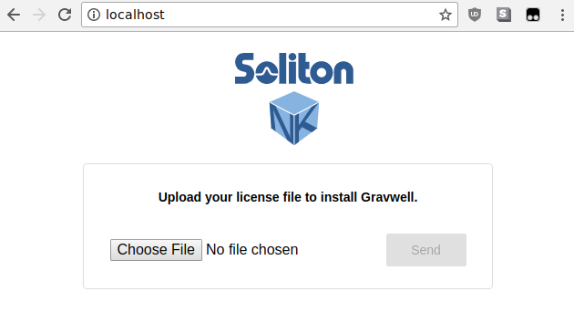
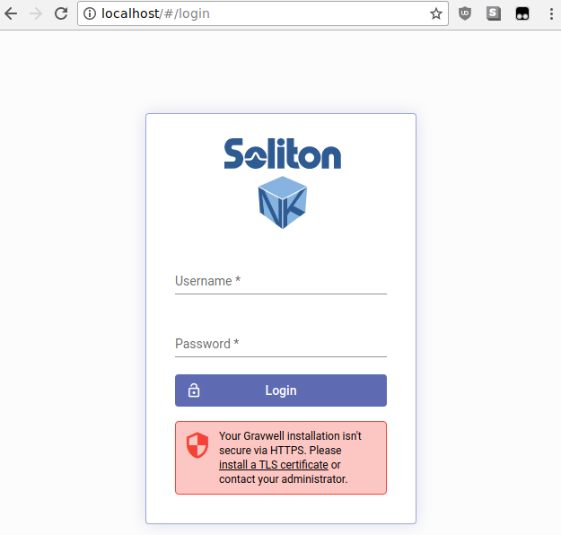

# Deploying Gravwell in Docker

With pre-built Docker images available in the Docker Hub, it is very easy to deploy Gravwell in Docker for experimentation or long-term use. In this document, we show how to set up a Gravwell environment within Docker.

If you are a paid Gravwell customer and wish to deploy Gravwell in Docker, contact support@gravwell.io for help. We also have some information about deploying a custom Docker instance [on this wiki](#!configuration/custom-docker.md) and [on our blog](https://www.gravwell.io/blog/gravwell-docker-deployment)

Once you have set up Gravwell, check out the [quickstart](#!quickstart/quickstart.md) for some starting points on *using* Gravwell.

Note: Users running Docker on MacOS should be aware that the MacOS host does not have direct IP access to containers, as explained [here](https://docs.docker.com/docker-for-mac/networking/). Be prepared to forward additional ports if you need to access container network services from the host.

## Create Docker network

To keep our Gravwell containers separated from any other containers you may be running, we'll create a Docker network called `gravnet`:

	docker network create gravnet

## Deploy the indexer and webserver

The Gravwell indexer and webserver frontend, plus the Simple Relay ingester, are shipped in a single Docker image ([gravwell/gravwell](https://hub.docker.com/r/gravwell/gravwell/)) for convenience. We will launch it with port 80 forwarded to port 8080 on the host for access to the webserver:

	docker run --net gravnet -p 8080:80 -p 4023:4023 -p 4024:4024 -d -e GRAVWELL_INGEST_SECRET=MyIngestSecret -e GRAVWELL_INGEST_AUTH=MyIngestSecret -e GRAVWELL_CONTROL_AUTH=MyControlSecret -e GRAVWELL_SEARCHAGENT_AUTH=MySearchAgentAuth --name gravwell gravwell/gravwell:latest

Note that the new container is named `gravwell`; we will use this when pointing ingesters to the indexer.

We have set several environment variables which bear examination. They set shared secrets used to communicate between components of Gravwell. Normally these are set in [configuration files](#!configuration/parameters.md), but we can also set them via [environment variables](#!configuration/environment-variables.md) for a more dynamic, Docker-friendly config. We'll use the `GRAVWELL_INGEST_SECRET=MyIngestSecret` value later for ingesters too. The variables we set are:

* `GRAVWELL_INGEST_AUTH=MyIngestSecret` tells the *indexer* to use MyIngestSecret to authenticate ingesters.
* `GRAVWELL_INGEST_SECRET=MyIngestSecret` tells the *Simple Relay ingester* to use MyIngestSecret to authenticate to the indexer. This **must** match the value of GRAVWELL_INGEST_AUTH!
* `GRAVWELL_CONTROL_AUTH=MyControlSecret` tells the *frontend* and *indexer* that they should authenticate with each other using MyControlSecret
* `GRAVWELL_SEARCHAGENT_AUTH=MySearchAgentAuth` tells the *frontend* to use MySearchAgentAuth when authenticating the search agent

Attention: We **highly** recommend setting these values to secrets of your own choosing if you intend to run this long-term, ESPECIALLY if you expose it to the Internet in any way.

Attention: The secret value for GRAVWELL_INGEST_AUTH must match GRAVWELL_INGEST_SECRET

## Upload license and log in

Now that Gravwell is running, point a web browser at port http://localhost:8080 on the host. It should prompt for a license upload:



Note: Paid users and existing Community Edition users should have received a license via email. If you haven't signed up for Community Edition yet, head over to [https://www.gravwell.io/download](https://www.gravwell.io/download) and get a license.

Once you upload the license and it is verified, you'll get a login prompt:



Log in with the default credentials **admin** / **changeme**. You're now in Gravwell! If you're going to run Gravwell for a while, you should probably change the password (click the user icon in the upper right to change the password).

## Add some data to test

The gravwell/gravwell Docker image ships with the Simple Relay [ingester](#!ingesters/ingesters.md) pre-installed. It listens on the following ports:

* TCP 7777 for line-delimited logs (tagged 'default')
* TCP 601 for syslog messages (tagged 'syslog')
* UDP 514 for syslog messages (tagged 'syslog')

To make sure we can get data into Gravwell, we can use netcat to write lines to port 7777. However, when we launched the VM, we didn't forward any of those ports to the host. Luckily, we can use `docker inspect` to get the IP address assigned to the Gravwell container:

	docker inspect -f '{{range .NetworkSettings.Networks}}{{.IPAddress}}{{end}}' gravwell

In our case, it was **172.19.0.2**. We can then use netcat to send in some lines, hitting Ctrl-C when done:

	$ netcat 172.19.0.2 7777
	this is a test
	this is another test

Attention: MacOS users cannot access containers directly by IP, because the containers are actually run within a Linux VM. You can either use netcat from within a Docker container (either the same container or a new one), or forward port 7777 to the host when launching the Gravwell container.

We can then run a quick search over the last hour to verify that the data made it in and Gravwell is working properly:


## Set up ingesters

Besides the Simple Relay ingester that ships with the gravwell/gravwell image, we currently provide three pre-built standalone ingester images:

* [gravwell/netflow_capture](https://hub.docker.com/r/gravwell/netflow_capture/) is a Netflow collector, configured to receive Netflow v5 records on port 2055 and and IPFIX records on port 6343
* [gravwell/collectd](https://hub.docker.com/r/gravwell/collectd/) receives hardware stats from collectd acquisition points on port 25826
* [gravwell/simple_relay](https://hub.docker.com/r/gravwell/simple_relay/) is the Simple Relay ingester as pre-installed on the core image, in case you want to deploy it separately too.

We'll launch the Netflow ingester here, but the same command (with names and ports changed) can be used for the other ingesters too:

	docker run -d --net gravnet -p 2055:2055/udp --name netflow -e GRAVWELL_CLEARTEXT_TARGETS=gravwell -e GRAVWELL_INGEST_SECRET=MyIngestSecret gravwell/netflow_capture

Note the use of the `-e` flag to set environment variables. This allows us to dynamically configure the ingester by directing it to connect to the container named 'gravwell' for ingest (GRAVWELL_CLEARTEXT_TARGETS=gravwell) and setting the shared ingest secret to 'IngestSecrets' (GRAVWELL_INGEST_SECRET=IngestSecrets).

The `-p 2055:2055/udp` option forwards UDP port 2055 (Netflow v5 ingest port) from the container to the host. This should make it easier to send Netflow records into the ingest container.

Note: The netflow ingester is also configured by default to accept IPFIX records over UDP on port 6343. If you wish to ingest IPFIX records too, add `-p 6343:6343/udp` to the command line above.

We can verify that the ingester is active by clicking on the Ingesters item in the menu:


Now we can configure our Netflow generators to send records to port 2055 of the host; they'll be passed in to the container and ingested into Gravwell.

## Customizing services

The official Gravwell docker container contains a service management system that makes launching and controlling multiple services within the container very easy.  The manager controls service restarts, error reporting, and back off controls.  Gravwell has opensourced the [manager](https://github.com/gravwell/manager) application on [github](https://github.com/gravwell) under the BSD 3-Clause license.  So if you want a very small and easily configured SystemD like service manager for your docker containers, have at it.

The official gravwell Docker image contains the full Gravwell stack (indexer and webserver) as well as the Simple Relay ingester.  The default manager configuration is:

```
[Global]
	Log-File=/opt/gravwell/log/manager.log
	Log-Level=INFO

[Error-Handler]
	Exec=/opt/gravwell/bin/crashReport

[Process "indexer"]
	Exec="/opt/gravwell/bin/gravwell_indexer -stderr indexer"
	Working-Dir=/opt/gravwell
	Max-Restarts=3 #three attempts before cooling down
	CoolDown-Period=60 #1 hour
	Restart-Period=10 #10 minutes

[Process "webserver"]
	Exec="/opt/gravwell/bin/gravwell_webserver -stderr webserver"
	Working-Dir=/opt/gravwell
	Max-Restarts=3 #three attempts before cooling down
	CoolDown-Period=30 #30 minutes
	Restart-Period=10 #10 minutes

[Process "searchagent"]
	Exec="/opt/gravwell/bin/gravwell_searchagent -stderr searchagent"
	Working-Dir=/opt/gravwell
	Max-Restarts=3 #three attempts before cooling down
	CoolDown-Period=10 #10 minutes
	Restart-Period=10 #10 minutes

[Process "simple_relay"]
	Exec="/opt/gravwell/bin/gravwell_simple_relay -stderr simple_relay"
	Working-Dir=/opt/gravwell
	Max-Restarts=3 #three attempts before cooling down
	CoolDown-Period=10 #10 minutes
	Restart-Period=10 #10 minutes
```

This default configuration for the manager application enables the error reporting system which helps us identify and correct bugs.  If a service exits with a non-zero exit code, we get an error report.  To disable the error reporting system you can either remove the "[Error-Handler]" section or pass in the environment variable "DISABLE_ERROR_REPORTING" with a value of "TRUE".

Individual services can be disabled at the time of launch by passing in an environment variable with the service name in all caps and prefixed with "DISABLE_" assined to "TRUE".

For example, to launch the gravwell docker container without error reporting, launch with the "-e DISABLE_ERROR_REPORTING=true" option.

If you would like to disable the integrated SimpleRelay ingester, add "-e DISABLE_SIMPLE_RELAY=TRUE" and if you wanted to launch with ONLY the indexer started chain them all up like so:

```
docker run --name gravwell -e GRAVWELL_INGEST_SECRET=MyIngestSecret -e DISABLE_SIMPLE_RELAY=TRUE -e DISABLE_WEBSERVER=TRUE -e DISABLE_SEARCHAGENT=TRUE gravwell/gravwell:latest
```

For more information about the service manager visit the [github page](https://github.com/gravwell/manager).

### Customizing ingester containers

Once you've launched an ingester container, you may want to modify the default configuration somewhat. For instance, you may decide to run the Netflow ingester on a different port.

To make changes to the Netflow ingester container we launched above, we can launch a shell in the container:

	docker exec -it netflow sh

Then we can use vi to edit `/opt/gravwell/etc/netflow_capture.conf` as described in [the ingesters documentation](#!ingesters/ingesters.md). Once our modifications are made, we simply restart the whole container:

	docker restart netflow

## Configuring external (non-Docker) ingesters

If you refer back to the original command we used to launch the `gravwell/gravwell` image, you'll note that we forwarded ports 4023 and 4024 to the host. These are respectively the cleartext and TLS-encrypted ingest ports for the indexer. If you have an ingester running on another system (perhaps gathering log files on a Linux server somewhere), you can set the `Cleartext-Backend-target` or `Encrypted-Backend-target` fields in the ingester config file to point at your Docker host and ingest data into the Gravwell instance there.

Refer to [the ingesters documentation](#!ingesters/ingesters.md) for more information on configuring ingesters.

## Security considerations

If you intend to expose the forwarded container ports to the Internet, it is **critical** that you set the following to secure values:

* The 'admin' password must be changed from default 'changeme'.
* The GRAVWELL_INGEST_SECRET, GRAVWELL_INGEST_AUTH, GRAVWELL_CONTROL_AUTH, and GRAVWELL_SEARCHAGENT_AUTH environment variables set when launching the indexer & webserver (see above) must be set to complex strings.

## More Info

With Gravwell running, refer to [the rest of the documentation](#!index.md) for more information on how to use the system.

If you are a paid Gravwell customer and wish to deploy Gravwell in Docker, contact support@gravwell.io for help. We also have some information about deploying a custom Docker instance [on this wiki](#!configuration/custom-docker.md) and [on our blog](https://www.gravwell.io/blog/gravwell-docker-deployment)
