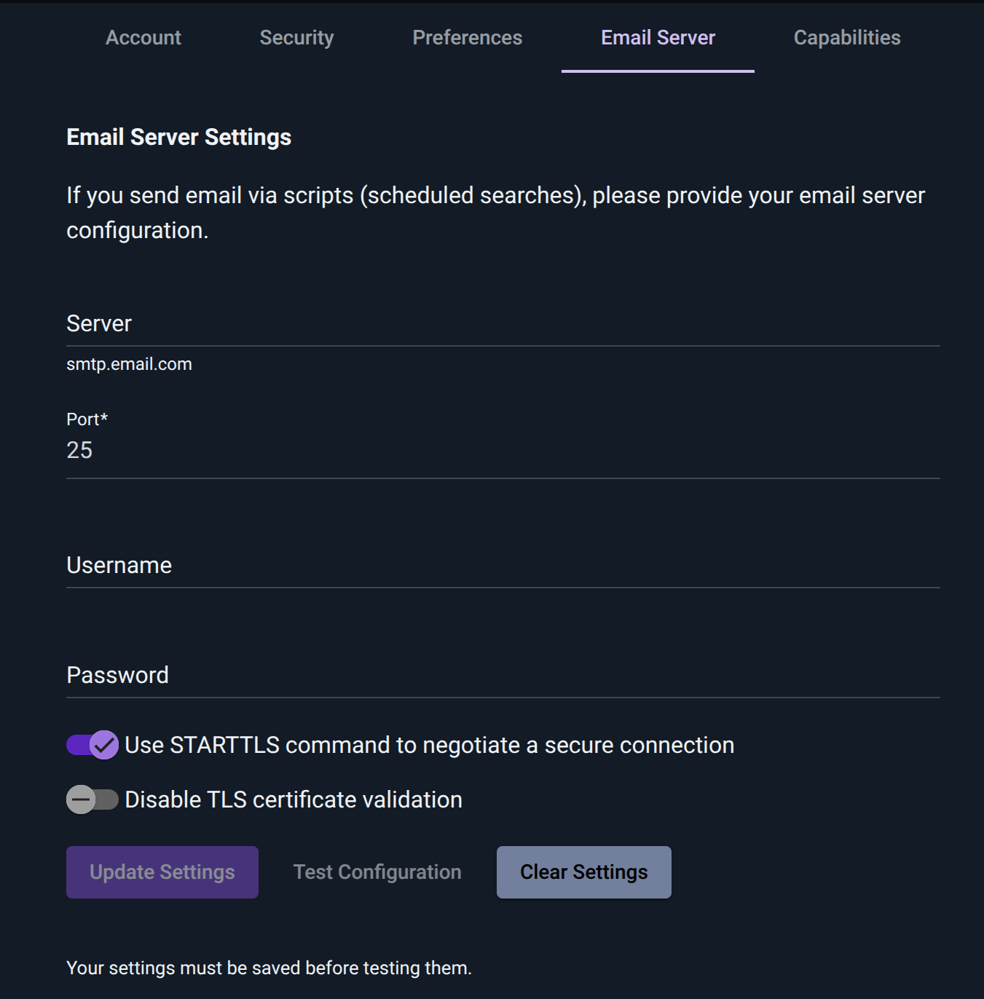

# Email Configuration

Gravwell can be configured to send Emails via automated scripts and flows, but this requires that the system be configured with a valid SMTP configuration.

## User Defined Email Configuration

Users can configure their own SMTP server by first visiting their [User Preferences](/configuration/gui.html#user-preferences) page and then clicking the "Email Server" tab.




The fields are mostly self-explanatory: "Server" is an SMTP server, "Port" is the port to use for SMTP, "Username" and "Password" authenticate to that server. "Use TLS" should be enabled if the server expects TLS connections. The "Disable TLS certificate validation" option is provided in case the server is using self-signed certificates; be cautious enabling this!

Once the fields have been populated, click "Update Settings" to save them, then click "Test Configuration" to send a test email.

If an email configuration is specified in a users preferences, Gravwell will use those credentials to send emails even if a shared Email configuration is available.  Gravwell will *NOT* fall back to the shared email configuration if a users email configuration fails.

## Shared Email Configuration

System administrators can configure a single SMTP server for all or some subset of users.  The shared Email configuration is designed to allow a system administrator to configure a single SMTP server and then place restrictions on who can use the email relay, where emails can come from, and where they can be sent to.

This type of configuration is often useful if many users may be generating automations and you want a central "alert" Email inbox that all the users can use.  The Global Email configuration is a system level configuration and is not tied to a specific account, nor will it be included in system backups.

The shared email configuration is specified by including a `[Shared-Email-Config]` block in either the `gravwell.conf` (typically located at `/opt/gravwell/etc/gravwell.conf`) or as a configuration overlay file in `/opt/gravwell/etc/gravwell.conf.d/`.

Here is an example configuration block which grants access to a few groups and enforces sender and destination addresses:

```
[Shared-Mail-Config]
	Server = `smtp.example.com`
	Port = 25
	Username = `userman`
	Password = `sneakypassword`
	UseTLS = true
	Force-From = `forced@example.com`
	Allowed-Group = group2
	Allowed-Group = group3
	Allowed-To = `[a-f0-9]+@example\.com`
	Allowed-To = `[a-f0-9]+@example\.io`
```


### Required Shared Email Configuration Parameters

At a minimum, the `[Shared-Email-Config]` requires the following SMTP parameters:

* `Server`: FQDN of an SMTP server.
* `Port`: SMTP server port.
* `Username`: Username used for authenticating with the SMTP server.
* `Password`: Password used for authenticating with the SMTP server.

### Optional Shared Email Configuration Parameters

The shared Email configuration also has several optional configuration parameters which can be used to enforce connection behavior, sender addresses, receiver addresses, and Gravwell group access.  The following are optional parameters:

* `UseTLS`: Boolean indicating that StartTLS should be used.  Defaults to false.
* `InsecureSkipVerify`: Boolean indicating that we should ignore TLS certificate validation errors.  Defaults to false.
* `Allowed-Group`: Name of a Gravwell group that is allowed to use the shared email configuration.  Multiple groups can be specified.
* `Force-From`: Email address override for all sent mail.  The `Force-From` address will always be applied regardless of what users specify.
* `Allowed-To`: Regular expression which can be used to limit destination addresses.  Multiple expressions can be specified.

The `Force-From` and `Allowed-To` configuration parameters are useful for ensuring that users do not specify bad sender addresses or attempt to send to unexpected addresses.  `Force-From` should probably be the Email address tied to the username and password for the SMTP server.  `Allowed-To` should be used to restrict which email addresses alerts can be sent to so that users don't send sensitive information outside mailboxes.

```{note}
Users must have a valid SMTP Email configuration set in their preferences or be allowed to use a shared Email configuration setup by an Admin.  If neither option is enabled, users will be unable to send automated alert emails.
```
