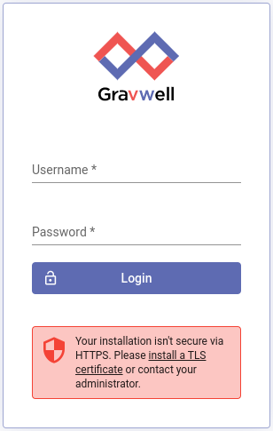
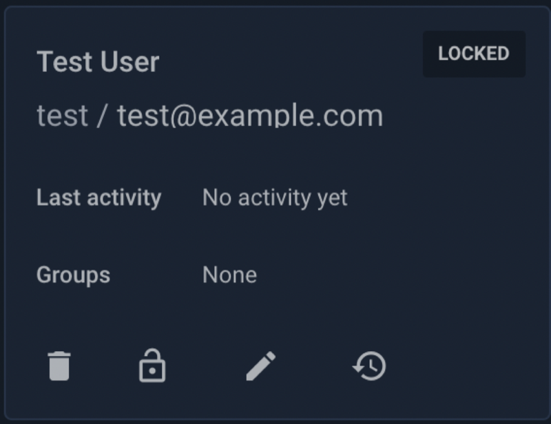

# Hardening a Gravwell Installation

Hardening a Gravwell installation is a pretty straight forward process.  We take pride in shipping a well-contained and well-isolated product that adheres to the [principle of least privilege](https://en.wikipedia.org/wiki/Principle_of_least_privilege).  Beyond a few basic tweaks and some common sense measures, hardening a Gravwell install is the exact same as hardening any other system.  Gravwell runs entirely in userspace with an unprivileged account; it is at the mercy of the system it runs on, so protect that system and you will protect Gravwell.

The [Linux Audit](https://linux-audit.com/linux-server-hardening-most-important-steps-to-secure-systems/) page has a few good tips for general hardening of Linux systems. Lock down your host OS and you're 90% of the way there.

There are a few areas that may warrant some attention upon initial installation, such as TLS certificates.  We ship with a set of defaults that should satisfy most users but there are a few settings that you may want to tweak.

We also highly recommend keeping up-to-date with the latest Gravwell releases and occasionally checking in on the [changelog](../#!changelog/list.md).  If we encounter a security issue we will document it there.  We will also notify customers of critical security issues via the prescribed point of contact.

## Quickstart

Securing Gravwell is not much different than securing any other network-accessible application.  Change the default passwords, setup proper encryption via TLS certificates, and make sure permissions and authentication tokens are strong.

If you are in a hurry and just want to hit the high points, do this:

1. Change the password for the admin user
2. Install a valid TLS Certificate and enable HTTPS [More Info](certificates.md)
3. Change the username for the admin user
4. Ensure you use good secrets for ingesters and enable Ciphertext connections [More Info](../#!ingesters/ingesters.md)
5. Enable [password complexity controls](#!configuration/configuration.md#Password_Complexity) or [Single Sign On](#!configuration/sso.md)
6. Enable HTTPS communication in the Search Agent [More Info](certificates.md)
7. Ensure communications between webservers and indexers are over a trusted network.

Installing a valid TLS certificate and enabling HTTPS is only slightly less important than changing the default password for the admin user.  When logging in, if Gravwell detects that you are not using HTTPS the login prompt will show a warning:



Without HTTPS enabled and valid TLS certificates attackers could sniff login credentials, so *never access Gravwell over the public Internet without HTTPS enabled!*

# Gravwell Users and Groups

Gravwell users and groups loosely follow the Unix patterns.  At a high level, Gravwell access controls boil down to the following rules:

1. A user can be a member of multiple groups
2. All searches, resources, and scripts are owned by a single user
3. Searches, resources, scripts, and dashboards can be shared via group membership
4. Access via  group membership does not grant write access (only owners and admins can write)
5. Admin users are not restricted in any way (think `root`)
6. The Admin user with UID 1 cannot be deleted or locked out of the system (again, think `root`)
7. Multiple users may be granted Admin privileges

User and group management is the sole responsibility of admin users. Non-admins cannot modify users or change user group memberships.

## Default Accounts

Default Gravwell installations have a single user named `admin` with the password `changeme`.  This default account uses the coveted UID of 1.  Gravwell treats UID 1 in the same way that Unix treats UID 0.  It is special and cannot be deleted, locked, or otherwise disabled.  You should protect this account carefully!

While you cannot delete the `admin` user with the special UID of 1, you can change the username; which we **HIGHLY** reccomend you do.  This makes it much harder for an unauthorized user to guess credentials.  To try and further drive home the point that this default account requires your attention, we set the accounts 'real name' to "Sir changeme of change my password the third".  Seriously, the first thing you should do is lock down this account.

A default installation also contains a basic `users` group.  This group is just a starting point and does not have any special privileges.

### Account Storage and Password Hashing

Gravwell uses the [bcrypt](https://en.wikipedia.org/wiki/Bcrypt) hashing system to store and validate logins.  This means that passwords are **NEVER** stored plaintext and we have no way to recover them.

We start with a pretty aggressive bcrypt hash cost of 12 and routinely re-evaluate whether we need to increase that cost. 

### Account Brute Force Protections

Gravwell employs a login throttling system to protect accounts.  If a user repeatedly fails authentication, Gravwell will introduce a delay in the authentication process that grows with each failed login attempt, eventually locking the account.  The login throttling controls can be tweaked using the following parameters in the `gravwell.conf` file:

`Login-Fail-Lock-Count` - Controls how many times a user can fail authentication before we start slowing down the login attempts.  The default value is 0.

`Login-Fail-Lock-Duration` - Duration in minutes used for calculating the failure count.  The default is 0.

The account lockout feature is disabled by default, however the `gravwell.conf` configuration shipped in the Docker containers and installers sets a value of 5 and 5, this means that a user can fail logging in up to 5 times in 5 minutes without locking their account.

The special UID 1 admin account **IS** subject to login throttling and exponential delays, but is **NOT** subject to account locking.  That account cannot be locked out.  Accounts that are locked due to brute force attempts do not eject all active sessions, while a user cannot login after having their account locked, they CAN maintain any active sessions.  This is so an attacker cannot DOS the Gravwell system and boot active users.

Setting either the `Login-Fail-Lock-Count` or `Login-Fail-Lock-Duration` to zero disables the locking of accounts.  Locked accounts can be unlocked in the user control panel.

[//]: # ()

## Installation Components

By default, Gravwell is installed in `/opt/gravwell`.  The installers create the user and group `gravwell`:`gravwell`.  Neither the user nor the group is installed with login privileges.  All components execute under the `gravwell` user, and almost all execute under the `gravwell` group.

The notable exception is the File Follower ingester which executes under the `admin` group so that it can tail log files in `/var/log`.  If you do not want *any* Gravwell component executing with elevated privileges we recommend not using the [File Follower](#!ingesters/ingesters.md#File_Follower) and instead configure syslog to send data to the [Simple Relay](#!ingesters/ingesters.md#Simple_Relay) ingester via TCP.  You may also alter the File Follower systemd unit file to execute using the `gravwell` group if you do not need to follow any controlled system log files.  Check out the system unit file section below for more info.

Gravwell installers come in two forms: respository installation packages (either Debian `.deb` or RedHat `.rpm`) and shell-based self-extracting installers.  The repository installation packages are all signed using the published Gravwell [respository key](https://update.gravwell.io/debian/update.gravwell.io.gpg.key).  The self-extracting shell installers are always accompanied by MD5 hashes. Always validate the MD5 hashes and/or repository signatures before installing any package (Gravwell or otherwise).

## Installation Configuration Files

Gravwell configuration files are stored in `/opt/gravwell/etc` and are used to control how webservers, search agents, indexers, and ingesters behave.  The Gravwell configuration files usually contain shared secret tokens that are used for authentication.  The shared secrets allow allow varying levels of control over Gravwell components.  For instance, if the `Ingest-Secret` is compromised attackers could send supurfluous entries into the index, consuming storage but not leaking any sensitive information, while compromising the `Control-Secret` would allow an attacker to search across the data in the indexers. Take care to avoid leaking secrets; aside from the ingest secret, most will never need to leave the indexer & webserver nodes.

## Systemd Unit Files

Gravwell relies on the [systemd](https://www.freedesktop.org/wiki/Software/systemd/) init manager to get Gravwell up and running, as well as manage crash reports.  The installers register and install [SystemD unit files](https://www.freedesktop.org/software/systemd/man/systemd.unit.html) into `/etc/systemd/system`.  These unit files are responsible for starting the Gravwell processes and applying cgroup restrictions to ensure that Gravwell processes behave.

Most users do not need to change the systemd unit files, but if you need to allow an ingester to touch specific resources or want to run as an alternate user or group, you may want to tweak the `User` or `Group` parameters under the `[Service]` section.

### Systemd Resource Restrictions

Gravwell is built for speed and scale.  Many of our customers are processing hundreds of gigabytes per day on very large systems, we thrive on high core counts, big memory, and fast disks.  You got cores?  We'll use 'em!  However, Community Edition users or customers that need to co-reside Gravwell with other systems may need to ensure that Gravwell doesn't stretch out and consume too many of the resources available to it.  Systemd unit files provide the ability to control Linux Cgroups, meaning you can restrict memory, CPU, and even system file descriptor use by Gravwell.

Hardening a system **for** Gravwell may also entail hardening a system **from** Gravwell.  Systemd can set up a bit of a "wall" so that we only use a subset of total system resources, even when Gravwell is working hard.  Below is an example systemd unit file that restricts the number of system threads, CPU usage, and resident memory.

We are restricting this indexer to 4 threads, 8GB of resident memory, and applying a nice value to the process to reduce its priority.  This means the indexer will tend to get less time on the CPU than other processes on the system.

```
[Install]
WantedBy=multi-user.target

[Unit]
Description=Gravwell Indexer Service
After=network-online.target
OnFailure=gravwell_crash_report@%n.service

[Service]
Type=simple
ExecStart=/opt/gravwell/bin/gravwell_indexer -stderr %n
ExecStopPost=/opt/gravwell/bin/gravwell_crash_report -exit-check %n
WorkingDirectory=/opt/gravwell
Restart=always
User=gravwell
Group=gravwell
StandardOutput=null
StandardError=journal
LimitNOFILE=infinity
TimeoutStopSec=120
KillMode=process
KillSignal=SIGINT
LimitNPROC=4
LimitNICE=15
MemoryAccounting=true
MemoryHigh=7168M
MemoryMax=8192M
```

Notice that we don't limit the number of open file descriptors using the `LimitNOFILE` parameter. Gravwell is careful with file descriptors, but limiting the number that can be open may cause errors when searching large swaths of time or when many ingesters are connected.  For a full list of all system tweaks available, see the freedesktop.org [exec](https://www.freedesktop.org/software/systemd/man/systemd.exec.html) manual.

## Gravwell Application Executables

All Gravwell service executables (excluding the Windows ingesters) are installed in `/opt/gravwell/bin` and owned by the user `gravwell` and the group `gravwell`.  The permission bits on the executables do not allow reading, writing, or execution by `other`.  This means that only root and the `gravwell`:`gravwell` user and group can execute or read the applications.

Some components are installed with special capabilities that allow them to perform specific actions without executing as a special user or group.  At this time, Gravwell components only make use of the following two capabilities:

* `CAP_NET_BIND_SERVICE` - allows non-root applications to bind to ports less than 1024.
* `CAP_NET_RAW` - Allows a non-root application to open a raw socket.

The `CAP_NET_RAW` capability is only used by the [Network Capture](/#!ingesters/ingesters.md#Network_Ingester) ingester so that it can capture raw packets from an interface without running as root.

The `CAP_NET_BIND_SERVICE` capability is used by the [Simple Relay](/#!ingesters/ingesters.md#Simple_Relay) and the Webserver so that they can bind to low numbered ports such as 80, and 443 for the webserver and 601 and 514 for the Simple Relay ingester.

## Search Scripting and Automation

The Gravwell automation system is extremely powerful. It can execute queries, update resources, and reach out to external systems.  The automation scripting system is underpinned by a [Turing Complete](https://simple.wikipedia.org/wiki/Turing_complete) language and can essentially do *anything*.  But with great power comes great responsibility.  Depending on your userbase, you may wish to disable "risky" API access in scripts to limit what a user can do.  APIs that are deemed "risky" are those that can establish external connectivity outside of Gravwell, including HTTP, network, SSH, FTP, SFTP, etc.

Disabling the risky APIs can reduce the chances that users export sensitive data.  Disable these APIs by setting the following in your Gravwell.conf file:

`Disable-Network-Script-Functions=true`

Note: The network scripting functions are extremely useful, so only disable them if you're concerned about users abusing them.

[//]: # (# Query Controls)

## Notes on SELinux

Gravwell's installers attempt to configure SELinux appropriately if SELinux is enabled. This configuration consists of the following:

* Adding the usr_t context to all files in `/opt/gravwell/` (excepting the `bin` subdirectory) via the semanage command.
* Adding the bin_t context to all files in `/opt/gravwell/bin` via the semanage command.
* Using the `restorecon` command to apply the new context rules.

If you find that SELinux is preventing Gravwell from running, check the rules using `/sbin/semanage fcontext -l | grep /opt/gravwell`.
