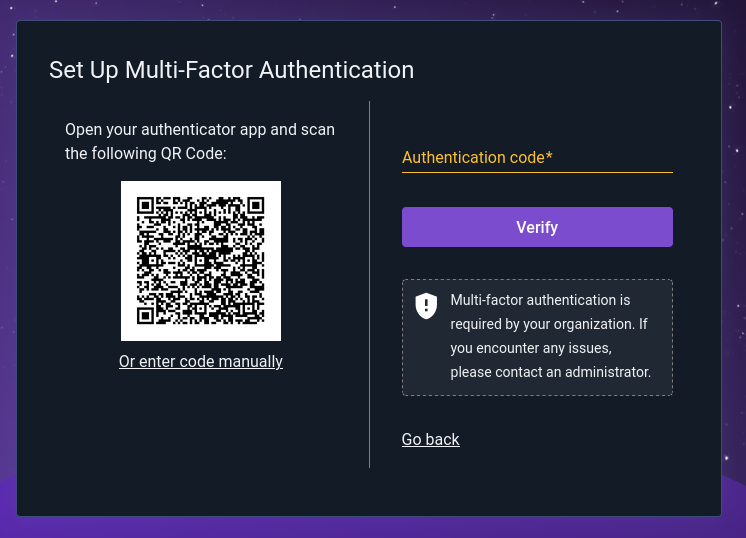
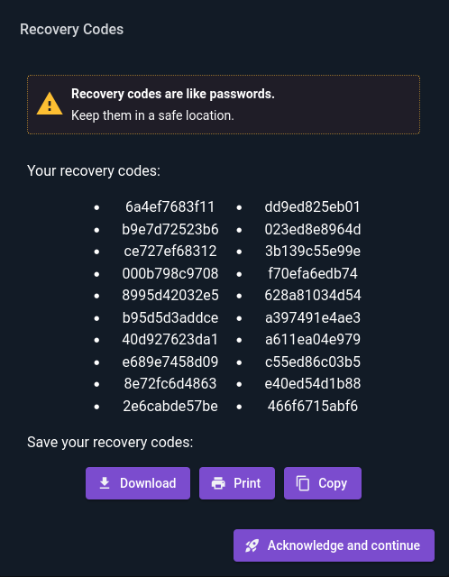
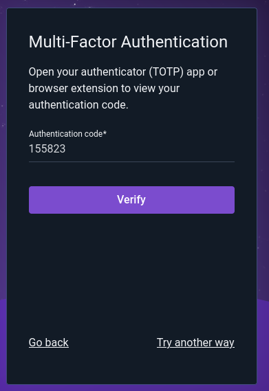
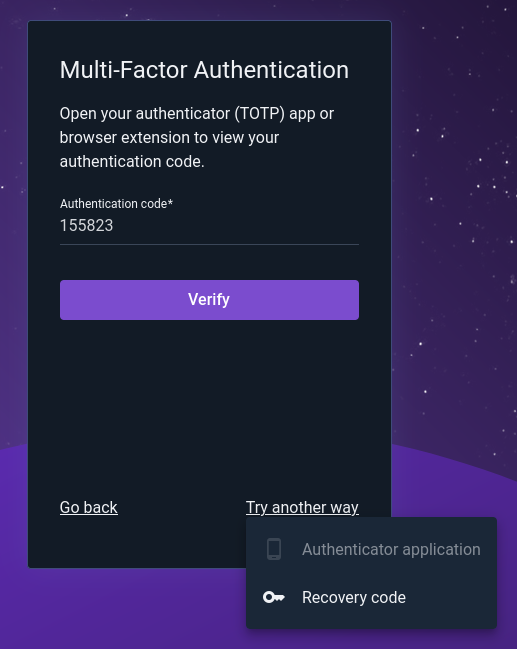
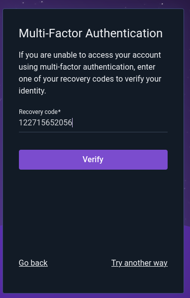
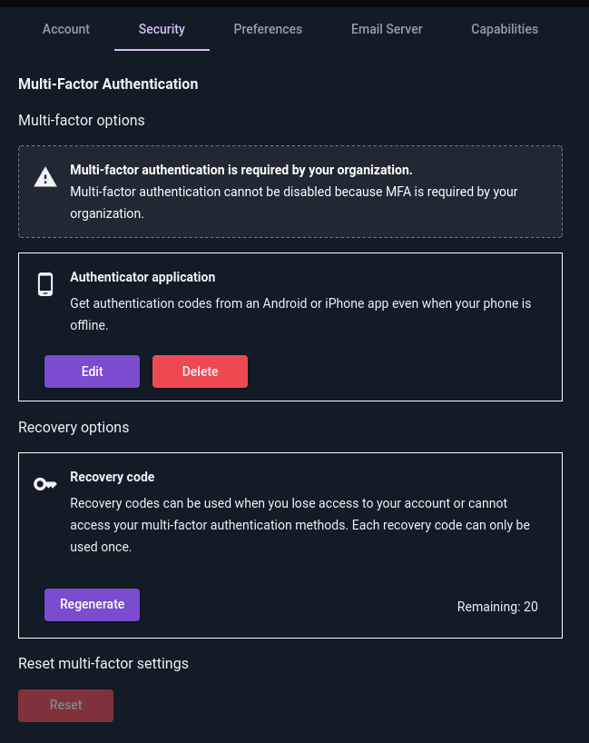
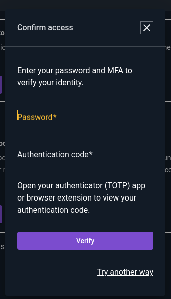
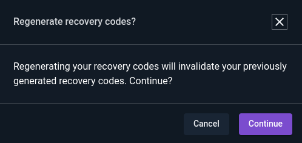
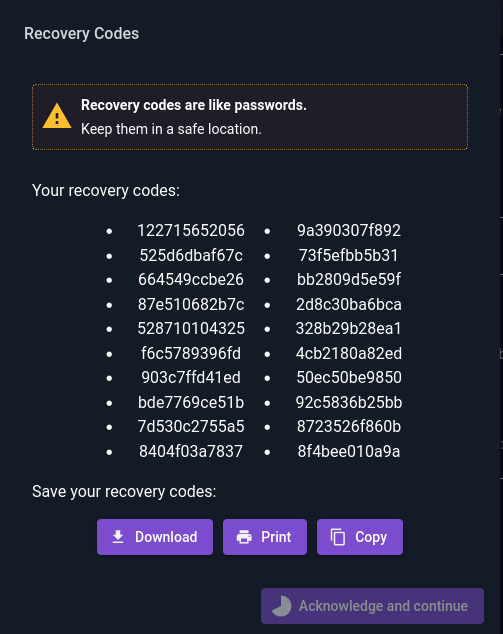
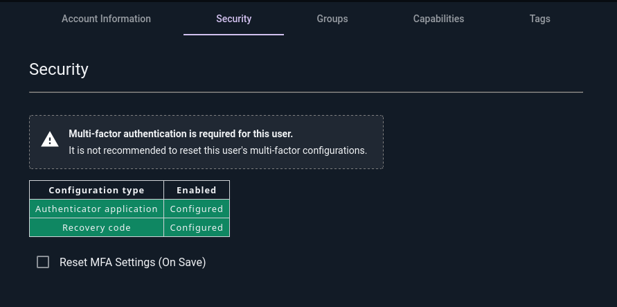

# Multi-Factor Authentication

Gravwell supports Multi-Factor Authentication, also known as Two-Factor Authentication, for added security on local (non-SSO) accounts. When enabled, users must provide their password *and* a valid additional factor (either a [TOTP](https://en.wikipedia.org/wiki/Time-based_one-time_password) "authenticator app" code or a recovery code) to login.

As of Gravwell 5.5.0, any user may choose to enable MFA for their account, or administrators may require it explicitly.

## Requiring MFA

To enable MFA, add the following line to the `[Global]` block of your webserver's `gravwell.conf`:

```
MFA-Required=true
```

Then restart the webserver:

```
sudo systemctl restart gravwell_webserver.service
```

## Configuring MFA

If MFA is required, users will be prompted to set it up the next time they log in:



Those who use authenticator apps on their smartphones can simply scan the QR code to set it up; users of PC-based systems such as KeePassXC will need to click "Or enter code manually" and copy the code into their authenticator program by hand.

Once the authenticator is set up, use it to get a one-time code and enter it into the verification field, then click Verify. Assuming everything was configured correctly, the login process will complete and a list of one-time-use recovery codes will be displayed:



These should be printed or copied to a secure place; they can be used in the future if the user loses access to their authenticator application.

## Logging in with MFA

Once MFA has been configured, logging in will include an additional step. Once the user has entered their username and password, a second dialog will be displayed prompting for an authentication code. By default, it will expect a code from the authentication app:



Clicking "Try another way" gives a menu of other MFA options the user may try:



If "Recovery code" is selected, the user will then be prompted to enter one of the single-use recovery codes generated during MFA setup:



## Modifying MFA Configuration

The Security tab of the user account page provides options for setting up or modifying MFA configurations:



In the screenshot above, a notification informs the user that at least one form of MFA is required. The user is allowed to delete the authenticator application (TOTP) configuration, because they still have 20 remaining recovery codes -- although this is not a good idea, it is permitted to log in using recovery codes each time.

If MFA is not *required*, the user may click the Reset button to disable all forms of MFA on their account.

### Reconfiguring Auth App (TOTP)

Clicking "Edit" on the Authenticator Application section will first prompt the user to re-authenticate for security:



Then the auth application configuration dialog will be shown again:


```{note}
Entering this dialog generates a *new* secret key for TOTP authentication. If you complete the process, any previously-configured authentication apps will stop working. Clicking "Go back" will cancel the process and preserve any existing configurations.
```

### Regenerating Recovery Codes

Clicking "Regenerate" on the Recovery Codes section will first prompt the user to make sure they wish to regenerate their codes:



Then it will require the user to fully authenticate themself for security:


Once the user authenticates, a new set of recovery codes will be generated and displayed to the user:



## Admin Actions

Administrators can reset a user's MFA configuration from the Security tab of the user editor (found under the Administrator > Users menu):



Selecting the checkbox and clicking "Save" on the page will fully reset the user's MFA configuration. If MFA is required on the system, the user will be prompted to reconfigure MFA at their next login.

```{note}
In general, it is best to let users manage their own MFA configuration, but an administrative reset may be necessary if a user loses their recovery codes and cannot log in.
```
