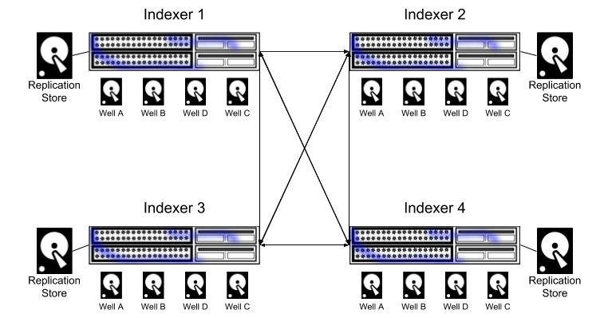
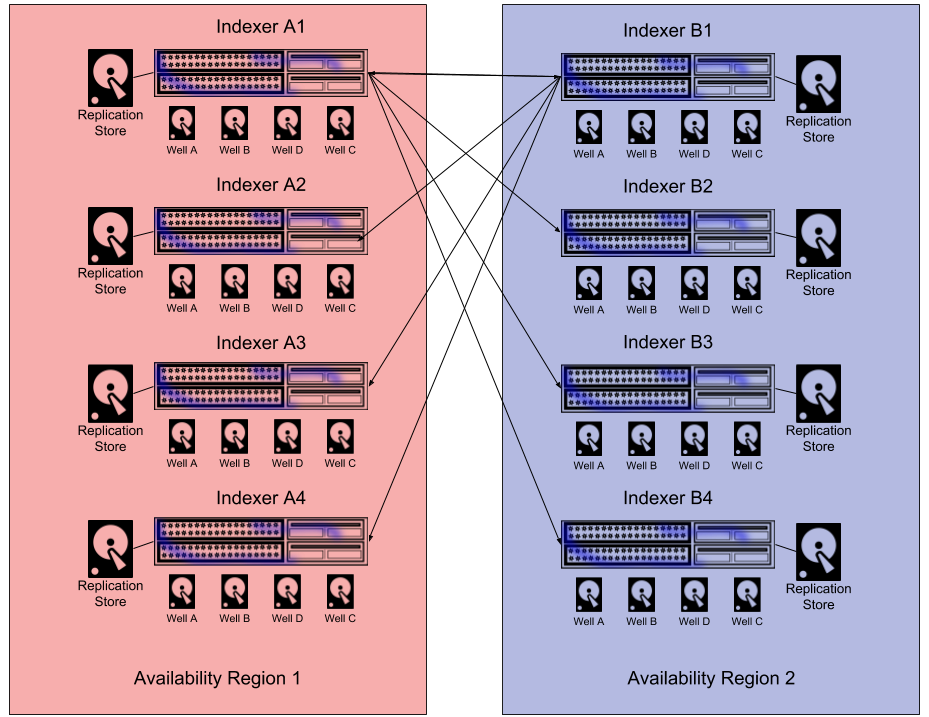
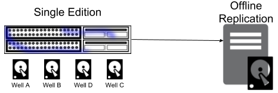

# データレプリケーション（データ複製）

レプリケーション機能はすべてのGravwell Cluster Editionライセンスに含まれており、この機能によって耐障害性を持つ可用性の高いデプロイができるようになっています。Gravwellレプリケーションエンジンは、自動フェイルオーバー、負荷分散されたデータ分配、および圧縮により、分散インデクサー間のデータレプリケーションを透過的に管理します。また、Gravwellは、どのウェルをレプリケーションに含めるか、およびデータをピア間でどのように分散させるかという制御についても、きめ細かく調整できるようになっています。お客様は、均一なデータ分布を持つGravwellクラスタを迅速に展開したり、地域を考慮したピア選択を使用してデータセンター全体の障害に耐えられるレプリケーションスキームを設計したりすることができます。また、オンライン・フェイルオーバー・システムは、一部のインデクサーがオフラインの場合でもデータへの継続的なアクセスを可能にします。

注意: Gravwellのレプリケーションシステムは、純粋にインジェストされたデータをレプリケートするために設計されています。ユーザーアカウント、ダッシュボード、検索履歴、リソースなどのインデクサーではなくウェブサーバーに保存されている情報のバックアップは行われせん。ウェブサーバーに復元性を持たせるには、[データストア](#!distributed/frontend.md)をウェブサーバーにデプロイし、ウェブサーバーのデータの冗長化用ライブコピーを保存することを検討してください。

レプリケーションシステムは論理的には「クライアント」と「ピア」に分かれており、各インデクサーはピアとクライアントの両方のどちらの役割を担う可能性もあります。クライアントの役割は、既知のレプリケーションピアにアクセスし、レプリケーショントランザクションを実行することです。レプリケーションモードでGravwellクラスタをデプロイする場合、インデクサーは全て、レプリケーションストレージノードとして動作するどのピアへのTCP接続を開始できるようにすることが重要です。

レプリケーション接続はデフォルトで暗号化されるので、インデクサーには利用可能な X509 証明書が与えられている必要があります。証明書が有効な証明書局 (CA) によって署名されていない場合は、レプリケーション設定セクションに `Insecure-Skip-TLS-Verify=true` の記述を追加しなければなりません。

レプリケーションストレージノード（レプリケートされたデータを受信するノード）には、特定のストレージ量が割り当てられており、そのストレージを使い切るまでデータ削除されることはありません。通常のエイジアウトの一環としてリモートクライアントノードがデータを削除した場合、データシャードは削除されたものとしてマークされ、レプリケーションノードがストレージの上限に達した際の削除の順位が付けられます。レプリケーションシステムでの削除順位は、最初が削除されたシャード、２番目がコールドシャード、最後が最も古いシャードです。すべてのレプリケーションデータは圧縮されます。コールドストレージの場所が提供されている場合、通常、レプリケーションストレージの場所はコールドストレージとホットストレージを合わせたストレージ容量と同じ容量にすることが推奨されます。

注意: 999MBを超えるエントリは、**レプリケートされません**。これらのエントリは通常通りインジェストされ、検索することもできますが、レプリケーションからは除外されます。

## 基本的なオンラインデプロイ

最も基本的なレプリケーションデプロイは、すべてのインデクサーが他のすべてのインデクサーに対してレプリケートできる対等配置です。対等配置は、各インデクサー設定のReplication Peer フィールドに他のすべてのインデクサーを記述することで設定されます。



### 設定例

3 つのインデクサー (192.168.100.50, 192.168.100.51, 192.168.100.52) がある場合の、192.168.100.50 のインデクサーの設定は以下のようになります:

```
[Replication]
	Peer=192.168.100.51
	Peer=192.168.100.52
	Storage-Location=/opt/gravwell/replication_storage
	Insecure-Skip-TLS-Verify=true
	Connect-Wait-Timeout=60
```

各ノードの設定について、他の全ノードを、`Peer` フィールドに指定してください。

## リージョンを意識したデプロイ

レプリケーションシステムは、インデクサーがどのピアにデータのレプリケーションを許可するかをきめ細かく調整して設定できます。レプリケーション・ピアを管理することによって、アベイラビリティリージョン（可用性リージョン）群を設定し、非停止リージョンにまで連鎖的なデータ喪失が広がることさえなければ、データを失うことなくリージョン単位でオフラインにすることができるようにできます。



### 設定例

例えば、8ノードのクラスタを2つのアベイラビリティゾーン(1と2)に分割することにしたとします。そして、アベイラビリティゾーン1には172.16.2.0/24のサブネットを与え、アベイラビリティゾーン2が172.20.1.0/24のサブネットを与えることにします。

リージョン1のノードは、リージョン2にレプリケートするように設定します:

```
[Replication]
	Peer=172.20.1.101
	Peer=172.20.1.102
	Peer=172.20.1.103
	Peer=172.20.1.104
	Storage-Location=/opt/gravwell/replication_storage
	Connect-Wait-Timeout=60
```

リージョン2のノードは、リージョン1にレプリケートするように設定します:

```
[Replication]
	Peer=172.16.2.101
	Peer=172.16.2.102
	Peer=172.16.2.103
	Peer=172.16.2.104
	Storage-Location=/opt/gravwell/replication_storage
	Connect-Wait-Timeout=60
```

## オフラインレプリケーションのデプロイ

レプリケーションは、標準のSingle Edition Gravwellライセンスには含まれていません。お客様の組織がGravwellのマルチノード展開を必要としないが、管理バックアップのためのレプリケーションエンジンへのアクセスを希望する場合は、<sales@gravwell.io>に連絡して、Single EditionライセンスをレプリケーションSingle Editionライセンスにアップグレードしてください。シングルエディションのレプリケーションは完全にオフラインです。つまり、インデクサー機能がオフラインになった場合、インデクサーがオンラインに戻ってリカバリーが完了するまでデータを検索することができません。



Cluster EditionのGravwellライセンスでは、オフラインレプリケーターを使用してオフラインレプリケーション構成を実装することを選択できます。オフラインレプリケータは、レプリケーションピアとしてのみ機能し、自動フェイルオーバーやインデクサーとしては機能しません。オフラインレプリケーション構成は、ストレージシステムがすでに冗長ストアによってバックアップされていて、データ損失が極めて起こりにくいクラウド環境で有用です。オフラインレプリケーション構成を使用することで、インデクサーとして機能しない非常に低コストのストレージプールに接続された低コストのインスタンスにデータをレプリケートすることができます。万が一、インデクサーが完全に失われた場合でも、低コストのレプリケーション・ピアは、より高コストのインデクサー・インスタンスを復元することができます。オフラインレプリケーションパッケージへのアクセスについては、<sales@gravwell.io>までお問い合わせください。


## 設定オプション

レプリケーションは、gravwell.conf設定ファイルの "Replication" 設定グループによって制御されます。レプリケーション設定グループには、以下の設定パラメーターがあります。

| パラメーター | 設定例 | 内容 |
|:----------|:--------|------------:|
| Peer      | Peer=10.0.0.1:9406 | レプリケーションストレージノードとして動作するリモートシステムを指定します。複数のピアを指定できます。|
| Listen-Address | Listen-Address=10.0.0.101:9406 | レプリケーションシステムがバインドするアドレスを指定します。デフォルトでは、すべてのアドレスのTCP ポート 9406 をリッスンします。|
| Storage-Location | Storage-Location=/mnt/storage/gravwell/replication | レプリケーションストレージに使用するフルパスを指定します。|
| Max-Replicated-Data-GB | Max-Replicated-Data-GB=4096 | レプリケーションシステムが消費する最大ストレージ量を指定します。例では4GBに設定されています。|
| Replication-Secret-Override | Replication-Secret-Override=replicationsecret | レプリケーションピアへの接続を確立する際に使用される認証トークンをこの設定値で上書きします。この設定がなされてないデフォルトでは、グローバル設定グループの「Control-Auth」トークンが使用されます。|
| Disable-TLS | Disable-TLS=true | レプリケーションピア間の TLS 通信を無効にします。デフォルト値は false (TLS 有効) です。|
| Insecure-Skip-TLS-Verify | Insecure-Skip-TLS-Verify=true | TLS 公開鍵の検証および有効化を無効にします。TLS 通信はまだ有効ですが、システムはピアから提示された公開鍵を無条件に受け入れます。|
| Key-File | Key-File=/opt/gravwell/etc/replicationkey.pem | レプリケーション接続のネゴシエーションに使用される X509 秘密鍵をこの設定値で上書きします。この設定がなされてないデフォルトでは、TLS 接続はグローバルキーファイルを使用します。|
| Certificate-File | Certificate-File=/opt/gravwell/etc/replicationcert.pem | レプリケーション接続のネゴシエーションに使用される X509 公開鍵証明書をこの設定値で上書きします。この設定がなされてないデフォルトでは、TLS 接続はグローバル証明書ファイルを使用します。|
| Connect-Wait-Timeout | Connect-Wait-Timeout=30 | 起動時にレプリケーションピアに接続しようとするときに、インデクサーが待つべき秒数を指定します。|
| Disable-Server | Disable-Server=true | インデクサーレプリケーションサーバーを無効にし、クライアントとしてのみ動作するようにします。これはオフラインレプリケーションを使用する場合に重要です。| 
| Disable-Compression | Disable-Compression=true | レプリケートされたデータのストレージの圧縮を無効にします。|
| Enable-Transparent-Compression | Enable-Transparent-Compression=true | レプリケートされたデータのためにホストファイルシステムを使用する際に透過的な圧縮を有効にします。|

## レプリケーションエンジンの動作仕様Replication Engine Behavior

用いられているレプリケーションエンジンは、インジェストと検索への影響を最小限に抑えるように設計されたベストエフォート方式の非同期レプリケーションとリストアシステムです。レプリケーションシステムは、タイムリーな割り当てと配布に重点を置いたベストエフォートなデータ配布を試みます。これは、シャードが先着順に割り当てられることを意味し、以前の配布に基づいたガイダンスがあることを意味します。システムは完全に一様なデータ分散をするわけではなく、高いスループット（帯域幅、ストレージ、CPUのいずれか）を持つレプリケーションピアの方が、スループットの低いピアよりも大きなレプリケーション負荷がかかる可能性があります。データレプリケーションをサポートすることを目的としたGravwellクラスタトポロジーを設計する際には、予期せぬバーストや完全に均一ではないデータ分布になることに対応できるように、レプリケーションストレージを10～15%オーバープロビジョニングすることをお勧めします。

レプリケーションエンジンは、タグと実際のエントリという2つのコアデータのバックアップを保証します。表記可能なタグ名とストレージIDの対応マッピングは、各インデクサーが独立して管理しており、効果的な検索を行うために重要です。タグから名前へのマップは比較的小さいため、各インデクサーはそのマップ全体を他の全てのレプリケーションピアにレプリケートします。一方、データは一度しかレプリケートされません。

レプリケーションは、データのエージアウト、マイグレーション、およびウェル分離と連携するように設計されています。インデクサーがデータをコールドストレージプールにエイジアウトしたり、完全に削除したりすると、リモートストレージピア上でもそのデータ領域についてはコールドストレージにエイジアウト、あるいは、削除されたとしてマークされます。リモートストレージピアは、どのデータを保持するか、あるいはノード障害時にどのデータをリストアするかを決定する際に、削除、コールドストレージ、およびシャードエイジのマークを使用します。データがインデクサーによって削除されたとマークされている場合、インデクサーが故障してレプリケーション経由で回復した場合、データはリストアされません。以前にコールドとマークされていたデータは、復元時にコールドストレージプールに直接戻されます。というのも、レプリケーションを使用して復旧する際には、インデクサーは障害前の状態と全く同じ状態に復元する必要があるからです。

### ベストプラクティス

高可用性の Gravwell クラスタの設計とデプロイは、下に示すいくつかの基本的なベストプラクティスを守っていれば、非常にシンプルです。以下のリストは、Gravwellクラスタインスタンスをデプロイして回復する際に、すべてのGravwell管理者が従うべきガイドラインを示しています。

1. `Indexer-UUID` はインデクサーのグローバルIDを表しています。このIDはノードを運用する限り維持され続けられ、障害が発生した後にも適切に復元されなければなりません。障害が発生したインデクサーが、以前に使用していたUUIDとは異なるUUIDを与えられてしまった場合、そのインデクサーはレプリケーションクラスタ内の完全に新しいメンバーとして解釈され、以前のデータはリストアされません。インデクサーが致命的な障害に見舞われた場合に備えて、安全な場所にインデクサーのUUIDを記録しておくことをお勧めします。
2. ウェルの設定を変更すると、レプリケーションの状態に影響を与える可能性があります。ウェルを追加したり削除したりすることは問題ありませんが、*障害発生後*、かつ、*復旧前*にウェルの設定を変更すると、レプリケーションエンジンが適切にデータを復旧できなくなります。
3. インデクサーの障害が発生した場合、新しいデータをインジェストするよりも前に、レプリケーションピアとの接続を確立し、第一レベルのタグの同期を実行できるようにすることが極めて重要です。設定パラメーター `Connect-Wait-Timeout` をゼロに設定し、レプリケーション接続を確立してタグの復元が完了するまでは、障害発生したインデクサーが動かないようにするのが良いでしょう。
4. レプリケーションのStorage Location（ストレージロケーション）は、レプリケーションシステム一つ一つに対して、それぞれ専用に確保されるべきです。例えば、複数のインデクサーの `Storage-Location` に同じネットワークに接続されたストレージロケーションを使用してしまうと、レプリケーションの失敗やデータの破損の原因となります。
5. レプリケートされたデータとプライマリデータの圧縮方式を一致させてください。インデクサーでホストベースの透過圧縮を使用している場合は、レプリケーションストアでもその圧縮方式を同一にするのが最善です。インデクサーとレプリケーションピアの間で圧縮スキームが一致していれば、復元プロセスは劇的に速くなります。

## トラブルシューティング

Potential problems and solutions when debugging a replication problem
レプリケーションに起こりがちな問題と、問題の切り分け方法と解決方法

#### 障害が発生した後、インデクサーがデータをリストアしない
インデクサーが復帰したときに、インデクサーが障害前と同じ `Indexer-UUID` の値を維持していることを確認してください。UUID の値が変わっていた場合は、元の値に戻し、その後インデクサーがすべてのデータをリストアするのに十分な時間をとってください。インデックスアのUUIDを変更した後の復元には、レプリケーションシステムが2つの異なるデータストアをマージするため、通常よりかなり多くの時間が必要となる可能性があります。

#### レプリケーションの保存場所にデータが表われない
すべてのレプリケーションピアが共通の `Control-Auth` (または `Replication-Secret-Override`) 値を持っていることを確認してください。ピアがお互いに認証できない場合、データの交換は行われません。

X509 証明書が、ホストシステム上の鍵ストアで信頼されている有効な認証局 (CA) によって署名されていることを確認してください。証明書ストアが有効でない場合は、公開鍵をホストマシンの証明書ストアにインストールするか、`Insecure-Skip-TLS-Verify` オプションを使用して TLS の検証を無効にしてください。

注意: `Insecure-Skip-TLS-Verify` を使って TLS 検証を無効にすると、レプリケーションが中間者攻撃に晒されてしまう可能性があります。攻撃者は通信区間に介入してデータを変更したり、ログを破損させたり、レプリケートされたデータにある活動履歴を隠したりする可能性があります。

ファイアウォールルールやルーティングACLをチェックして、インデクサーが指定されたポートで互いに通信できるようにしてください。

#### 障害発生後、タグのマージに失敗してインデクサーが起動しない
インデクサーが障害後にタグマッピングを復元する前にインデクサーがインジェストを開始した場合、レプリケーションノード上のタグマップがマージできない状態になる可能性があります。タグがマージできないというエラーが発生した場合は、障害が発生したノードを手動で復元するための支援を受けるために、<support@gravwell.io>に連絡してください。
 
#### 障害発生後、インデクサーにデータ全てはリストアされなかった
ストレージ・パフォーマンスの低下、ネットワーク・パフォーマンスの低下、またはレプリケーション・ノードのストレージ障害により、レプリケーション・ピアのレプリケーション処理がインデクサーでのデータ処理に追いつけなかった可能性があります。レプリケーションピアがインジェストされるデータ処理に追いつくために十分な帯域幅とストレージ容量を確保していることを確認してください。ストレージノードが毎秒数百メガバイトでインジェストしている場合でも、レプリケーションピアは同じ速度でデータを計算、転送、保存することができなければなりません。

また、レプリケーションピアに十分なストレージがあることを確認してください。ストレージノードが10TBのコールドデータと1TBのホットデータを保存するように構成されている場合、レプリケーションピアは少なくとも11TBのデータを保存することができるようにしなければなりません。レプリケーションノードが過負荷だったり、設定が間違っていたりした場合、古いデータが削除されてしまう可能性があります。

レプリケーションノードと全インデクサーのシステム時刻が一致していることを確認してください。どちらのシステムも自システムの時刻を参照して、データ削除してよいかどうかの判断をします。どれかのインデクサーのシステム時刻が正しくない場合、レプリケーション・ピアがストレージを使い果たした場合に、そのインデクサーのデータが優先的に削除されることになりえます。
