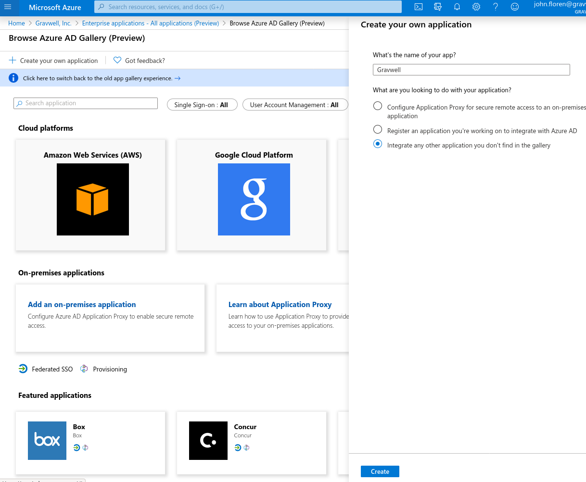
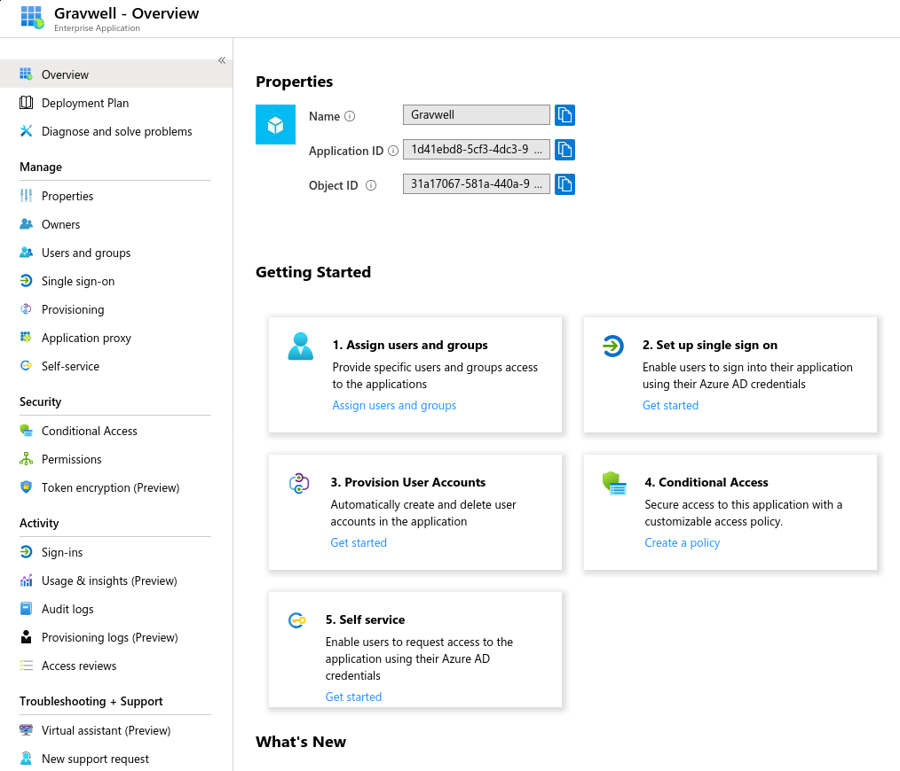
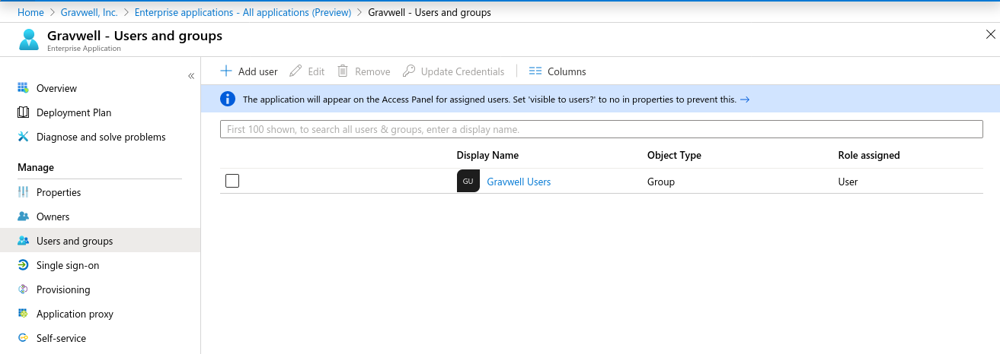
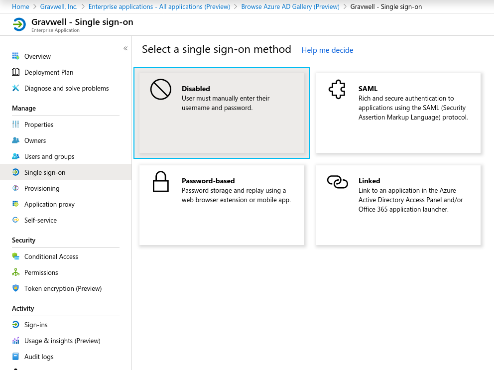
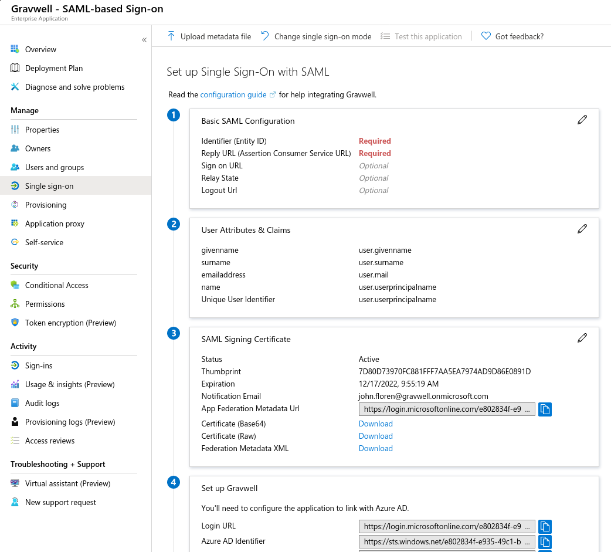
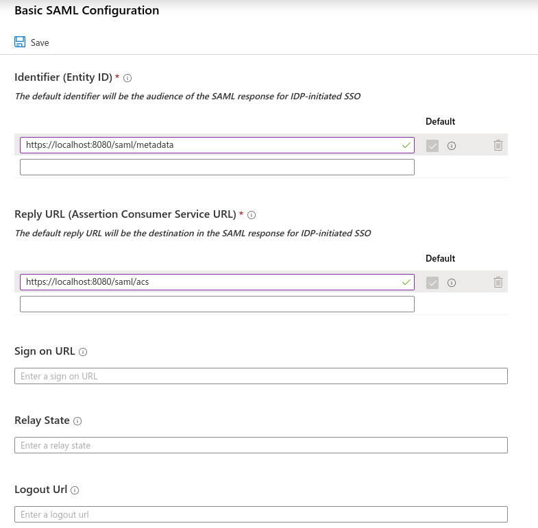
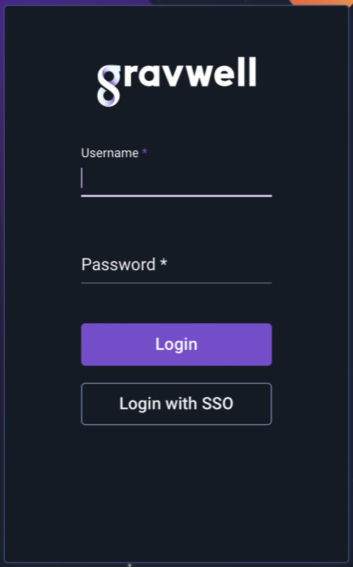
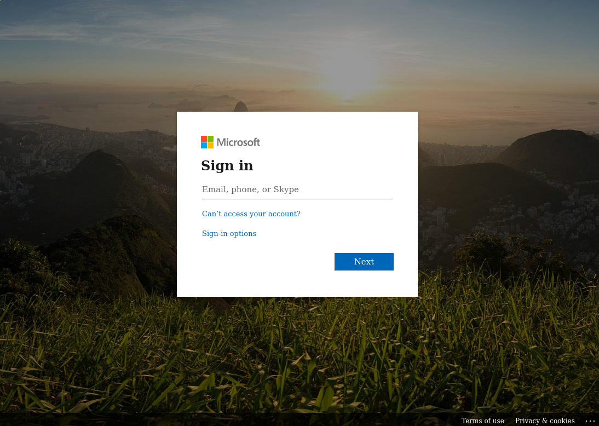

# Azure ActiveDirectoryのSSOの構成

MicrosoftのAzureActive Directoryサービスは、クラウドベースの認証とシングルサインオンを提供します。Gravwellは、認証のためにAzureADと統合できます。実際、これはセットアップが最も簡単なSSOサービスの1つです。

Gravwell用にAzureAD SSOをセットアップするには、次のものが必要です。

* エンタープライズアプリケーションとSSOの作成を可能にするAzureプレミアムライセンスまたは同等のもの（ニーズについては、マイクロソフトの営業担当者にお問い合わせください）。
* [TLS証明書とHTTPS](#!configuration/certificates.md)で構成されたGravwell Webサーバーです。

必要に応じて、追加のGravwell SSO構成情報が [ここ](#!configuration/sso.md)にあります。

注：このドキュメントでは、GravwellウェブサーバーのURLは `https://gravwell.example.com/`であると想定しています。

## Azureでアプリケーションを作成する

Azureで"Enterprise Application"を作成することにより、Gravwellの認証を管理します。 Azure Active Directoryコンソール内で、"Enterprise Applications"を選択し、"New Application" ボタンを選択します。


新しい画面が開き、新しいアプリケーションを作成するためのオプションが表示されます。 左上の"Create your own application"を選択し、表示されるフォームに入力します。



"Create"をクリックすると、新しく作成されたアプリケーションの管理ページが表示されます。



まず、"Assign users and groups" を選択し、Gravwellへのログインを許可するユーザーまたはグループを選択します。物事を単純にするために、"Gravwell Users"グループを作成することをお勧めします。



次に、左側のメニューで"Single sign-on"を選択し、表示される画面でSAMLを選択します。



SAML構成画面が表示されます。



 "Basic SAML Configuration" カードの鉛筆アイコンをクリックします。 "Identifier"フィールドと"Reply URL"フィールドに入力する必要があります。"Identifier"は、GravwellサーバーのメタデータファイルのURLである必要があります。`https://gravwell.example.com/saml/metadata`."Reply URL"は、GravwellのSSO返信URLになります。例：`https://gravwell.example.com/saml/acs`：



基本構成を保存します。メインのSAML構成画面に戻り、"App Federation Metadata URL"という名前のフィールドを見つけてそこに含まれているURLをコピーします。`https://login.microsoftonline.com/e802844f-e935-49c1-ba4e-b42442356fe1/federationmetadata/2007-06/federationmetadata.xml?appid=1d41efd8-5cf3-4ac3-9ad3-e3874f48cadc`のようになりますが、 URLのUUIDは異なります。

## Gravwellを構成する

Webサーバーで`gravwell.conf`を開き、SSOセクションを作成します。

```
[SSO]
	Gravwell-Server-URL=https://gravwell.example.org
	Provider-Metadata-URL=https://login.microsoftonline.com/e802844f-e935-49c1-ba4e-b42442356fe1/federationmetadata/2007-06/federationmetadata.xml?appid=1d41efd8-5cf3-4ac3-9ad3-e3874f48cadc
	Common-Name-Attribute=http://schemas.microsoft.com/identity/claims/displayname
	Username-Attribute=http://schemas.xmlsoap.org/ws/2005/05/identity/claims/name
```

`Gravwell-Server-URL`をGravwellウェブサーバーを指すように変更し（これは必要に応じてIPアドレスにすることができます）、`Provider-Metadata-URL`を前のセクションでコピーした「AppFederationMetadataURL」に設定します。他の2つのパラメーターはそのままにしておくことができます。

重要： `Provider-Metadata-URL`オプションを設定する必要があります。 与えられたものは無効であり、例としてのみ機能します。

次に、Gravwell Webサーバーを再起動します（`systemctl restart gravwell_webserver.service`）戻ってくるはずです。そうでない場合は、構成のタイプミスを確認し、`/dev/shm/gravwell_webserver.service` および `/opt/gravwell/log/web/` でエラーを確認してください。

## SSOをテストします

Gravwellを再起動すると、ログインページに[Login withSSO]ボタンが表示されます。



クリック；Microsoftのログインページに移動する必要があります。



Gravwellアプリケーションにアクセスするために設定したユーザーの1人としてログインします。ログインが完了すると、Gravwell Webサーバーにリダイレクトされ、Azureユーザーと同じユーザー名のユーザーとしてログインする必要があります。

## グループに関する注意事項

Gravwellは、[メインのSSOページでドキュメント化されています](#!configuration/sso.md)のように、グループを自動的に作成し、これらのグループにSSOユーザーを追加することができます。アプリケーションのUser Attributes & Claims構成ページで「Add a group claim」をクリックすることで、グループでクレームを送信するようにAzure ADを構成することができます。


グループを有効にするには、どの属性にグループのリストが含まれているかをGravwellに伝え、AzureグループID(UUIDとして送信される)からGravwellで希望するグループ名へのマッピングを指定する必要があります。Azure Object ID = dc4b4166-21d7-11ea-a65f-cfd3443399eeで「gravwell-users」という名前にしたいグループがある場合、これをgravwell.confのSSOセクションに追加する必要があります。

```
	Groups-Attribute=http://schemas.microsoft.com/ws/2008/06/identity/claims/groups
	Group-Mapping=dc4b4166-21d7-11ea-a65f-cfd3443399ee:gravwell-users
```
