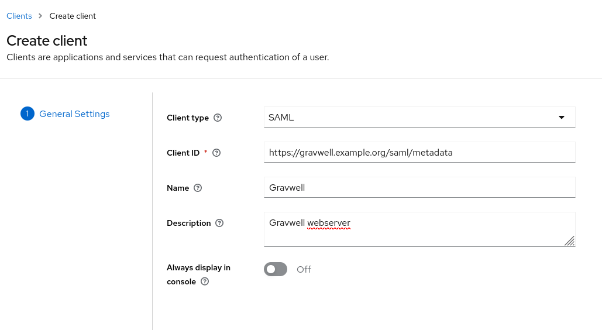
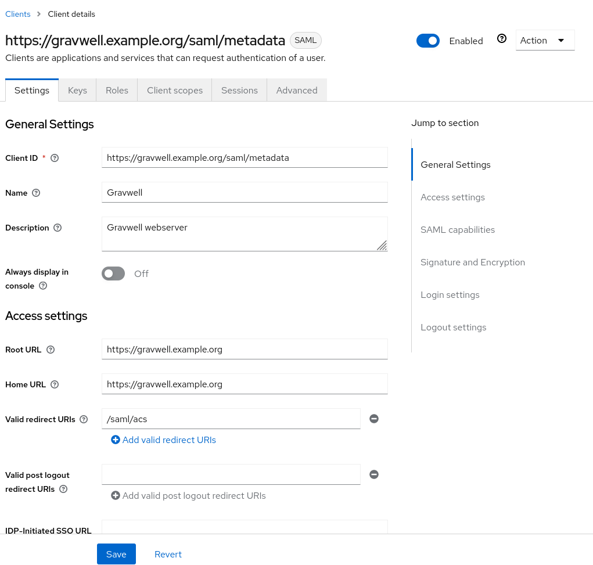
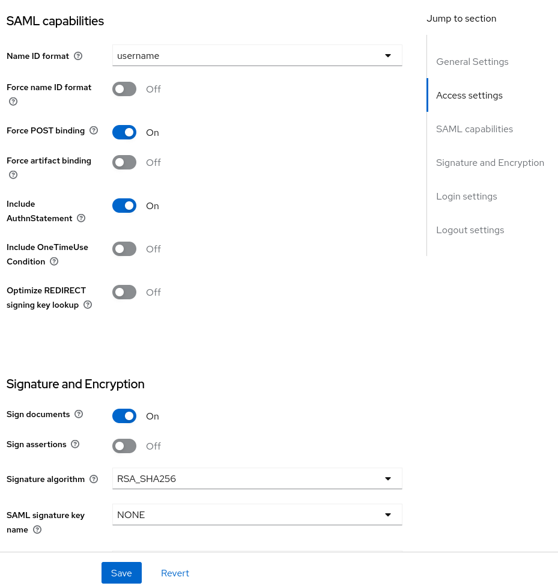
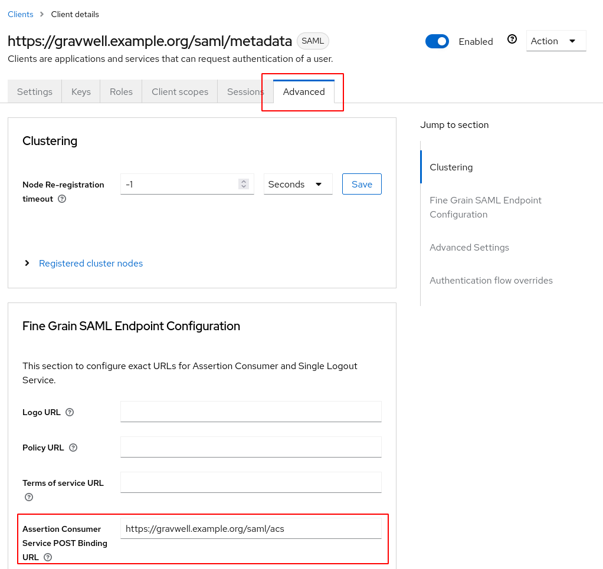
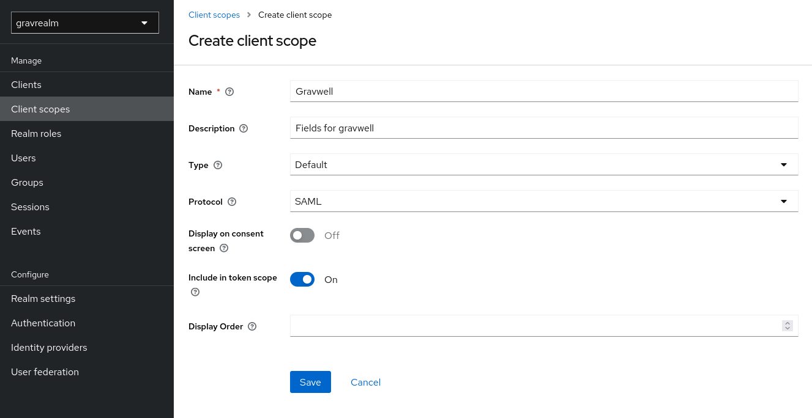
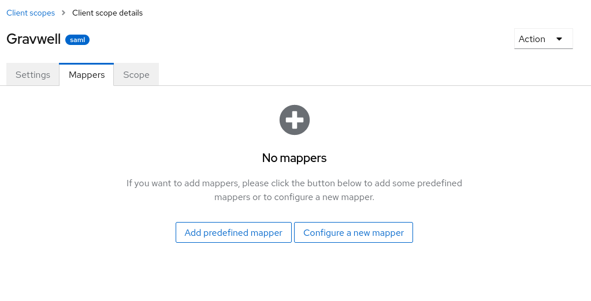
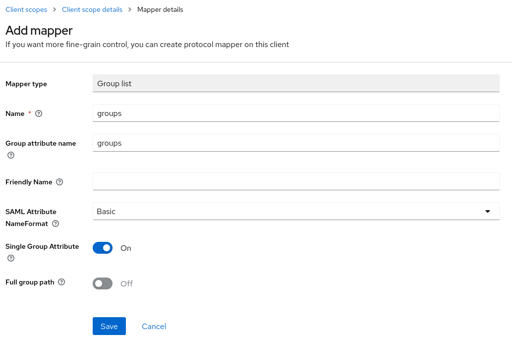
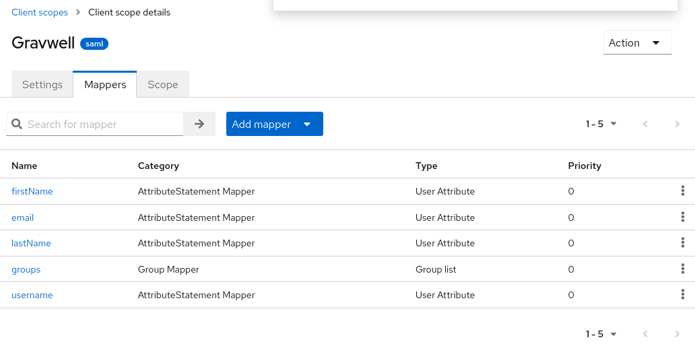
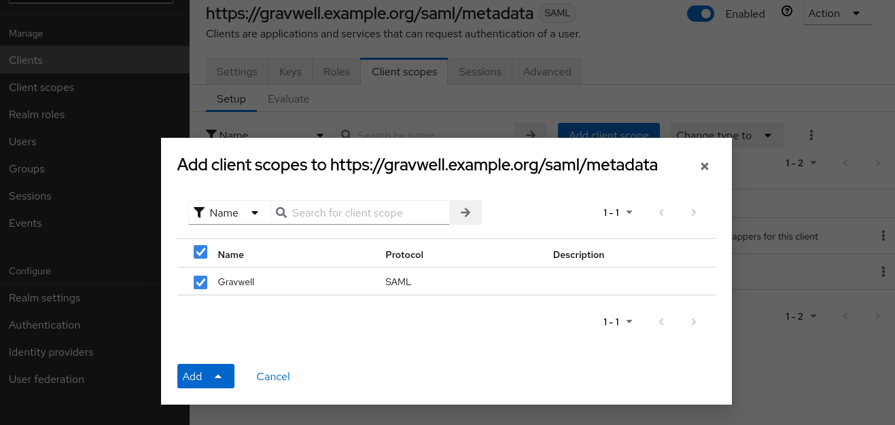

# Configuring Keycloak SSO with Gravwell

Keycloak is an open-source single sign-on product which can be integrated with Gravwell for user authentication. Installing Keycloak is outside the scope of this document, but once you have Keycloak running, you can use these instructions to set it up for Gravwell.

In this document, we assume the following:

* The Keycloak server is listening at https://keycloak.example.org:8443 and is running Keycloak 20 or later.
* The Keycloak admin has created a realm named "gravrealm"
* The Gravwell server can be accessed at https://gravwell.example.org

## Set up Gravwell configuration block

On the system running the Gravwell webserver, create a file named `/opt/gravwell/etc/gravwell.conf.d/sso.conf` and paste the following into it:

```
[SSO]
	Gravwell-Server-URL=https://gravwell.example.org
	Provider-Metadata-URL=https://keycloak.example.org:8443/realms/gravrealm/protocol/saml/descriptor
	#Insecure-Skip-TLS-Verify=true
	Username-Attribute="username"
	Given-Name-Attribute="givenname"
	Surname-Attribute="surname"
	Email-Attribute="email"
	Groups-Attribute="groups"
	Group-Mapping=TestGroup:testgroup
```

The `Gravwell-Server-URL` parameter should contain the URL used to access your Gravwell server.

The `Provider-Metadata-URL` parameter points at the Keycloak server. Note that the URL contains the string `gravrealm`, which is the name of the realm we will use within Keycloak.

If your Keycloak server is using self-signed certificates, you may need to uncomment the `Insecure-Skip-TLS-Verify` parameter.

Note the `Group-Mapping=TestGroup:testgroup` option. This tells Gravwell that users in the Keycloak group named "TestGroup" should be placed into a Gravwell internal group named "testgroup". You can repeat the `Group-Mapping` parameter multiple times to include multiple groups.

The remaining config options tell Gravwell how to map attributes in the SSO request to Gravwell user accounts. These do not need to be modified.

Once you've saved the configuration file, you can restart the Gravwell webserver:

```
systemctl restart gravwell_webserver
```

## Create a Keycloak client

Open the Keycloak admin console web UI and select "Clients" from the menu, then click the "Create client" button. Set the client type to "SAML", then paste `https://gravwell.example.org/saml/metadata` into the Client ID field, changing "gravwell.example.org" to your own Gravwell instance's hostname. Give the client a friendly name and then click save:



After creating the client, you'll be taken to the Client Details page. There are a few more fields to configure here. First, set the Root URL and Home URL fields to `https://gravwell.example.org`. Then add `/saml/acs` to the Valid Redirect URLs list.



Scroll down and make sure "Force Post binding" is enabled, then turn on "Sign assertions":



Finally, scroll back to the top and click the "Advanced" tab, then set the "Assertion Consumer Service POST Binding URL" field to `https://gravwell.example.org/saml/acs`:



```{note}
If your Gravwell webserver is using a self-signed certificate, click the "Keys" tab and turn off the "Client signature required" toggle.
```

## Configure client scope

We must now configure Keycloak to send additional information with each authentication request, so the Gravwell webserver knows which user is being authenticated. In the main menu, select "Client scopes" and click the "Create client scope" button. Populate the wizard with a name like "Gravwell" and a reasonable description, set the type to "Default", and set the protocol to "SAML":



This will create a new scope and put you in a configuration page for the scope. Click the "Mappers" tab, and then click "Configure a new mapper":



A list of mapper types will appear; select "User Attribute". Fill out the form using "firstName" for the Name and User Attribute fields, and "givenname" for the SAML Attribute Name, as shown below:


Repeat this process to create all the following mappers:

| Name | User Attribute | SAML Attribute Name |
|------|----------------|---------------------|
| firstName	| firstName	| givenname |
| email	| email	| email	|
| lastName	| lastName	| surname	|
| username	| username	| username	|

Note that the "SAML Attribute Name" fields correspond to the parameters configured in `sso.conf` on the Gravwell webserver. We are essentially telling Keycloak how to pass attributes to Gravwell in the authorization message.

Finally, click "Configure a new mapper" again and select "Group list", then set the Name and Group attribute name fields to "groups":



When everything is configured, the Mappers tab of the client scope should look like this:



## Add client scope to client

Select "Clients" from the main menu, then click the Gravwell client we created earlier. Click the "Client scopes" tab, then click the "Add client scope" button. From the dialog which appears, select the Gravwell client scope we created in the previous step and click the Add button:



## Restart Gravwell and test login

You should now restart the Gravwell webserver one more time:

```
systemctl restart gravwell_webserver
```

Then go to your Gravwell login screen; you should see the "Login with SSO" button underneath the regular username & password fields. Clicking this button will take you to the Keycloak login page, where you can enter credentials for a valid Keycloak user. This should log you in to Gravwell.
