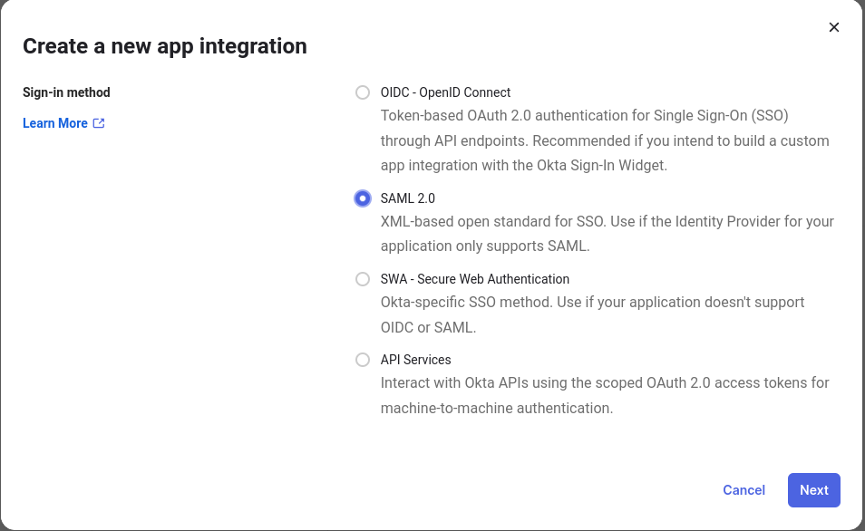
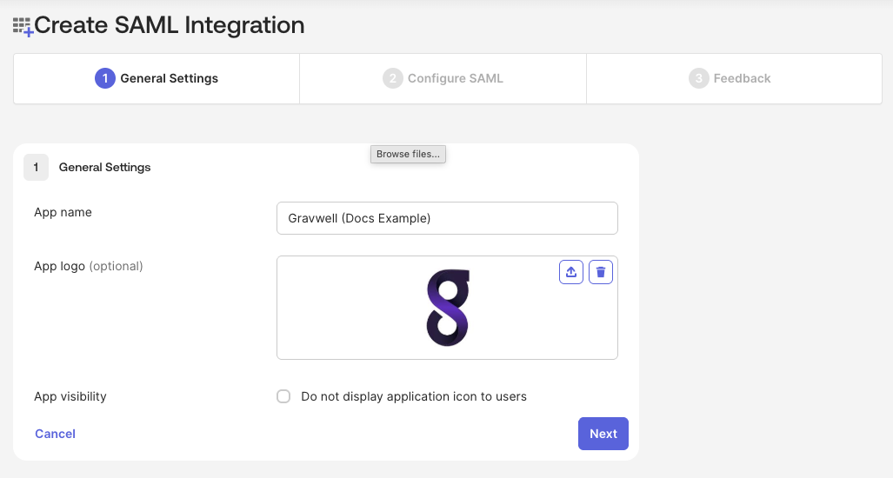
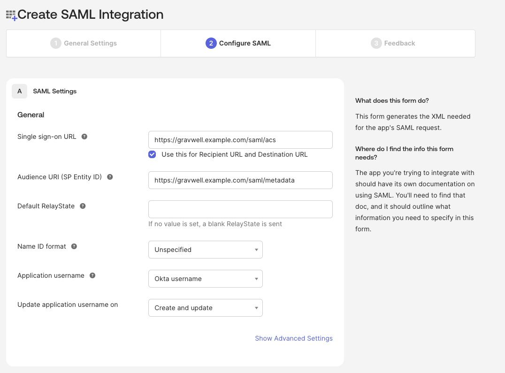
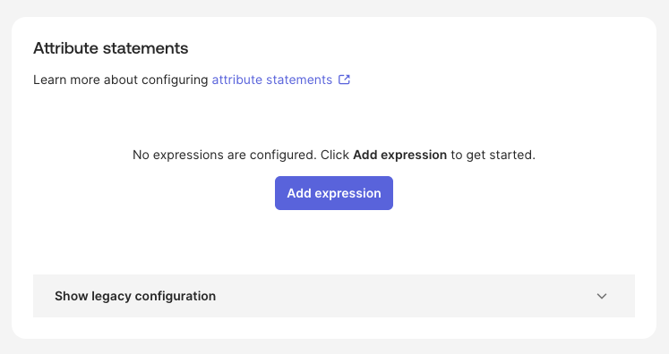
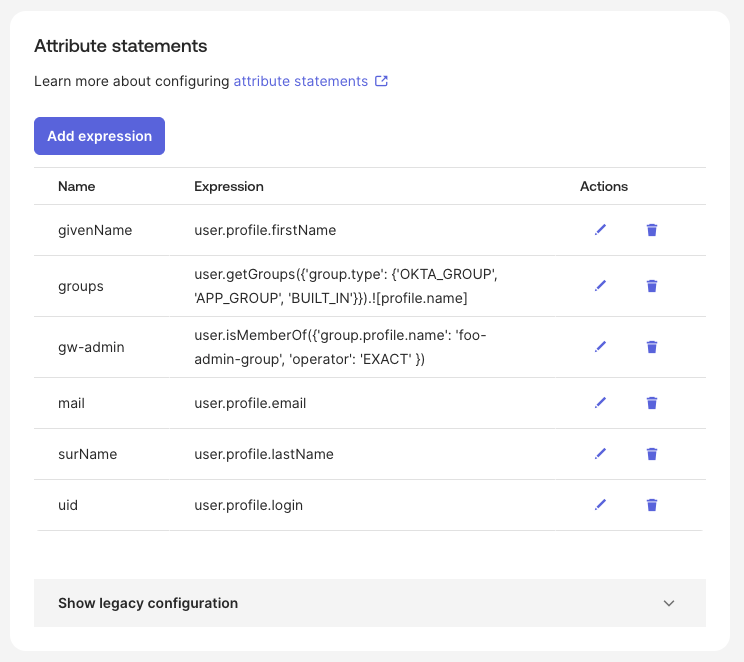
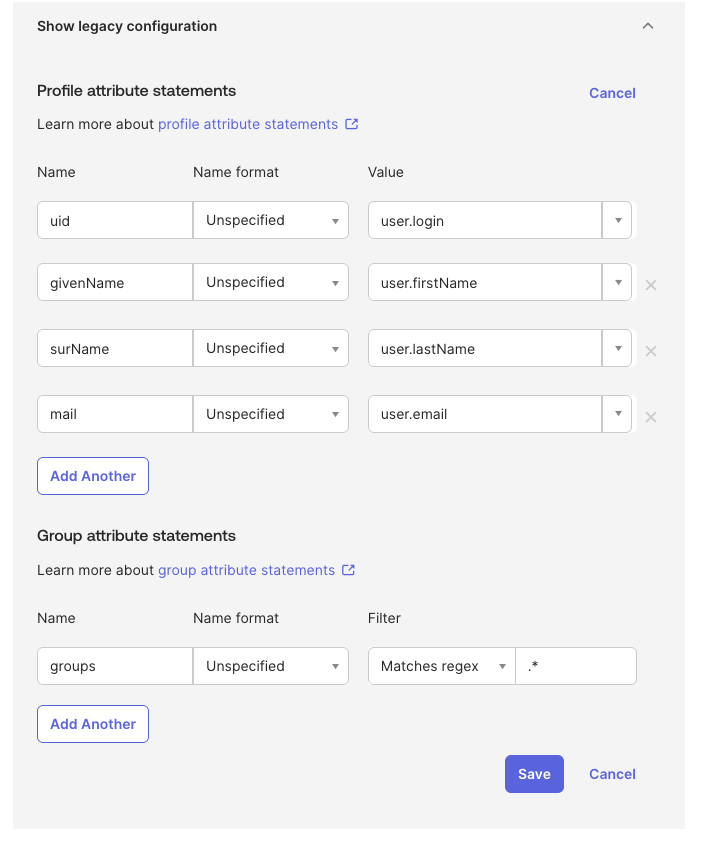
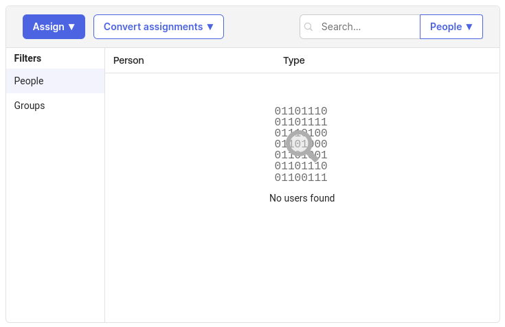
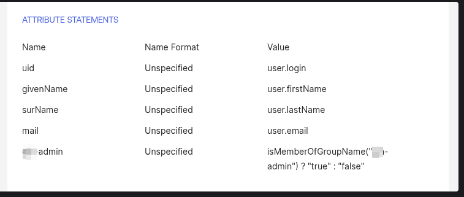

# Configuring Okta SSO with Gravwell

Okta is a managed identity provider that provides cloud hosted identity and authentication services; if your organization uses Okta for identity management, integrating with Gravwell is an incredibly easy process.

In this document, we assume the following:

* The Gravwell instance has a valid DNS name of gravwell.example.com.
* The Gravwell instance is publicly available with valid SSL certificates.
* You are an Okta admin and can establish a new application and assign users to it.

## Creating The Okta Application

The first step is to log into the Okta management console and click on `Applications`, then click `Create App Integration` to begin setting up a Gravwell integration.



Name your SAML 2.0 application and upload an image so that users know what they are interacting with; feel free to grab our logo and use it. Proceed to step 2 (`Configure SAML`).



Make sure to set the appropriate fully qualified URL for your SSO URL and SP Entity ID URL; given the domain of `gravwell.example.com` the appropriate URLs are `https://gravwell.example.com/saml/acs` and `https://gravwell.example.com/saml/metadata`.



Finalize this step and use the defaults for step 3 (`Feedback`).

## Setting Okta SAML Attributes

Next configure Attribute Statements so that user information such as names, email addresses, and groups can be forwarded from Okta to Gravwell.

Locate the newly created application in your list of Okta applications. Open the application and navigate to the `Sign On` tab. Find the `Attribute statements` block.


Configure Okta SAML attributes using either Option A or Option B as described below. The `uid` and `mail` attributes are mandatory, but we suggest adding `givenName` and 
`surName` too. Set the `groups` attribute to select which Okta groups to forward from Okta to Gravwell. Both options (A and B) show how to send **all** groups.



### (Option A) Attribute Statements

Okta's attribute statements have migrated to using the [Okta Expression Language (EL)](https://developer.okta.com/docs/reference/okta-expression-language).
The following example would forward all groups from Okta and grant admin access to members of Okta group `foo-admin-group`.



### (Option B) Legacy Configuration

If you do not want to use EL for SAML attributes, you can still use Okta's legacy configuration as follows.



## Okta App Assignments

Next go to your Okta application and assign people and groups to the application to allow sign-on access to Gravwell.



## Set up Gravwell configuration block

You will need the metadata URL provided in the Gravwell Okta app -> `Sign On` tab -> `Metadata URL` block.

On the system running the Gravwell webserver, create a file named `/opt/gravwell/etc/gravwell.conf.d/sso.conf` and paste the following into it:

```
[SSO]
    Gravwell-Server-URL="https://gravwell.example.com"
    Provider-Metadata-URL="https://trial-niner-niner.okta.com/app/abcdefghijklmnop/sso/saml/metadata"
    Username-Attribute=uid
    Given-Name-Attribute=givenName
    Surname-Attribute=surName
    Email-Attribute=mail
    Groups-Attribute=groups
	Group-Mapping=group1:groupOne
	Group-Mapping=group2:groupTwo
```

```{note}
Do not forget to adjust the Gravwell-Server-URL and Provider-Metadata-URL.
```

### Gravwell configuration block details
The `Gravwell-Server-URL` parameter should contain the URL used to access your Gravwell server.

The `Provider-Metadata-URL` parameter points at the Okta provided metadata URL; this will be unique for each app integration.

Note the `Group-Mapping=group1:groupOne` option. This tells Gravwell that users in the Okta group named "group1" should be placed into a Gravwell internal group named "groupOne". You can repeat the `Group-Mapping` parameter multiple times to include multiple groups.

The remaining config options tell Gravwell how to map attributes in the SSO request to Gravwell user accounts. These do not need to be modified, but they should match the values you specify in the Okta setup page.

Once you've saved the configuration file, you can restart the Gravwell webserver.

### Granting Admin Status

The Gravwell SSO configuration enables setting a users admin status via SAML attributes. This is done using the `Admin-Attribute`.  The `Admin-Attribute` field expects a boolean value in the form of either `true` or `false`.  It is possible to specify this attribute individually for each user in the Okta admin control panel, but a much easier method is to just define a new group and tell Okta to deliver a boolean in this field if a user is a member of the group in the Okta application `ATTRIBUTE STATEMENTS` configuration.

For example, if you create a group named `gw-admin` and create a new attribute statement with the name `gw-admin` and the value `isMemberOfGroupName("gw-admin") ? "true" : "false"` Okta will deliver a boolean value in the SAML attributes of either "true" or "false" depending on whether a user is a member of the `gw-admin` group.  Granting admin status to Gravwell is now just a matter of assigning users into the `gw-admin` group.

Tell Gravwell to look for that admin status in that boolean value by setting `Admin-Attribute="gw-admin"` in the SSO configuration block.





```
[SSO]
    Gravwell-Server-URL="https://gravwell.example.com"
    Provider-Metadata-URL="https://trial-niner-niner.okta.com/app/abcdefghijklmnop/sso/saml/metadata"
    Username-Attribute=uid
    Given-Name-Attribute=givenName
    Surname-Attribute=surName
    Email-Attribute=mail
    Admin-Attribute="gw-admin"
    Groups-Attribute=groups
	Group-Mapping=group1:groupOne
	Group-Mapping=group2:groupTwo
```

## Restart Gravwell and test login

You should now restart the Gravwell webserver:

```
systemctl restart gravwell_webserver
```

Then go to your Gravwell login screen; you should see the "Login with SSO" button underneath the regular username & password fields. Clicking this button will take you to the Okta login page, where you can enter credentials for a valid Okta user. This should log you in to Gravwell.
