# Gravwell Single Sign-On

Gravwell's GUI supports single sign-on using SAML. In theory, any SAML-compliant Identity Provider can be used to log in. This page describes Gravwell's SSO configuration options, then show an example of how Gravwell can be configured to authenticate with a Windows AD FS server.

Note: Although regular users log in via SSO, the default 'admin' user does not. Be sure you change the admin user's password when you set up a new system, even if you configure SSO immediately. Be aware also that the Gravwell admin user can still create new non-SSO user accounts from within the GUI if needed.

## Gravwell SSO Configuration Parameters

To enable SSO on a Gravwell instance, we must insert an SSO section into the webserver's `gravwell.conf` file. Here is a minimal configuration which will work with a Windows AD FS server:

```
[SSO]
	Gravwell-Server-URL=https://gravwell.example.org
	Provider-Metadata-URL=https://sso.example.org/FederationMetadata/2007-06/FederationMetadata.xml
```

These are the basic SSO configuration parameters:

* `Gravwell-Server-URL` (required): specifies the URL to which users will be redirected once the SSO server has authenticated them. This should be the user-facing hostname or IP address of your Gravwell server.
* `Provider-Metadata-URL` (required): specifies the URL of the SSO server's XML metadata. The path shown above (`/FederationMetadata/2007-06/FederationMetadata.xml`) should work for AD FS servers, but may need to be adjusted for other SSO providers.
* `Insecure-Skip-TLS-Verify` [default: false]: if set to true, this parameter instructs Gravwell to ignore invalid TLS certificates when communicating with the SSO server. Set this option with care!

The following are more advanced parameters which may need to be adjusted based on your SSO provider. The defaults are suitable for Microsoft AD FS servers.

* `Username-Attribute` [default: "http://schemas.xmlsoap.org/ws/2005/05/identity/claims/upn"]: defines the SAML attribute which will contain the username. On a Shibboleth server this should be set to "uid" instead.
* `Common-Name-Attribute` [default: "http://schemas.xmlsoap.org/claims/CommonName"]: defines the SAML attribute which will contain the user's "common name". On a Shibboleth server this should be set to "cn" instead.
* `Given-Name-Attribute` [default: "http://schemas.xmlsoap.org/ws/2005/05/identity/claims/givenname"]: defines the SAML attribute which will contain the user's given name. On a Shibboleth server this should be set to "givenName" instead.
* `Surname-Attribute` [default: "http://schemas.xmlsoap.org/ws/2005/05/identity/claims/surname"]: defines the SAML attribute which will contain the user's surname.
* `Email-Attribute` [default: "http://schemas.xmlsoap.org/ws/2005/05/identity/claims/emailaddress"]: defines the SAML attribute which will contain the user's email address. On a Shibboleth server this should be set to "mail" instead.

Gravwell can be configured to receive a list of group memberships with the user's login response, auto-generate any required groups, and add the user to those groups. To enable this, you must set `Groups-Attribute` and define at least one `Group-Mapping`:

* `Groups-Attribute` [default: "http://schemas.microsoft.com/ws/2008/06/identity/claims/groups"]: defines the SAML attribute which contain's the list of groups to which the user belongs. You will typically have to explicitly configure the SSO provider to send the group list.
* `Group-Mapping`: Defines one of the groups which may be automatically created if listed in the user's group memberships. This may be specified multiple times to allow multiple groups. The argument should consist of two names separated by a colon; the first is the SSO server-side name for the group (typically a name for AD FS, a UUID for Azure, etc.) and the second is the name Gravwell should use. Thus, if we define `Group-Mapping=Gravwell Users:gravwell-users`, if we receive a login token for a user who is a member of the group "Gravwell Users", we will create a local group named "gravwell-users" and add the user to it.

## Example: Setting up Azure Active Directory

Documentation on setting up SSO with Azure Active Directory is separated into its own page. [Click here](sso-azure/azure.md) to read it.

## Example: Setting up Windows Server 2016

Gravwell SSO works well with Microsoft's AD FS (Active Directory Federation Services) as provided with Windows Server. We'll describe how to configure AD FS and Gravwell for SSO authentication.

You must have Active Directory and AD FS installed on your server before you begin. Basic installation and setup of these services is outside the scope of this document--we assume that if you're setting up SSO, you probably already have Active Directory configured!

Attention: It is *essential* that any user accounts you intend to use with Gravwell must have an email address set in Active Directory! This is used as the username internally to Gravwell. If you get errors in the event log with EventID 364, this is why!

### Set up Gravwell

In order to configure AD FS, you'll need an SSO metadata file from your Gravwell instance. We'll therefore set up Gravwell first; you'll see an SSO button on the Gravwell GUI, but it will be disabled until we configure AD FS. To enable SSO, you *must* have TLS certificates (self-signed or otherwise) configured on the Gravwell webserver; see [this documentation section](certificates.md) for instructions on setting up TLS.

Open your `gravwell.conf` and add an `[SSO]` section below the `[Global]` section. If your AD FS server is at "sso.example.org" and your Gravwell webserver is at "gravwell.example.org", your config might look like this:

```
[SSO]
	Gravwell-Server-URL=https://gravwell.example.org
	Provider-Metadata-URL=https://sso.example.org/FederationMetadata/2007-06/FederationMetadata.xml
```

If for some reason you are using self-signed certificates on your AD FS server, you will need to add `Insecure-Skip-TLS-Verify=true` to the section.

Now restart the Gravwell webserver (`systemctl restart gravwell_webserver.service`). It should come back up; if not, check for typos in your configuration and look in `/dev/shm/gravwell_webserver.service` and `/opt/gravwell/log/web/` for errors.

### Add Relying Party

We must now configure the AD FS server to accept authentication requests from Gravwell. Open the AD FS management tool and select "Add Relying Party Trust":

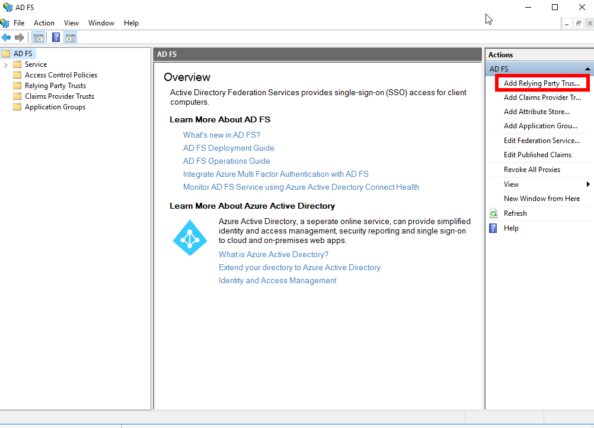

This will open the Add Relying Party Trust wizard. It will first ask if you want a Claims-Aware or Non-Claims-Aware application; select Claims-Aware and click Start.

You must now select one of two ways to get metadata information about your Gravwell server into AD FS. If your Gravwell server uses properly-signed TLS certificates, you can simply enter a URL in the "Federation metadata address" field of the first option and click next:

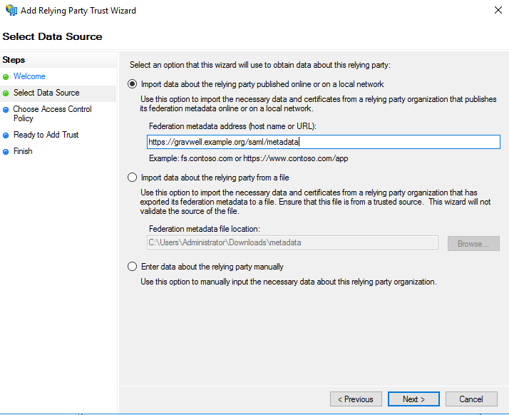

If, however, Gravwell is using self-signed certificates, you must manually download the metadata first. Open the web browser and go to `https://gravwell.example.org/saml/metadata`. Save the file when prompted, then go back to the wizard and set the appropriate path in the second option:

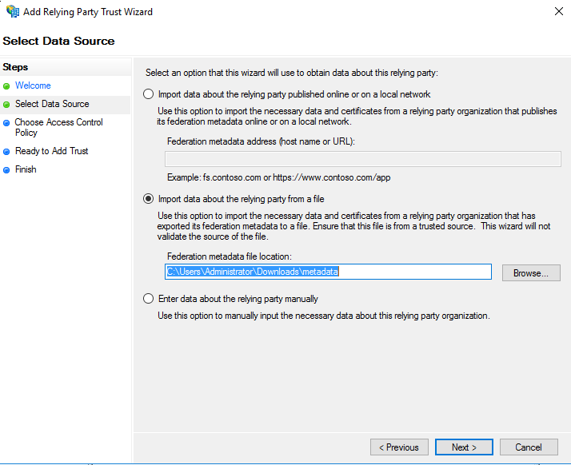

On the next page of the wizard, you will be prompted to set a display name. "Gravwell" or something similar would be fine. In the further pages of the wizard, you should be able to leave the defaults.

### Edit Claims Issuance Policy for Relying Party

You must now add a few claims issuance transform rules to the relying policy. Select "Edit Claim Issuance Policy" for the newly-created relying party:

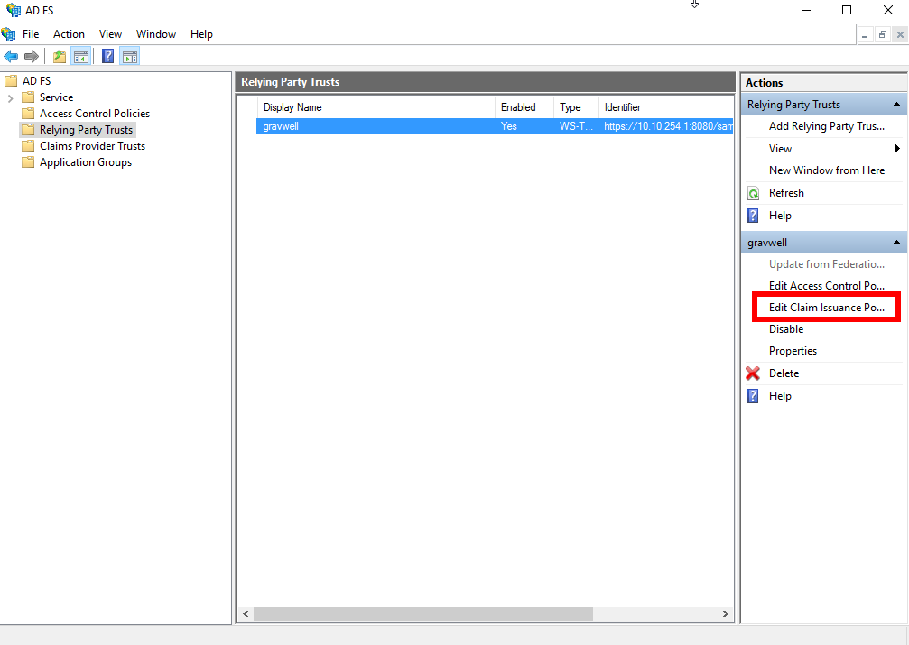

You must create three rules. First, click Add Rule to open the wizard; select "Send LDAP Attributes as Claims", click Next, and populate it as shown below:

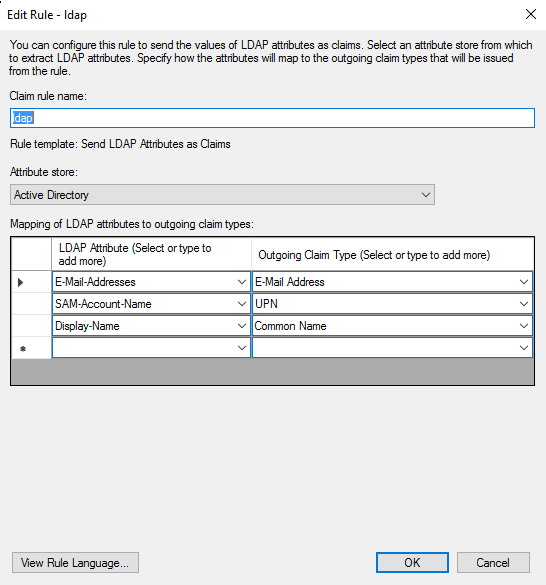

Next, create another rule, this time selecting "Transform an Incoming Claim" and populating it as shown below:

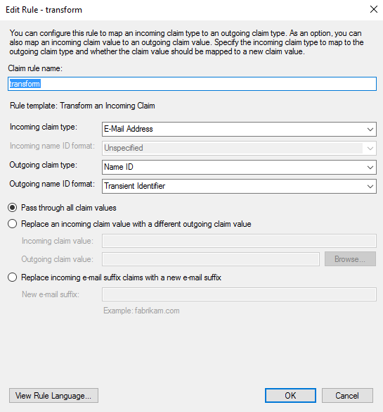

Finally, create another rule, selecting "Send Claims Using a Custom Rule" and pasting in the following text into the field:

```
c:[Type == "http://schemas.microsoft.com/ws/2008/06/identity/claims/windowsaccountname", Issuer == "AD AUTHORITY"]
=> issue(store = "Active Directory",
types = ("http://schemas.xmlsoap.org/ws/2005/05/identity/claims/emailaddress",
"http://schemas.xmlsoap.org/ws/2005/05/identity/claims/givenname",
"http://schemas.xmlsoap.org/ws/2005/05/identity/claims/surname"),
query = ";mail,givenName,sn;{0}", param = c.Value);
```

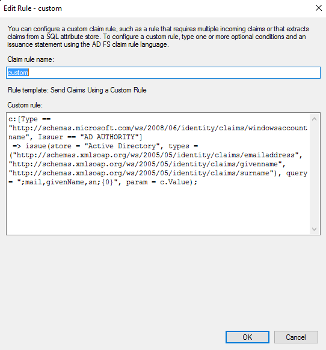

When finished, you should have three rules:

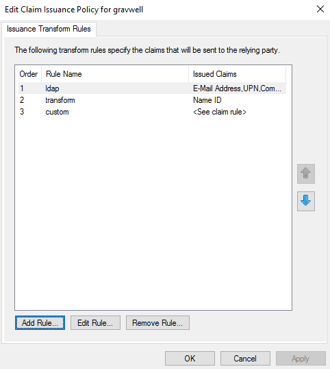

### (Optional) Send Group Info

Gravwell can automatically create groups and add SSO users to these groups as mentioned earlier in this document. You can configure Active Directory to send a claim containing a list of group names by creating an LDAP claim rule that maps "Token-Groups - Unqualified Names" to "Group" as shown in the screenshot below:

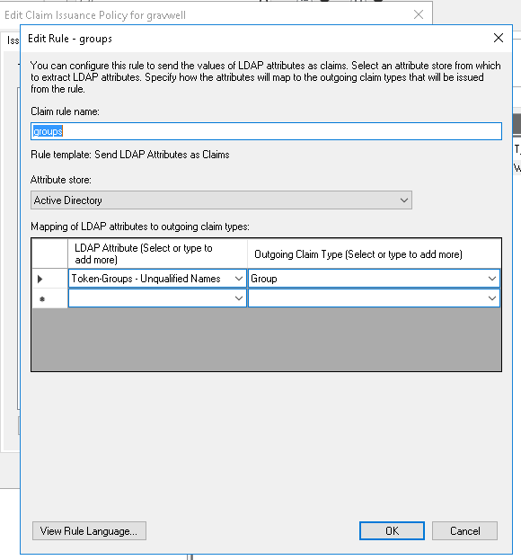

In gravwell.conf, you'll need to add a `Groups-Attribute` field (`http://schemas.microsoft.com/ws/2008/06/identity/claims/groups` if you set the outgoing claim type to "Group" as shown above) to indicate which attribute contains the list of groups. You'll also need at least one `Group-Mapping` field to map Active Directory group names to desired group names within Gravwell. The example below maps an AD group named "Gravwell Users" to a Gravwell group named "gravwell-users":

```
	Groups-Attribute=http://schemas.xmlsoap.org/claims/Group
	Group-Mapping=Gravwell Users:gravwell-users
```

### Test Configuration

With AD FS and Gravwell both configured, you should now see the SSO login button enabled on the Gravwell login page:

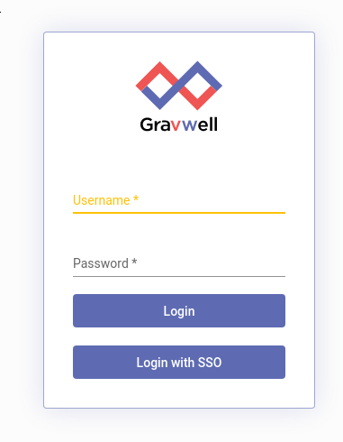

Clicking it will take you to the Windows server's AD FS authentication page. Authenticate as one of your Active Directory users, including the domain in the username (so type "jfloren@gravwell.io" rather than just "jfloren").

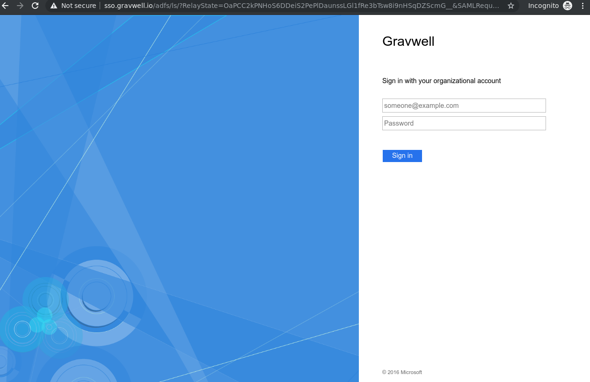

Once you click Sign In, you should be taken back to the Gravwell UI, this time logged in as the appropriate user. 
