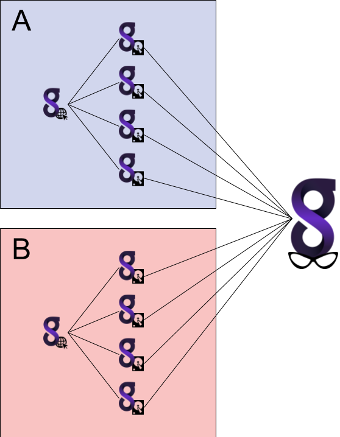
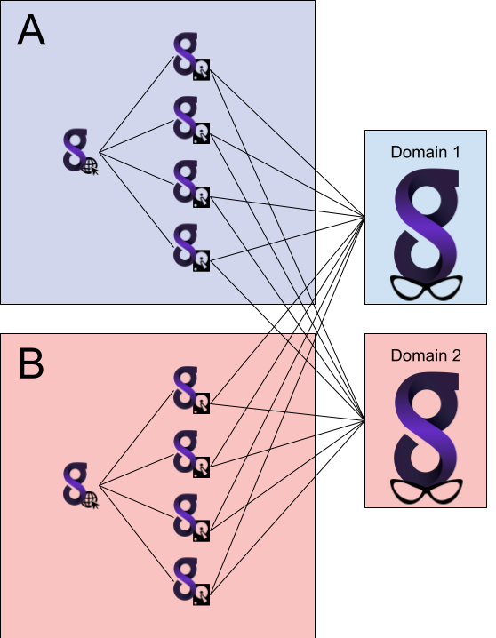

# Gravwell Overwatch

For any number of reasons it may be advantageous to run multiple separate instances of Gravwell. A Managed Security Service Provider (MSSP) might set up a Gravwell indexer+webserver instance for each of their customers for easy separation of data and simpler user management. However, while you don't want Customer A to access Customer B's data, it would be useful for the MSSP to be able to query across Customer A and Customer B simultaneously.

Overwatch makes this possible. An Overwatch webserver can connect to the *indexers* of both customers and run searches across all data simultaneously. It maintains its own set of users, resources, scheduled searches, etc. completely unique from the customer clusters.

The image above shows an example Overwatch configuration. Customers A and B each have their own set of 4 indexers and 1 webserver. An Overwatch webserver (shown on the right with glasses) connects directly to the indexers, bypassing the customer webservers.

## Security notes

We recommend the following when running multiple Gravwell clusters for external clients, expecially when using Overwatch:

* Clients should not be allowed to SSH into their webserver or indexer systems. This could allow them to break their configurations.
* For extra security, *client* Gravwell clusters should not be able to route to each other. The Overwatch server must be allowed to route to each cluster, but they should not be allowed to communicate with each other.

## Licensing Notes

Gravwell overwatch requires a specific license that is unique to overwatch webservers, if you are interested in getting access to overwatch, email [sales](mailto:sales@gravwell.io).

Overwatch webservers will NOT distribute their license to client nodes.  This means that an overwatch webserver cannot be used for the initial setup of a Gravwell cluster as the indexers will not receive licenses during setup.  Overwatch licenses also cannot be used on indexers.

## Configuring Overwatch

Before setting up your Overwatch server, note that *all* indexers must use the same `Control-Auth` token. This allows the Overwatch server to connect to all the indexers simultaneously.

To install an Overwatch server, use the Gravwell installer to install only the webserver component. Configure it to use the same `Control-Auth` in use on the client indexers, then set the `Remote-Indexers` list to include *all* client indexers.

Next, the webserver should be configured in an **Overwatch Domain**. The domain is set with the `Webserver-Domain` parameter in gravwell.conf. Client webservers can safely be left in domain 0, but the Overwatch webserver should be set to a different number; this can be any integer between 0 and 32767.

Those are the only essential configurations for the Overwatch webserver. You may wish to [configure TLS](#!configuration/certificates.md) or set other options, but at this point it should be safe to restart the webserver (`systemctl restart gravwell_webserver.service`) and begin use.

### Configuring Multiple Overwatch Servers

It may be advantagous to configure multiple overwatch systems that are tied to either all or some subset of client indexers.  MSSPs may want the ability to segment their customer base such that specific analysts operate on some subset of clients.  Enterprises may wish to provide fully independent overwatch webservers to multiple organizations.  Because overwatch systems operate on the domain configuration parameter, multiple overwatch webservers can be configured on multiple domains.

Warning: Multiple Overwatch webservers *MUST* be on seperate domains unless they are configured to operate in distributed mode. If multiple Overwatch webservers are configured on the same domain, resources will be improperly mananged on the indexers, leading to query errors.

## Using an Overwatch server

Use the Overwatch webserver exactly like a regular Gravwell webserver--because it *is* a regular Gravwell webserver. You can use the Overwatch server to keep an eye on ingest rates across all clients; has someone's Active Directory server stopped uploading logs? You can use it to investigate incidents at the request of clients, etc. Users and resources created on the Overwatch webserver will not interfere with those created on the client clusters, but be aware that performing a resource-intensive search will consume *indexer* resources on the client clusters... and a particularly large search across all clients could result in hundreds of gigabytes of results being shipped up to the Overwatch server, so query with that in mind.
