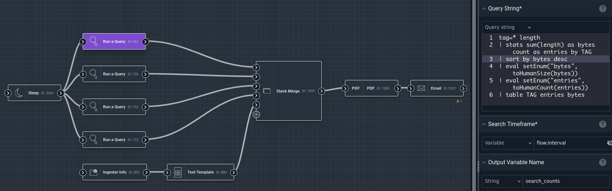
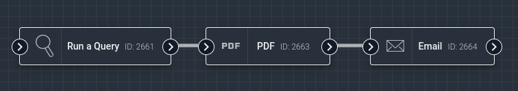
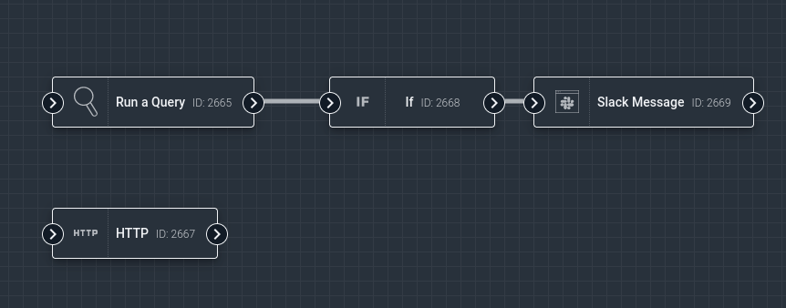

# Flows

Flows provide a no-code method for developing advanced automations in Gravwell. By wiring together nodes in a drag-and-drop user interface, you can:

* Run queries
* Generate PDF reports
* Send emails
* Fire off Slack and MS Teams messages
* Re-ingest alerts
* and more!



This document will describe what makes a flow, the flow editor, and how to debug & deploy your own flows.

## Basic flow concepts

Flows are *automations*, meaning they are normally executed on a user-specified schedule by the search agent. You can also run them manually through the user interface. The basic process of flow development is:

1. Create a new flow
2. Instantiate nodes in the flow and connect them together
3. Configure nodes
4. Test the flow with debug runs
5. Deploy the flow by setting a schedule & enabling scheduled execution

### Nodes

A flow is a collection of *nodes*, linked together to define an order of execution. Each node does a single task, such as running a query or sending an email. In the example below, the leftmost node runs a Gravwell query, then the middle node formats the results of that query into a PDF document, and finally the rightmost node sends that PDF document as an email attachment.



All nodes have a single output socket. Most have only a single input socket, but some nodes which merge *payloads* (see below) have multiple input sockets.

One node's output socket may be connected to the *inputs* of multiple other nodes, but each input socket can only take one connection.

### Payloads

*Payloads* are collections of data passed from node to node, representing the state of execution. For instance, the "Run a Query" node will insert an item named "search" into the payload, containing things like the query results and metadata about the search. The PDF node can *read* that "search" item, format it into a nice PDF document, and insert the PDF file back into the payload with a name like "gravwell.pdf". Then the Email node can be configured to attach "gravwell.pdf" to the outgoing email.

The node receives an incoming payload through its *input* socket, then passes its outgoing payload via the *output* socket. In most cases, the outgoing payload will be a modified version of the incoming payload.

### Execution order

Nodes are always executed one at a time. A node can be executed if all nodes upstream of it (its *dependencies*) have executed. If multiple nodes are ready to execute, one will be chosen at random. In the example below, both the "Run a Query" node and the "HTTP" node are candidates to run first. After the Query node finishes, the If node can execute; when it is done, the Slack Message node may run. We say that the If node is *downstream* of the Query node, and the Slack node is *downstream* of both the If and Query nodes.



Note that some nodes may block execution of downstream nodes. The **If** node is configured with a boolean logic expression; if that expression evaluates to *false*, none of the If node's downstream nodes are executed. Nodes which can block downstream execution will always have a note to that effect in the online documentation.

## Flow editor

Flows are created using the flow editor. Please refer to the [flow editor documentation](editor) for a detailed description of the editor, instructions on how to use it, and information about debugging & scheduling flows.

## Common Flow Patterns

Because flows are quite flexible, it can be a bit daunting trying to figure out how to tackle a given task. We have collected some [common flow patterns](patterns/patterns) to help with this.

## Node list

```{toctree}
---
maxdepth: 1
hidden: true
---

Email <nodes/email>
Flow Storage Read <nodes/storageread>
Flow Storage Write <nodes/storagewrite>
Gravwell Notification <nodes/notification>
HTTP <nodes/http>
If <nodes/if>
Indexer Info <nodes/indexerinfo>
Ingest <nodes/ingest>
Ingester Info <nodes/ingesterinfo>
JavaScript <nodes/javascript>
JSON Encode/Decode <nodes/json>
Mattermost Message <nodes/mattermost>
Nest Merge <nodes/nestmerge>
PDF <nodes/pdf>
Query Log Ingest <nodes/queryalert>
Read Macros <nodes/macroget>
Read Resources <nodes/resourceget>
Rename <nodes/rename>
Run a Query <nodes/runquery>
Set Variables <nodes/inject>
Slack File <nodes/slackfile>
Slack Message <nodes/slackmessage>
Sleep <nodes/sleep>
Splunk Query <nodes/splunkquery>
Stack Merge <nodes/stackmerge>
Teams Message <nodes/teams>
Text Template <nodes/template>
Throttle <nodes/throttle>
Update Resources <nodes/resourceupdate>
```

* [Email](nodes/email): send email.
* [Flow Storage Read](nodes/storageread): read items from a persistent storage.
* [Flow Storage Write](nodes/storagewrite): write items into a persistent storage.
* [Gravwell Notification](nodes/notification): set Gravwell notifications.
* [HTTP](nodes/http): do HTTP requests.
* [If](nodes/if): perform logical operations.
* [Indexer Info](nodes/indexerinfo): get information about Gravwell indexers.
* [Ingest](nodes/ingest): ingest data into Gravwell.
* [Ingester Info](nodes/ingesterinfo): get information about Gravwell ingesters.
* [JavaScript](nodes/javascript): run JavaScript code.
* [JSON Encode/Decode](nodes/json): encode and decode JSON.
* [Mattermost Message](nodes/mattermost): send a Mattermost message.
* [Nest Merge](nodes/nestmerge): join multiple input payloads into one.
* [PDF](nodes/pdf): create PDF documents.
* [Query Log Ingest](nodes/queryalert): convert search results to alert entries & ingest.
* [Read Macros](nodes/macroget): read Gravwell macros.
* [Read Resources](nodes/resourceget): read Gravwell resources.
* [Rename](nodes/rename): rename variables in the payload.
* [Run a Query](nodes/runquery): run a Gravwell query.
* [Set Variables](nodes/inject): inject variables into the payload.
* [Slack File](nodes/slackfile): upload a file to a Slack channel.
* [Slack Message](nodes/slackmessage): send a message to a Slack channel.
* [Sleep](nodes/sleep): pause flow execution for a given period of time.
* [Splunk Query](nodes/splunkquery): run a Splunk query.
* [Stack Merge](nodes/stackmerge): join multiple input payloads into one.
* [Teams Message](nodes/teams): send a Microsoft Teams message.
* [Text Template](nodes/template): format text.
* [Throttle](nodes/throttle): limit execution frequency of certain nodes within a flow.
* [Update Resources](nodes/resourceupdate): create or update Gravwell resources.

The following nodes tend to be needed only in particular advanced cases:

```{toctree}
---
maxdepth: 1
hidden: true
---

Get Table Results <nodes/gettableresults>
Get Text Results <nodes/gettextresults>
```

* [Get Table Results](nodes/gettableresults): get results from a search using the table renderer.
* [Get Text Results](nodes/gettextresults): get results from a search using the text renderer.
