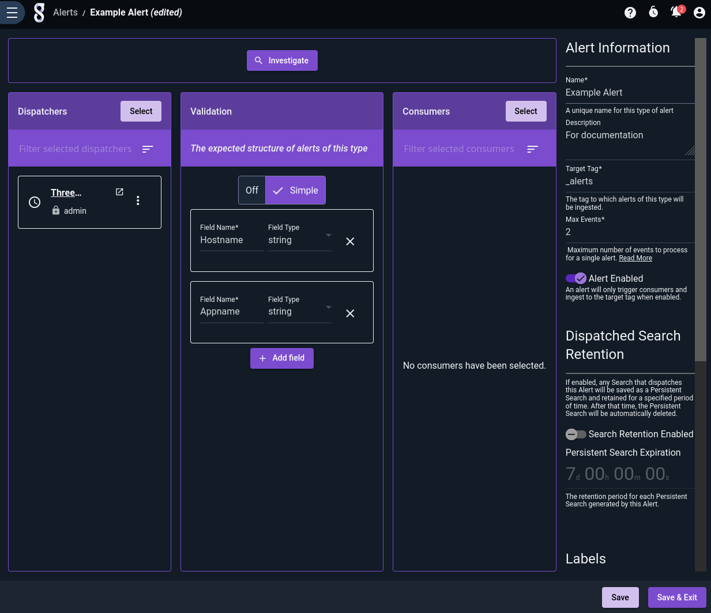
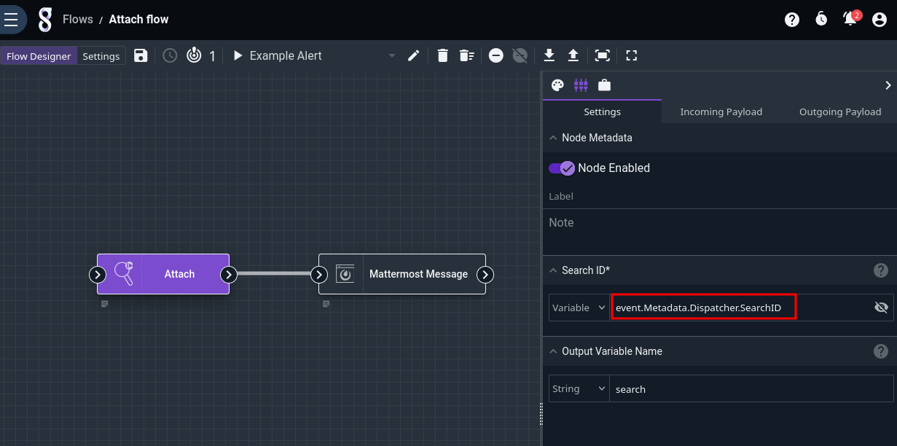
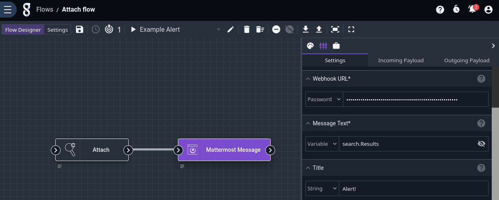
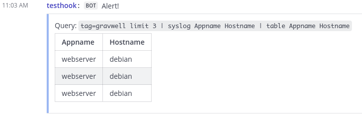

# Attach

The Attach node connects to an existing Gravwell query, specified by a search ID. Like the [Run Query](runquery) node, it outputs a structure (named `search` by default) containing information about the search into the payload and allows other nodes to access the results.

The most common use of the Attach node is to connect to the scheduled search which triggered the [Alert](/alerts/alerts) for which the current flow is a consumer. See the example below for more information on this use case.

## Configuration

* `Search ID`, required: the ID of an existing Gravwell query.
* `Output Variable Name`: the name to use for results in the payload, default "search".

## Output

The node inserts an object (named `search` by default) containing information about the search into the payload. The component fields are documented in the [Run Query node's documentation](runquery).

## Example

In this example, we will build a flow which, when triggered from an [alert](/alerts/alerts), attaches to the search which triggered the alert and sends the search results to a Mattermost channel.

First, we build a scheduled search; for testing, we're running the following query:

```
tag=gravwell limit 3 | syslog Appname Hostname | table Appname Hostname
```

Next, we create an Alert and set that scheduled search as a dispatcher:



```{note}
Observe that the alert has "Max Events" set to 1. That's because our flow will be connecting to the dispatching search and retrieving *all* results from the search, so we only want the alert to run the flow at most once per execution of the search. Setting Max Events to 1 accomplishes this.
```

Finally, we create a flow using the Attach node and the Mattermost node and associate it with the alert:





Note how the Mattermost node is able to use `search.Results` as the message text, exactly as if we had used the [Run Query](runquery) node instead of Attach.

The output looks like this:



