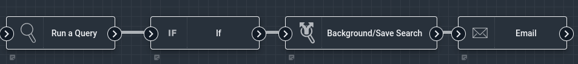
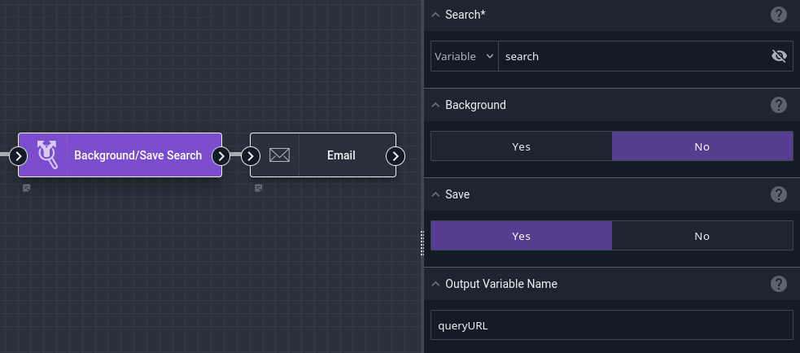
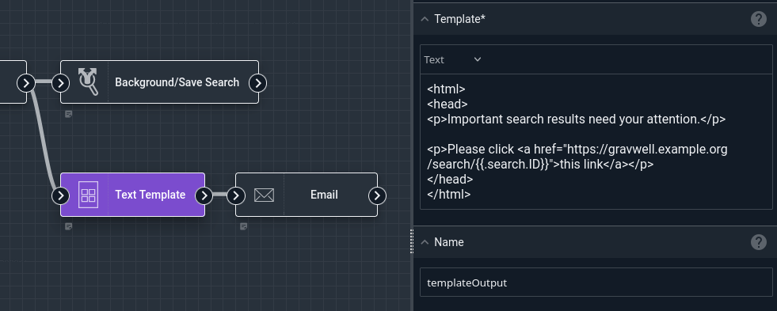
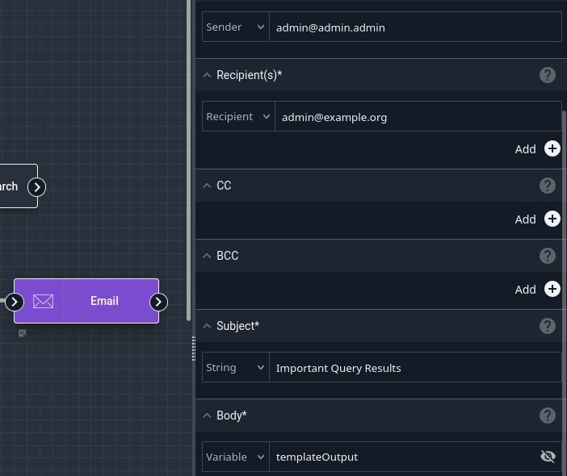

# Background/Save Search Node

This node can mark a Gravwell query (as created via the [Run Query](runquery) node) as backgrounded or flag the results to be saved.

Normally, searches executed by a flow are cleaned up when the flow finishes. *Backgrounding* a search will make it stick around until the next time the flow runs (or until the webserver restarts). *Saving* a search will keep the results around until you explicitly delete them.

The node also outputs a URL into the payload which can be sent to a user via email or other channels; when clicked, this URL will immediately load the results of the search in question.

```{note}
Be careful about unconditionally Saving searches on flows which run frequently! If you always save a search within your flow, and the flow is scheduled once a minute, you could end up with 1440 saved searches per day.
```

## Configuration

* `Search`, required: the search to be modified.
* `Background`: if true, the search will be backgrounded.
* `Save`: if true, the search will be saved.

## Example

This flow runs a query, then if there was at least one result it saves the search and sends an email which links directly to the results.



The [Run Query](runquery) node is configured with a query which will only return results if something important has been found, requiring user review. The [If](if) node is set to check if `search.Count` > 0.

The Background/Save Search node is set up to save `search`, the output of the Run Query node, and put a URL for the search into a variable named `queryURL`.



Finally, the [Email](email) node is configured to send an email whose body contains the URL:



The resulting email is quite simple:



If we want to add more context, we could use the [Text Template](template) node to build a more detailed email body.
