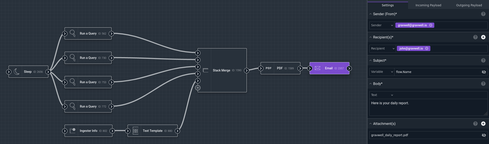

# Email Node

The Email node sends an email message to a list of one or more recipients, with optional attachments.

## Configuration

* `Sender`, required: This is the address which will appear in the "From" header of the email.
* `Recipients`, required: The email will be sent to this address or addresses.
* `CC`: An optional list of CC recipients.
* `BCC`: An optional list of BCC recipients.
* `Subject`, required: The subject line of the email.
* `Body`, required: The body text of the email message. Enter a string manually, or select a variable containing suitable text. The [Text Template](template) node provides powerful tools for formatting text in the flow.
* `Attachments`: An optional array of items to add as attachments on the email. The Email node makes a best-effort attempt at determining the appropriate file type on the attachment. Consider using the output of the [PDF](pdf) node as an attachment.

## Output

The node adds nothing to the payload.

## Example

The screenshot below shows a complex flow using the Email node:

The flow runs several Gravwell queries and also gathers information about ingesters, then uses the [Stack Merge](stackmerge) node to join all the results together. It then feeds those results into the PDF node, which generates a file named `gravwell_daily_report.pdf`.

The Email node is configured to send a message from gravwell@gravwell.io to john@gravwell.io. The email's subject will be set to the contents of the payload variable `flow.Name`, which corresponds to the *name of the flow* e.g. "Daily Report Flow". The body is set to a simple static string, and the previously-generated PDF file is included as an attachment.
