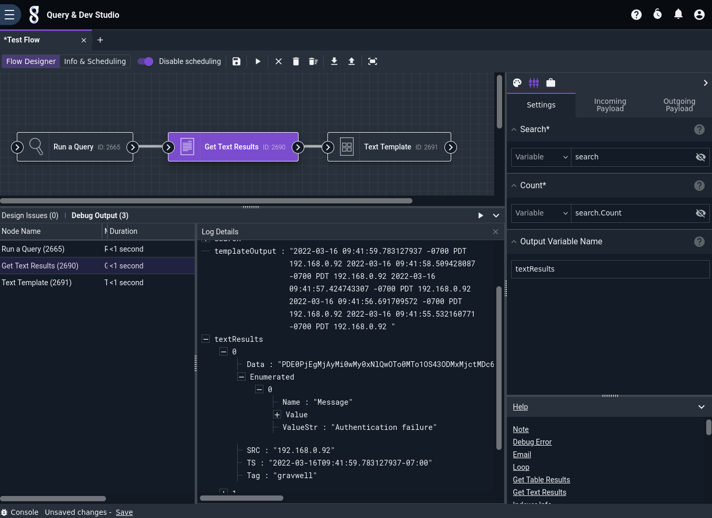

# Get Text Results Node

This node fetches a user-specified number of results from a search which was previously executed using the [Run a Query](runquery.md) node. Many nodes, such as the [PDF](pdf.md) node, can operate directly on the search object output by the Query node, but in some specific situations (formatting results in a specific way using the [Text Template](template.md) node, for instance) this node can provide the raw output required.

## Configuration

* `Search`, required: The search from which results should be fetched. This should be the output of a [Run a Query](runquery.md) node.
* `Count`, required: The number of rows to fetch from the results. This can be a static integer, or it can be set to `search.Count` to fetch all results from the query.
* `Output Variable Name`: Results will be stored in the payload under this name. Defaults to `textResults`.

## Output

This node inserts an object into the payload, using the key set in the `Output Variable Name` config option. This object contains an array of search entries from the query. Below is an example of the structure presented in JSON format:

	[
		{
			"Data": "<14>1 2022-03-16T16:13:53.784699Z web1.floren.lan webserver 20000033 webserver/login.go:121 [gw@1 user="adf"] Authentication failure",
			"Enumerated": [
				{
					"Name": "Message",
					"Value": {
						"Data": "QXV0aGVudGljYXRpb24gZmFpbHVyZQ==",
						"Type": 1
					},
					"ValueStr": "Authentication failure"
				}
			],
			"SRC": "192.168.10.31",
			"TS": "2022-03-16T16:13:53.784699228Z",
			"Tag": "gravwell"
		},
		{
			"Data": "<14>1 2022-03-16T16:13:51.361355Z web1.floren.lan webserver 20000033 webserver/login.go:121 [gw@1 user="adf"] Authentication failure",
			"Enumerated": [
				{
					"Name": "Message",
					"Value": {
						"Data": "QXV0aGVudGljYXRpb24gZmFpbHVyZQ==",
						"Type": 1
					},
					"ValueStr": "Authentication failure"
				}
			],
			"SRC": "192.168.10.31",
			"TS": "2022-03-16T16:13:51.361355046Z",
			"Tag": "gravwell"
		}
	]

## Example

This example runs a query, fetches the text results, and uses the [Text Template](template.md) node to print the TS and SRC fields of each entry.



The Run Query node is set to run `tag=gravwell syslog Message=="Authentication failure" | limit 5` over the last day.

Get Text Results is configured to fetch results from `search`; by setting Count to `search.Count`, it will fetch *all* results from the query.

The Text Template node is configured with the following template:

```
{{ range .textResults }}{{ .TS }} {{ .SRC}}
{{ end }}
```
