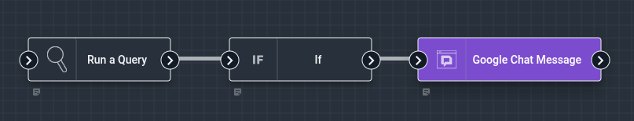
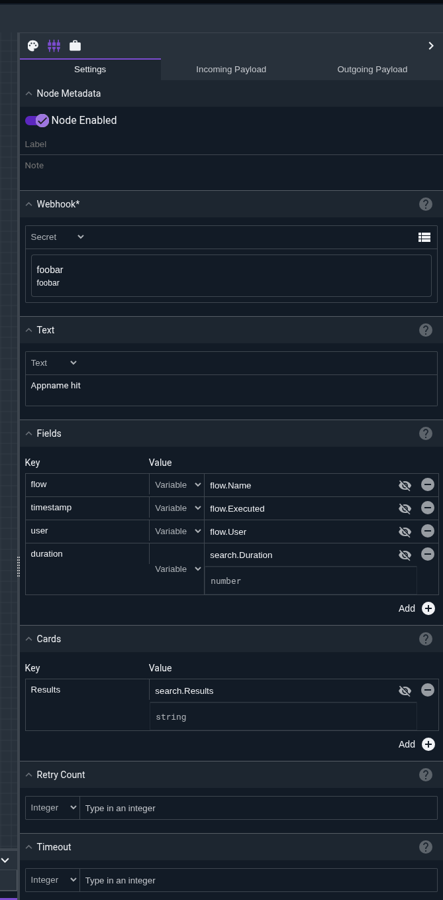
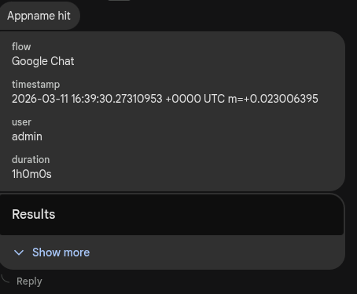
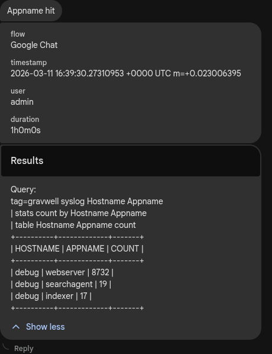

# Google Chat Message Node

The Google Chat Message node sends a message to a Google Chat space via webhook.



## Configuration

* `Webhook`, required: a [Google Chat webhook](https://developers.google.com/chat/how-tos/webhooks) URL for the space you wish to send to.
* `Text`: the text message to send. This will appear as the main message text in the chat space.
* `Fields`: optional key-value pairs to display as structured data in a single card. These will be rendered as decorated text widgets with labels.
* `Cards`: optional named inputs that will be formatted as separate collapsible cards with titles. Each card can contain structured data, lists, or text.
* `Retry Count`: number of retry attempts if sending fails (default: 1, which means a single attempt with no retries).
* `Timeout`: timeout in seconds for each request (default: 5).



### Message Formatting

The Google Chat node supports multiple ways to structure your messages including simple text, structured fields, and named cards. You can use these features in combination to create rich messages for your chat space.

#### Named Cards
The `Cards` configuration allows you to create multiple named cards with titles that are hiddent by default

When both `Fields` and `Cards` are used, the fields card appears first, and subsequent cards are collapsed.



### Retry Behavior

If the initial send attempt fails, the node will retry based on the `Retry Count` setting:
- Retry attempts use exponential backoff starting at 1 second
- Maximum backoff between retries is capped at 10 seconds
- Each attempt respects the configured timeout

## Example

This example gathers information about currently-connected ingesters, formats that information using structured fields, and posts it to a Google Chat space.

The message includes both text and a fields card to display the ingester information in a structured format.


### Example Message

The following message was generated by the Google Chat node with a text message and structured fields for ingester information and an additional card that has been expanded in the Google Chat application.



### Creating a Google Chat Webhook

To create a webhook for a Google Chat space:

1. Open the Google Chat space where you want to add the webhook
2. Click the space name at the top, then select `Apps & integrations`
3. Click `Add webhooks`
4. Name your webhook and optionally add an avatar
5. Click `Save` and copy the webhook URL

For detailed instructions, see the [Google Chat webhooks documentation](https://developers.google.com/chat/how-tos/webhooks).

```{note}
The webhook URL is sensitive and should be stored as a secret in Gravwell. Anyone with access to the webhook URL can send messages to your Google Chat space.
```

```{note}
Google Chat enforces rate limits on webhook messages. If you send too many messages in rapid succession, requests may be throttled. Use the retry and timeout settings to handle transient failures gracefully.
```

```{note}
The node does not modify the payload.
```
