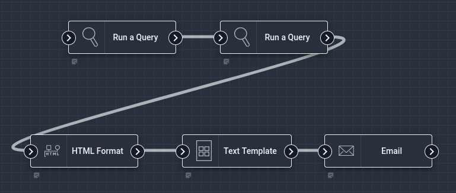
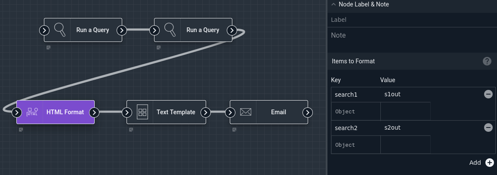
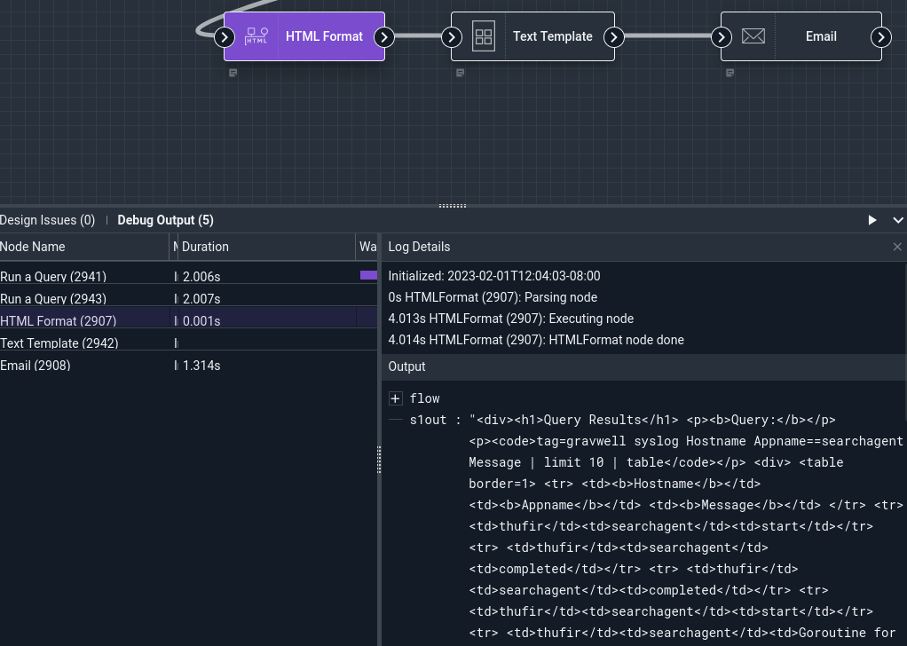
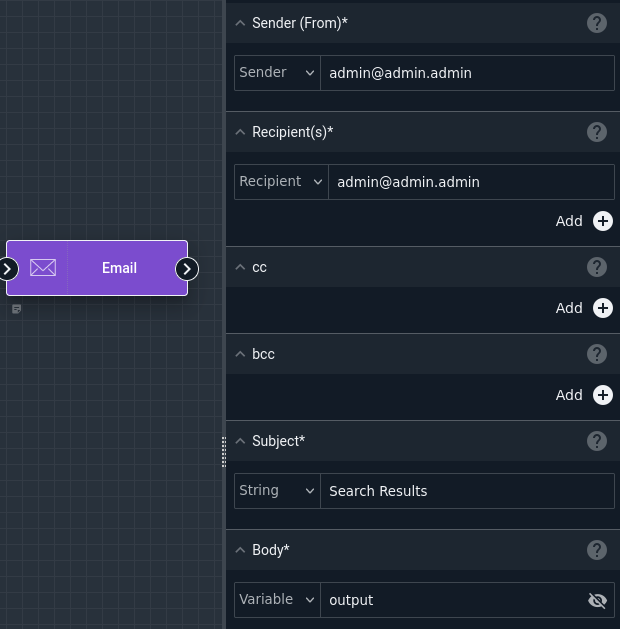
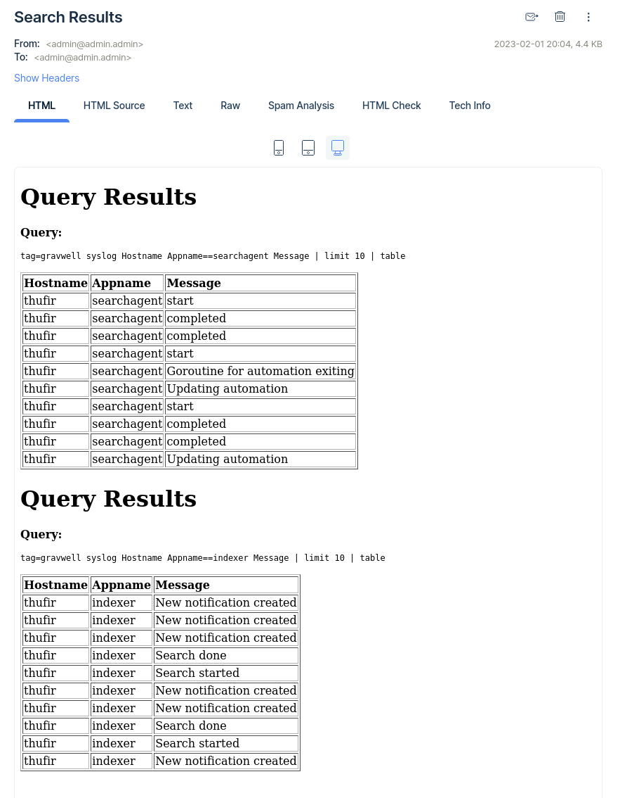

# HTML Format Node

This node will attempt to format one or more variables from the payload as HTML, inserting the results back into the payload under different names.

## Configuration

* `Items`, required: One or more pairs of strings. The first string, the key, specifies the name of an existing variable to be formatted. The second string, the value, specifies the *new* name which will contain the HTML-formatted output.

## Output

The node will create one or more variables in the payload, one for each key-value pair specified in the configuration.

## Example

This example uses the HTML Format node to format the results of two searches as HTML. The Text Template node then combines them using a trivial template, and the Email node sends the results out. The Email node will automatically HTML-format a single query if set as the body of the email, but this example shows how you can generate an HTML message containing *multiple* search results.



The two Run a Query nodes run the following searches over `flow.Interval`, outputting the results into variables named `search1` and `search2`, respectively:

```
tag=gravwell syslog Appname==searchagent Message | limit 10 | table
```

```
tag=gravwell syslog Appname==indexer Message | limit 10 | table
```

The HTML Format node is configured to format `search1` into a variable named `s1out` and `search2` into `s2out`:



After a debug run, we can verify that the variables have been appropriately set in the payload:



The Text Template node then uses a simple template to join the two results together, placing the results into `templateOutput`:

```
<html>
{{.s1out}}
{{.s2out}}
</html>
```

Last, the Email node uses `templateOutput` as the Body of the outgoing email.




The results look like this:


