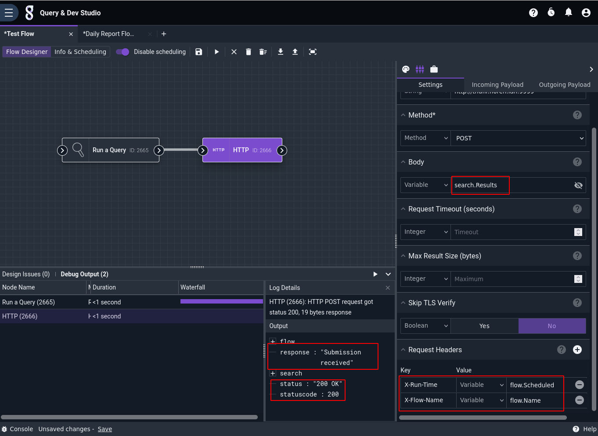
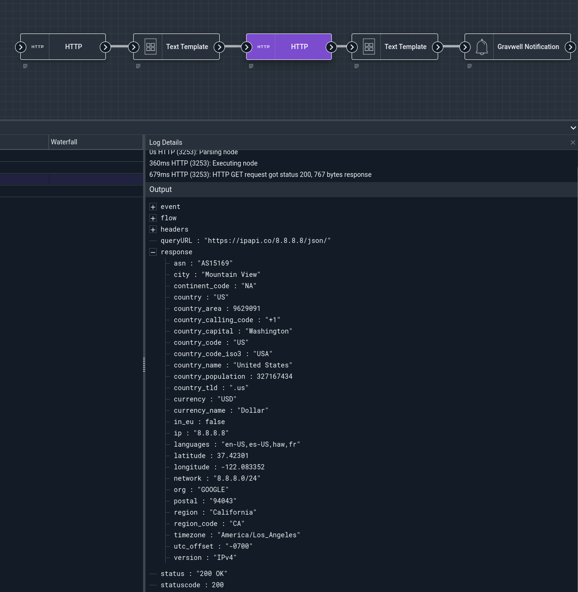

# HTTP Node

This node can perform HTTP requests with considerable flexibility. It can send items from the payload in the body of the request, making it extremely useful for triggering infrastructure webhooks.

## Configuration

* `URL`, required: The URL for the request. HTTP and HTTPS are both supported.
* `Method`, required: The HTTP method to be used.
* `Body`: If set, the contents of the Body config option will be sent in the body of the HTTP request.
* `Request Timeout`: If set, the request will time out after this many seconds.
* `Max Result Size`: If set, the node will read no more than this many *bytes* in the HTTP response.
* `Skip TLS Verify`: If set to true, the node will not validate the TLS certificate of the HTTP server. Use with caution!
* `Request Headers`: May be used to set headers on the outgoing HTTP request, such as authentication tokens.
* `Decode Body`: If set to true, the node will attempt to decode the response body into a structure.

## Output

The HTTP node sets several items in the outgoing payload:

* `response`: The body of the HTTP response, if any.
* `status`: A string representation of the HTTP status, e.g. "200 OK".
* `statuscode`: The numeric HTTP response code, e.g. 200.


## Example

This example runs a Gravwell query (`tag=gravwell limit 2`) and sends the results to a simple HTTP server listening for POST requests.

The HTTP node is configured to use `search.Results` as the request body. Internally, it formats the search results as a string before sending. It is also set up to attach two headers to the request: `X-Run-Time` will contain the time at which the flow ran (the `flow.Scheduled` variable), and `X-Flow-Name` will contain the name of the flow (the `flow.Name` variable).

The screenshot below shows the results of a debug run:



The HTTP server logged the following:

```
Headers: map[Accept-Encoding:[gzip] User-Agent:[gravwell-5.0.0] X-Flow-Name:[Test Flow] X-Run-Time:[2022-03-15 23:27:17.966735258 +0000 UTC]]
Body: <15>1 2022-03-15T23:27:16.315639Z web1.floren.lan webserver 0 - [gw@1 host="192.168.10.1" method="DELETE" url="/api/scheduledsearches/1439300184/error" status="200" useragent="Mozilla/5.0 (X11; Linux x86_64; rv:98.0) Gecko/20100101 Firefox/98.0" elapsed="3ms"]
<15>1 2022-03-15T23:27:16.278106Z web1.floren.lan webserver 0 - [gw@1 host="192.168.10.1" method="GET" url="/api/scheduledsearches/checkin" status="200" useragent="Mozilla/5.0 (X11; Linux x86_64; rv:98.0) Gecko/20100101 Firefox/98.0" elapsed="0ms"]
```

Note the headers; the `Accept-Encoding` and `User-Agent` headers are automatically set by the search agent.

### Example With Decode Body

The HTTP node can return data of any type, by default the node will store the response data as an array of bytes; when working with binary data or grabbing a remote file to us as a resource this is the most useful form.  Many use cases for the HTTP node may want to natively process an HTTP response so that the flow can more easily handle the response data; examples may include better display of text data or accessing fields in a JSON response.

This example performs an HTTP GET request on a remote API which returns JSON data using the HTTP node with `Decode Body` set to true; because the `Decode Body` value is set to true the HTTP node will look at the `Content-Type` returned by the HTTP request and determine if it can decode the response into an object.   Because the remote endpoint returns a JSON object we can decode that into the payload as structured data which can then be processed in the flow.  The decoded response payloads make it easy to take the response from one API and use it to create a request to another without having to manually decode the HTTP response. 


