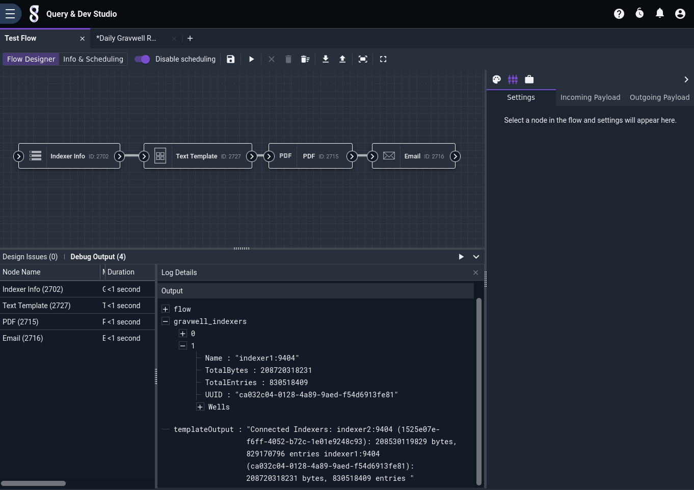
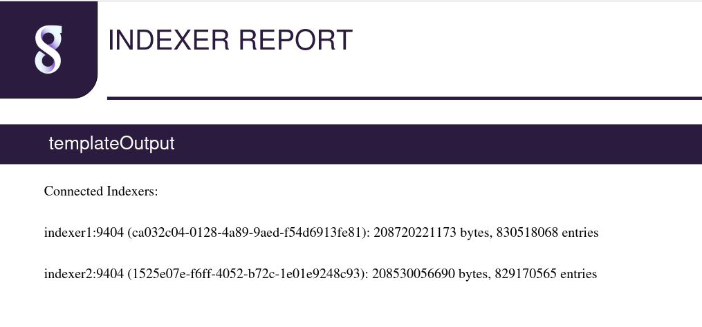

# Indexer Info Node

This node injects information about the current Gravwell indexers into the payload. This is useful when generating reports or monitoring cluster health.

## Configuration

* `Output Variable Name`: the name to use for results in the payload, default "gravwell_indexers".

## Output

The node inserts an array (named `gravwell_indexers` by default) into the payload containing information about the indexers currently active in the Gravwell cluster. Each element in the array is a structure containing the following fields:

* `Name`: the name of the indexer, e.g. "indexer1:9404".
* `UUID`: the UUID of the indexer.
* `TotalEntries`: the total number of entries stored on the indexer.
* `TotalBytes`: the total number of bytes stored on the indexer.
* `Wells`: an array of structures containing information about individual wells (see below).

The Wells array contains structures with the following fields:

* `Name`: the name of the well, e.g. `default`.
* `Entries`: the number of entries in this well.
* `Bytes`: the number of bytes in this well.

## Example

The following example formats the indexer info, packs it into a PDF, and sends the PDF via email:



The [Text Template](template.md) node is configured with the following template:

```
Connected Indexers:
{{ range .gravwell_indexers }}
{{ .Name }} ({{ .UUID }}): {{ .TotalBytes }} bytes, {{ .TotalEntries }} entries
{{ end }}
```

The resulting PDF looks like this:


