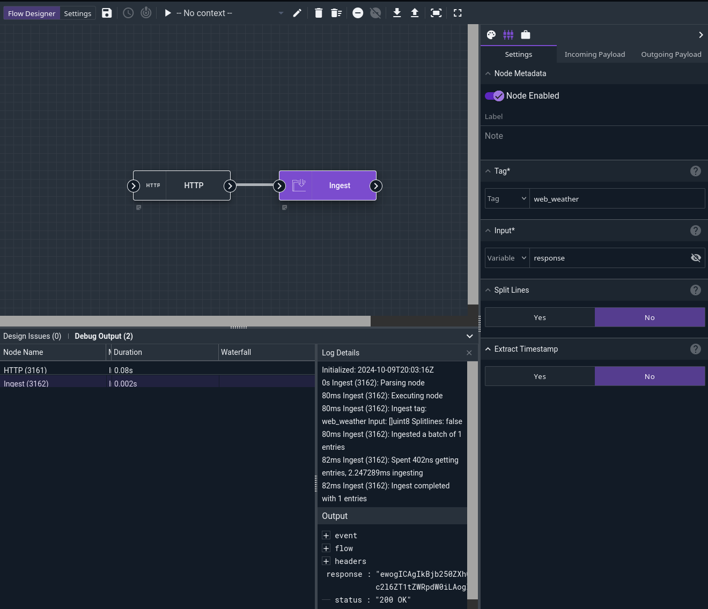

# Ingest Node

This node ingests data into Gravwell under a specified tag. Note that the user must be a member of a group specified in the [`Webserver-Ingest-Groups` configuration parameter](/configuration/parameters) to ingest entries.

## Configuration

* `Tag`, required: the Gravwell tag into which the data should be ingested.
* `Input`, required: the data to ingest.
* `Split Lines`: if set to true, the node will split the input data into separate entries at newline boundaries.
* `Extract Timestamp`: if set to true, Gravwell will attempt to extract timestamps from the input data. If false, the entries will be ingested with the current timestamp.

## Output

The node does not inject anything into the payload, but it does ingest entries into Gravwell.

## Example

This example fetches JSON weather information from `api.weather.gov` and ingests it into the `web_weather` tag.

The HTTP node is configured to perform a GET request on `https://api.weather.gov/gridpoints/MTR/82,105/forecast` to fetch a weather report from the San Francisco peninsula. The ingest node then takes the `response` value (generated by the HTTP node) and ingests it into the web_weather` tag. Because we wish to ingest the entire HTTP response in a single entry, we leave the Split Lines config option set to "No". Because we're fetching the current weather, the timestamp at execution is acceptable, so we leave Extract Timestamp set to "No".

A query run on the `web_weather` tag shows the results:

