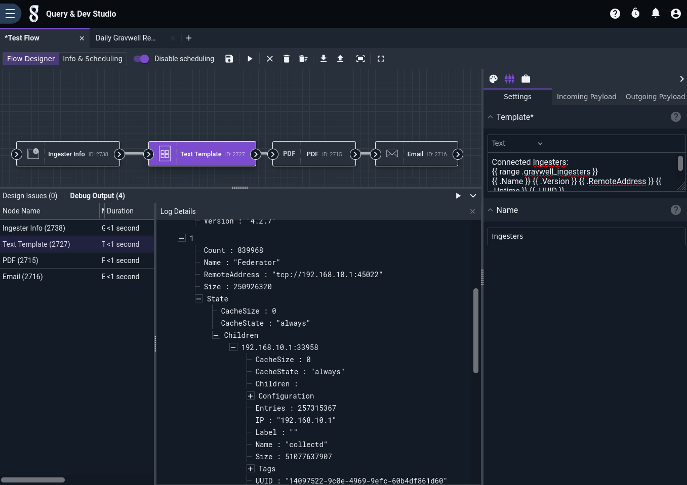
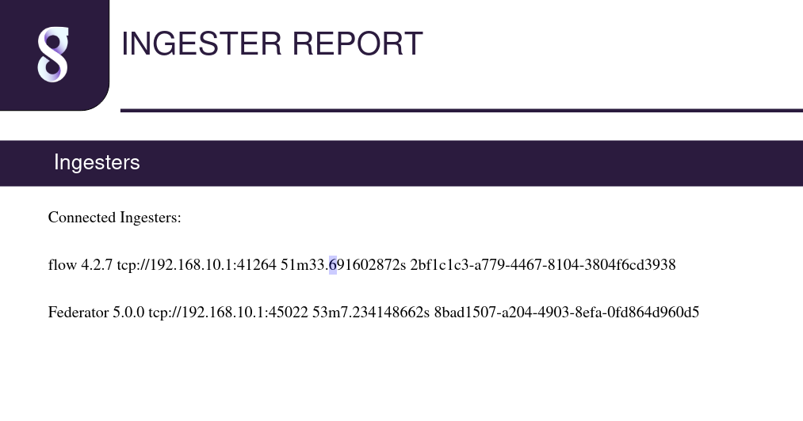

# Ingester Info Node

This node injects information about currently-connected Gravwell ingesters into the payload. This is useful when generating reports or monitoring cluster health.

## Configuration

* `Output Variable Name`: the name to use for results in the payload, default "gravwell_ingesters".

## Output

The node inserts an array (named `gravwell_ingesters` by default) into the payload containing information about the ingesters currently active in the Gravwell cluster. Each element in the array is a structure containing the following fields:

* `Name`: the name of the ingester, e.g. "Federator".
* `RemoteAddress`: the IP address of the ingester, e.g. "tcp://192.168.0.5:45022".
* `Count`: the number of entries sent by the ingester since connecting.
* `Size`: the number of bytes sent by the ingester since connecting.
* `Uptime`: how long the ingester has been connected.
* `Tags`: an array of strings representing the tags the ingester has negotiated.
* `Version`: the version of the ingester.
* `UUID`: the ingester's UUID.
* `State`: a structure containing additional information about the ingester, including any other ingesters which are connected to it in the case of the Federator.

## Example

The following example formats the ingester info, packs it into a PDF, and sends the PDF via email:



The [Text Template](template.md) node is configured with the following template:

```
Connected Ingesters:
{{ range .gravwell_ingesters }}
{{ .Name }} {{ .Version }} {{ .RemoteAddress }} {{ .Uptime }} {{ .UUID }}
{{ end }}
```

The resulting PDF looks like this:


