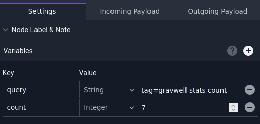
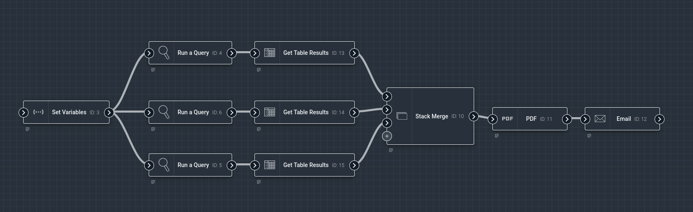
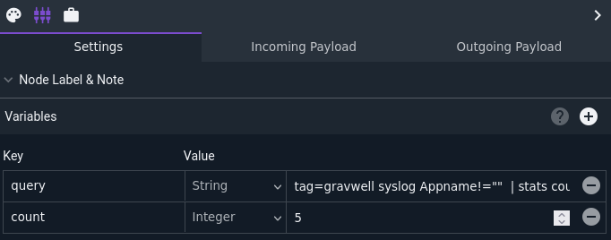
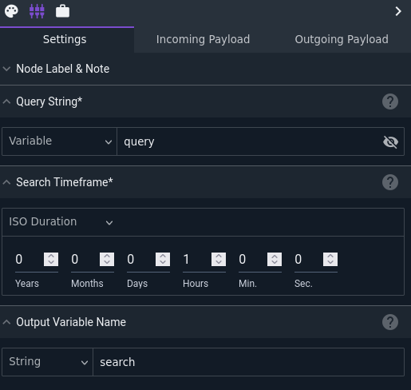
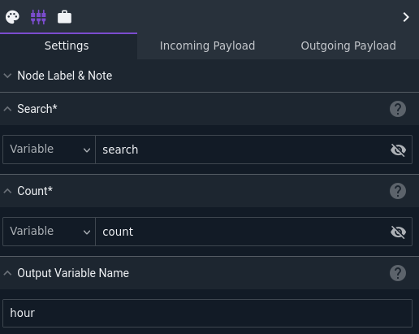

# Set Variables Node

This node manually injects variables into the payload. This can be used to set a long string, such as a Gravwell query, in one place, then use it in several other nodes.

## Configuration

The node takes a variable number of config options, one per variable to be injected. The screenshot below shows a node configured to inject two variables: one named "query" containing a Gravwell query string, and one named "count" containing the integer 7.

## Output

The node injects an entry into the payload for each config item specified.

## Example

This example uses the Set Variables node to define a query string and a count, which are used in multiple Run Query and Get Table Results nodes to make modifications easier. The results of those nodes are then fed into the [PDF](pdf) node to generate a nice report, which is then sent out via email.

The Set Variables node is configured to inject a variable named "query" containing the string `tag=gravwell syslog Appname!=""  | stats count by Appname | table` and a variable named "count" containing the integer 5.

The Run Query nodes are configured with the Query String setting pointed at the "query" variable defined earlier. One node runs over the last hour, one over the last day, and one over the last week.

The Get Table Results nodes are configured to read results from the previous search and save the results in a variable named "hour", "day", or "week" depending on the particular search's duration.

The PDF generated looks like this:

