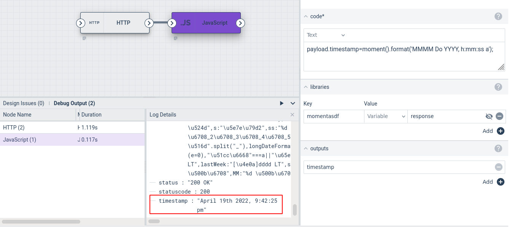

# JavaScript Node

This node can execute JavaScript code in a flow. It can read from the payload and insert values into the outgoing payload. It can also load JavaScript libraries for additional functionality.

## Configuration

* `Code`, required: The JavaScript code to run.
* `Libraries`: Loads optional JavaScript libraries. This is a key-value configuration block in which the key is the name of the library (for organizational purposes only) and the value is the contents of the library.
* `Outputs`: a list of variables to be output from the script (see below).

## Output

The JavaScript node can modify any value in the incoming payload. It can also create new items in the outgoing payload, but those new items *must* be listed in the Outputs config field.

Variables in the payload are accessed in JavaScript code with the prefix `payload`, e.g. `payload.flow.Scheduled` to get the scheduled execution time of the flow.

## Example

This example fetches a JavaScript library from a web server, then uses that library to format a timestamp.

The HTTP node is configured to fetch `https://momentjs.com/downloads/moment-with-locales.min.js`. The JavaScript node then uses `response` (the body of the HTTP response, containing the JS library) as input to its `libraries` config option. It sets up an output named `timestamp`. The code (below) then formats the current time and puts the result into the payload:

```
payload.timestamp=moment().format('MMMM Do YYYY, h:mm:ss a');
```


