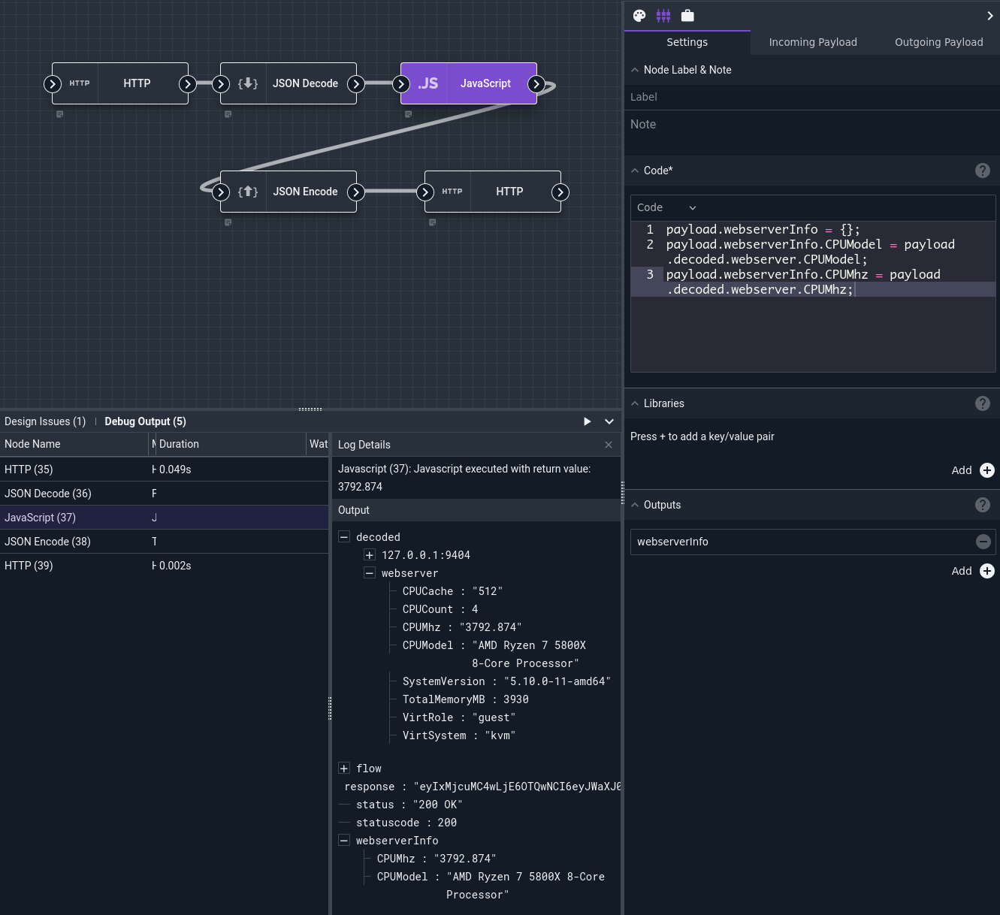

# JSON Encode / JSON Decode Nodes

These nodes manipulate JSON data. The JSON Encode node takes items from the payload, encodes them as JSON, and puts the result back into the payload. The JSON Decode node takes strings containing raw JSON from the payload, decodes them as JSON, and puts the resulting variables back into the payload.

## Configuration

Both nodes have a single configuration option, "Items":

* `Items`, required: One or more key-value pairs. The *key* is a variable in the payload to be used as input; the *value* is the name of the variable into which the output should be placed.

In the case of JSON Encode, the keys should be objects in the payload to be JSON-encoded. For JSON Decode, the keys are objects in the payload containing raw JSON which should be decoded.

## Output

Depending on the configuration, the node will create one or more new elements in the outgoing payload.

## Example

This example uses both the JSON Encode and JSON Decode nodes. It hits a Gravwell endpoint, decoding the JSON in the response. It then extracts some specific fields from the decoded response, encodes those fields back as JSON, and sends them to a different HTTP endpoint.



First, the [HTTP](http.md) node does a GET request on `http://localhost/api/stats/sysDesc`, querying the local Gravwell system for information about the system. The response comes back as a JSON-encoded string, so we feed that into the JSON Decode node, which is configured to decode the variable `response` and put the result into the payload under the name `decoded`.

Next, we use the [JavaScript](javascript.md) node to pick out the CPU model and CPU MHz fields from the decoded structure and put them into a different object within the payload. Refer back to the screenshot above; note how the payload coming out of the JavaScript node has a `decoded` field, with lots of information about the webserver, and a `webserverInfo` field, containing only the two items we picked out in the JS code. The JavaScript code used was:

```
payload.webserverInfo = {};
payload.webserverInfo.CPUModel = payload.decoded.webserver.CPUModel;
payload.webserverInfo.CPUMhz = payload.decoded.webserver.CPUMhz;
```

Next, a JSON Encode node is used to encode `webserverInfo` (the sub-selected values from the JavaScript node) into JSON, placing the encoded string into a variable named `toSend`.

Finally, the terminal HTTP node does a POST request to a different API endpoint, using the `toSend` variable as the body of the request.
The HTTP server receives the following:

```
{"CPUMhz":"3792.874","CPUModel":"AMD Ryzen 7 5800X 8-Core Processor"}
```
