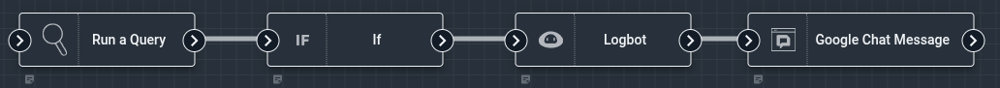
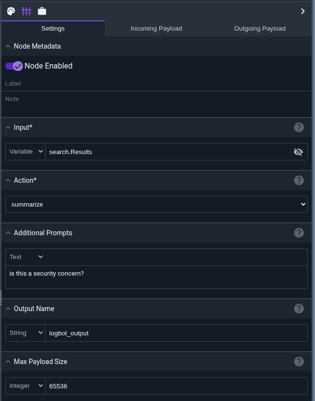
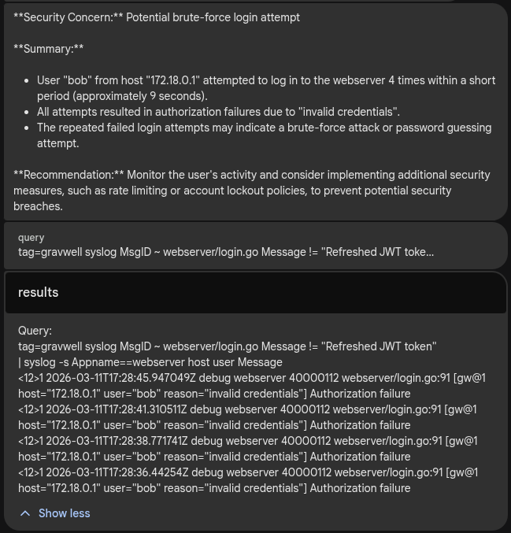

# Logbot Node

The Logbot node uses Gravwell's AI-powered Logbot service to analyze, explain, or summarize log data and text. It sends input text to the Logbot API and returns the AI-generated response in a configurable output variable.



```{note}
This node requires the Logbot/AI API service to be enabled on your Gravwell instance. The node uses network access to communicate with the Logbot service.
```

## Configuration

* `Input`, required: The text or log data to send to Logbot. This can be a static string or a variable from the payload (such as search results, formatted text, or raw log entries).
* `Action`, required: The type of analysis to perform. Must be one of:
  * `explain` - Analyzes and explains the individual components of log entries and provides context about what each part represents
  * `summarize` - Extracts and summarizes the most important information from log entries into a condensed form
  * `custom` - Allows you to provide your own custom prompt without predefined instructions
* `Additional Prompts`: Optional extra instructions to include with your request. This allows you to refine or customize the analysis (e.g., "Focus on security-related events" or "Identify anomalies").
* `Output Name`: The name of the variable where the Logbot response will be stored in the payload (default: `logbot_output`).
* `Max Payload Size`: Maximum input size in bytes (default: 65536). If the input exceeds this size, it will be truncated and a warning will be logged.



## Output

The node sets a variable in the payload (named `logbot_output` by default, or as specified in the `Output Name` configuration) containing the Logbot response text.

The node does not modify other payload values.



## Action Types

The `explain` action analyzes log entries and provides detailed explanations of each component:

Use this action when you need to:
- Understand the structure of unfamiliar log formats
- Document what different log fields represent
- Learn about a new system's logging patterns

The `summarize` action condenses log entries into a shorter, more digestible form:

Use this action when you need to:
- Create executive summaries of log events
- Reduce verbose log output to key points
- Generate concise reports from detailed logs


The `custom` action allows you to provide your own prompting without any predefined system prompt. Use the `Additional Prompts` field to specify exactly what you want Logbot to do with the input.

Use this action when you need to:
- Perform specialized analysis not covered by explain/summarize
- Apply domain-specific knowledge to log analysis
- Create custom workflows with specific instructions

## Error Handling

The Logbot node is designed to be resilient and will **not** cause flows to fail even if the Logbot API encounters errors. Instead:

- Any errors are captured and placed in the output variable
- Errors are logged for debugging purposes
- The flow continues executing downstream nodes

This ensures that temporary API issues don't break your automation workflows.

## Input Payload Size

The `Max Payload Size` setting limits how much data is sent to the Logbot API:

- Default: 65536 bytes (64 KB)
- If input exceeds this limit, it is automatically truncated
- A warning is logged when truncation occurs
- You can increase this value if you need to analyze larger log sets

Be aware that very large inputs may take longer to process and could hit API rate limits.

## Example: Examining some failed Gravwell Login Attempts

This example retrieves Apache access logs from Gravwell, formats them as text, and uses Logbot to explain the log format.


The flow consists of three nodes:

1. **Run a Query** node executes a Gravwell query:

```{code}
tag=gravwell syslog MsgID ~ webserver/login.go Message != "Refreshed JWT token"
| syslog -s Appname==webserver host user Message
```
   This retrieves login activity that is not basic JWT refreshes.

2. **If** node checks if there are results using `search.Count > 0` logic.

3. **Logbot** node is configured as shown below.

The Logbot node configuration:

* **Input**: References the formatted text output from the Text Template node
* **Action**: Set to `summarize` to get summery of what happened
* **Additional Prompts**: "is this a security concern?"
* **Output Name**: Uses the default `logbot_output`

When executed, Logbot analyzes the gravwell logs and produces a summary and analysis of the login attempts, including whether there are any security concerns. The output is stored in the `logbot_output` variable and can be used by downstream nodes for further processing or notifications.


## Example: Custom Analysis

Using the `custom` action with custom prompting:

**Logbot node:**
- **Input**: Raw log data from a custom application
- **Action**: `custom`
- **Additional Prompts**: 
  ```
  Analyze these application logs and identify any performance issues, 
  errors, or anomalies. Categorize findings by severity (critical, warning, info).
  Provide specific line numbers or timestamps for critical issues.
  ```

This gives you complete control over how Logbot processes the input.

## Integration with Other Nodes

The Logbot output can be used by downstream nodes:

- **Email/Slack/Teams**: Send AI-generated summaries and explanations to team members
- **Ingest**: Re-ingest Logbot analysis as enriched log data
- **PDF**: Include AI analysis in automated reports
- **If**: Make decisions based on keywords in Logbot output
- **Text Template**: Format Logbot output into custom report templates

```{tip}
Combine Logbot with the Text Template node to format raw query results before analysis. This helps Logbot understand the data better and produces more accurate results.
```

```{warning}
Logbot requires network access and the AI API service. Ensure your flow is configured to allow network operations and that your Gravwell instance has Logbot enabled.
```
