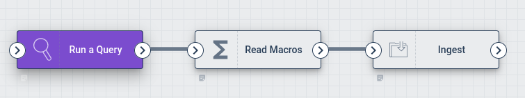
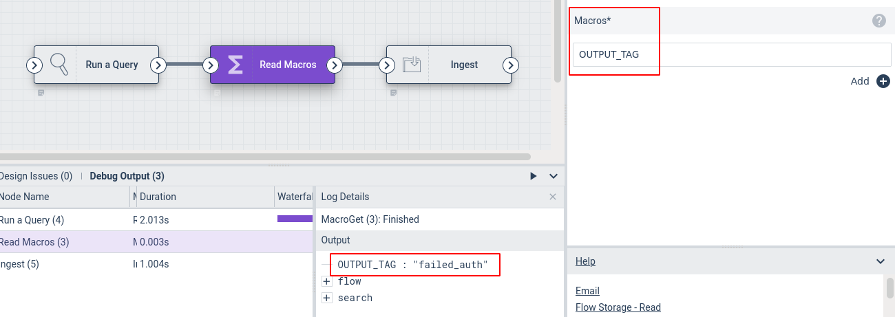
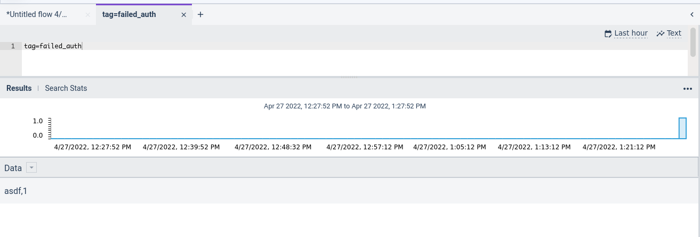

# Read Macros Node

This node reads the values of named [Gravwell macros](/search/macros). For each specified macro, it outputs a new value into the payload with a name matching the macro name.

## Configuration

* `Macros`: A list of macros to fetch. These should be the macro names without preceding `$` characters.

## Output

The node inserts an object into the payload for each macro specified. The contents of the value in the payload correspond to the expansion of the macro. If no such macro exists, the contents of the value in the payload will be equal to the macro name.

## Example

This example runs a query, then re-ingests the results into a tag whose name is fetched from a macro. 



The Run Query node is configured to run the following query over the last 24 hours to find failed logins:

```gravwell
tag=gravwell syslog Message=="Authentication failure" user | stats count by user | table user count
```

The Read Macros node reads the contents of a macro named `$OUTPUT_TAG`, which has been configured to expand to "failed_auth":



The Ingest node then uses the search results as its input and the payload variable `OUTPUT_TAG` to specify the tag:


After running the flow, we can query the "failed_auth" tag and see that a user named "asdf" failed to log in 1 time:


