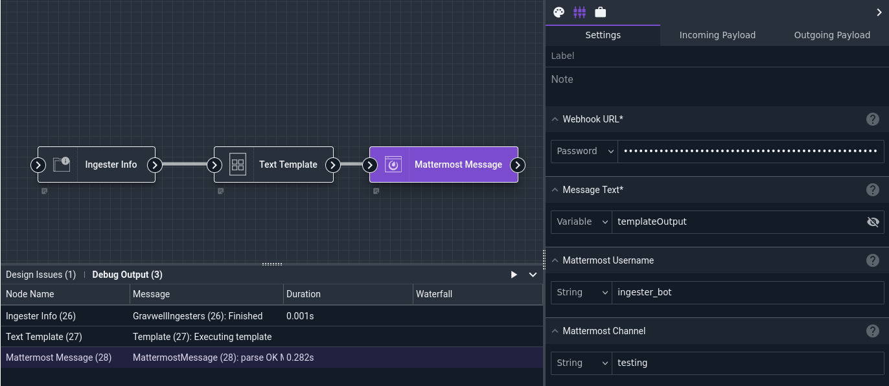
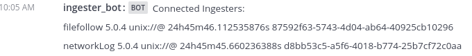

# Mattermost Message Node

The Mattermost Message node sends a message to a Mattermost channel.

## Configuration

* `Webhook URL`, required: a [Mattermost webhook](https://docs.mattermost.com/developer/webhooks-incoming.html) for the server you wish to send to.
* `Message Text`, required: the body of the message you wish to send.
* `Mattermost Username`: the webhook is configured to send messages with a default username; this setting will override that default.
* `Mattermost Channel`: the webhook is configured to send messages to a default channel; this setting overrides the channel to which the message is sent.
* `Icon URL`: set an icon URL for message post.

## Output

The node does not modify the payload

## Example

This example gathers information about currently-connected ingesters, formats that information into a text representation, and posts it to a Mattermost channel.



The [Text Template](template) node is configured with the following template:

```
Connected Ingesters:
{{ range .gravwell_ingesters }}
{{ .Name }} {{ .Version }} {{ .RemoteAddress }} {{ .Uptime }} {{ .UUID }}
{{ end }}
```

The output in Mattermost looks like this:


