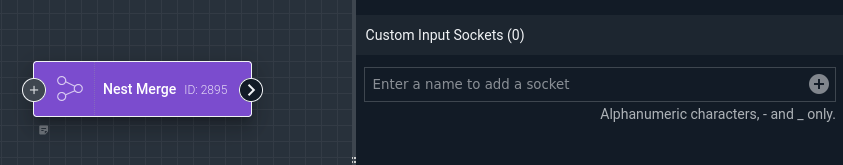
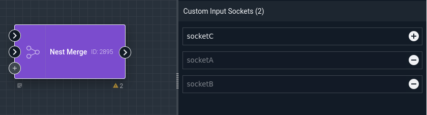
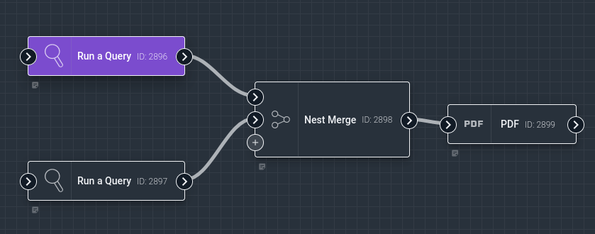
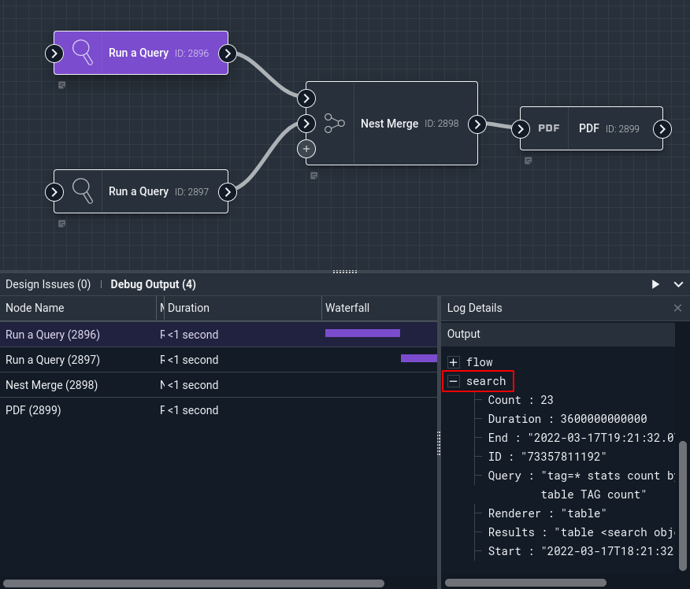
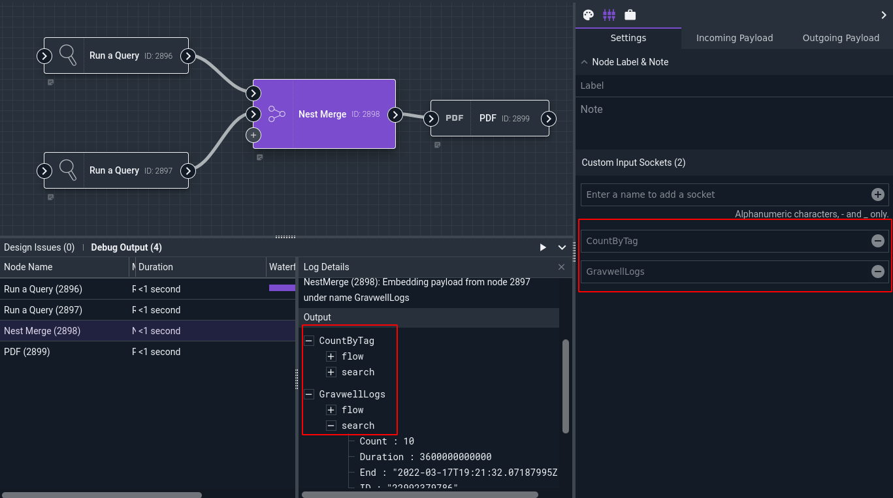
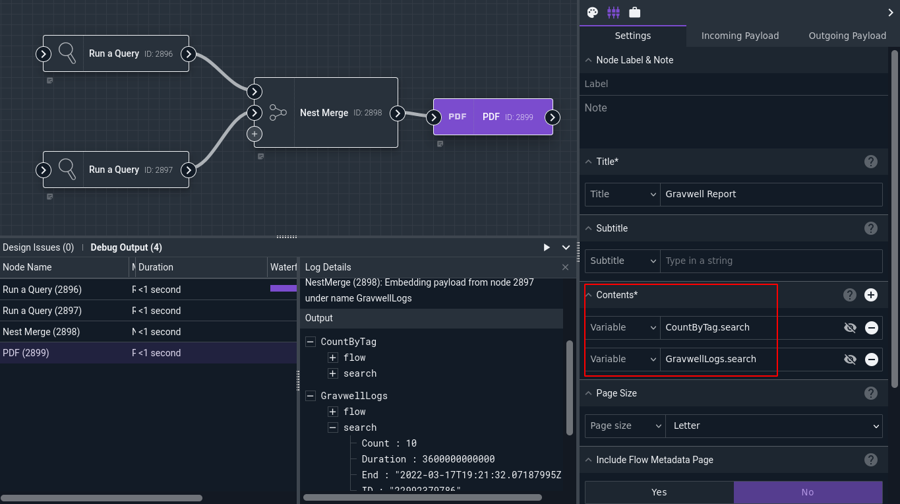

# Nest Merge Node

This node combines multiple input payloads into a single output payload. Each input payload is "nested" into the output payload under a unique name. Consider two input payloads, both containing a variable `foo` containing the value "bar"; feeding these into a Nest Merge node and labeling the inputs "a" and "b" will result in a single output payload with a structure like this:

```
{
	"a": { "foo": "bar" },
	"b": { "foo": "bar" }
}
```

## Configuration

The Nest Merge node has no "configuration" settings in the same sense as most nodes; instead, it has a variable number of input sockets, each with a user-specified name. Initially, there are no input sockets:



Typing a name into the field and clicking the "+" icon will add new inputs:



## Example

This example runs two Gravwell queries, combines the outputs via a Nest Merge node, then generates a PDF containing both searches:



Each of the Run Query nodes outputs a `search` into its output payload:



The Nest Merge node has two input sockets defined: `CountByTag` and `GravwellLogs`. Observe the output payloads of the Nest Merge node; there is a `CountByTag` item and a `GravwellLogs` item, each containing the `flow` and `search` items originating from their respective Run Query nodes:



The PDF node is then configured to include `CountByTag.search` and `GravwellLogs.search` in its contents:


