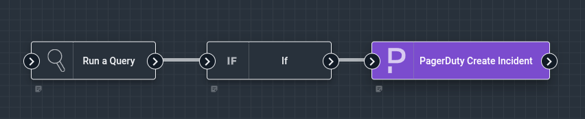
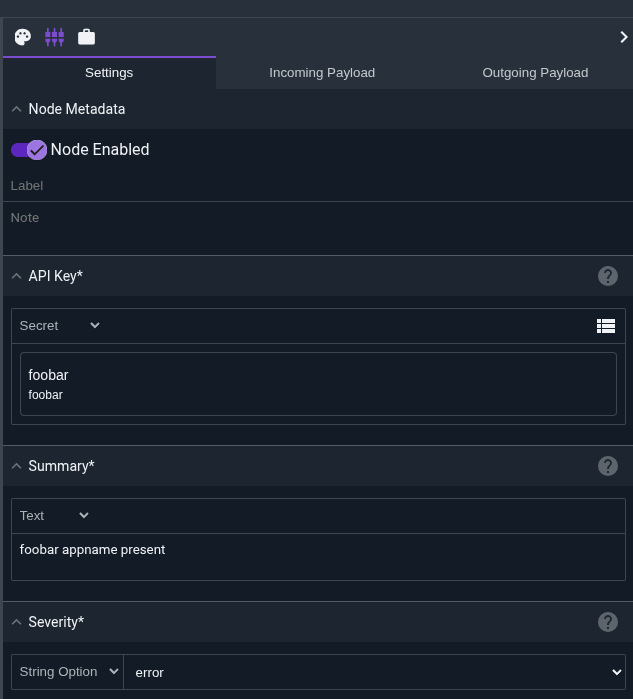
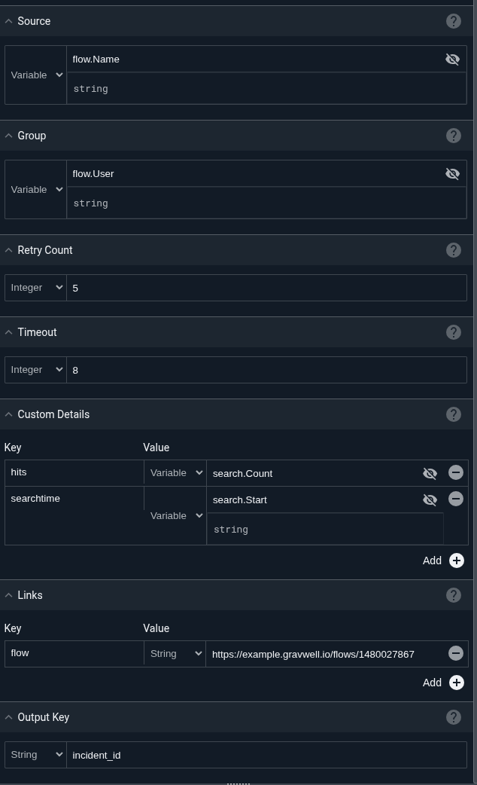

# PagerDuty Create Incident Node

The PagerDuty Create Incident node creates a PagerDuty incident for alerting and incident management.

## Configuration

* `API Key`, required: a [PagerDuty API integration key](https://support.pagerduty.com/docs/api-access-keys) (also known as a routing key) for the desired service.
* `Summary`, required: a brief text summary of the incident, providing a high-level description of the problem.
* `Severity`, required: the severity level of the incident. Select from `critical`, `error`, `warning`, or `info`.
* `Source`: an optional string identifying the source of the incident (e.g., a hostname, service name, or monitoring system).
* `Group`: an optional logical grouping for the incident, useful for organizing related incidents.
* `Retry Count`: the number of retry attempts to make if the initial request fails. Values less than or equal to 1 mean a single attempt will be made. The node uses exponential backoff between retries.
* `Timeout`: timeout in seconds for the PagerDuty API request. The default is 5 seconds. Values less than or equal to 0 disable the timeout.
* `Output Key`: the name of the payload field where the deduplication key will be stored. Defaults to `DedupKey` if not specified.
* `Custom`: optional custom key-value pairs that will be included in the incident's `custom_details` field. These can include any additional context relevant to the incident.
* `Links`: optional key-value pairs where the key is the link text and the value is the URL. These will be included as links in the PagerDuty incident.

## Output

The node adds a deduplication key to the payload. The deduplication key is returned by PagerDuty and can be used to update or resolve the incident later. By default, this key is stored in the `DedupKey` field, but this can be customized using the `Output Key` configuration option.

## Example

This example runs a query to detect an unauthorized `Appname` in the `gravwell` tag. if results exist, it creates a PagerDuty incident with a "high" severity.



The PagerDuty node is configured with:

* `API Key`: A reference to a secret containing the PagerDuty integration key
* `Summary`: "foobar appname present"
* `Severity`: "high"
* `Source`: A reference from the flow name
* `Custom`: Additional fields like `search.Count` and `search.Start`
* `Links`: A link back to the Gravwell flow
* `Timeout`: A time out of 10 seconds, each pagerduty request attempt will wait up to 10 seconds for a response before failing and retrying.
* `Retry Count`: 5, if the initial request fails, the node will retry up to 5 times with exponential backoff.

The output in PagerDuty will display the incident with all configured details and the flow payload will contain the deduplication key for future reference.





## PagerDuty API Keys

The PagerDuty Create Incident node requires a valid integration key (also called a routing key) to send incidents to PagerDuty. This key is specific to a PagerDuty service and can be obtained from the service's integration settings.

To create an integration key:

1. Navigate to **Services** in your PagerDuty account
2. Select the service you want to integrate with
3. Go to the **Integrations** tab
4. Add a new integration using the **Events API V2** integration type
5. Copy the **Integration Key** (routing key)

```{warning}
Pagerduty API keys can create incidents and get people out of bed in the middle of the night, be sure to store them as secrets and restrict access as much as possible.
```

```{note}
This node is designed to be highly resilient and prioritize getting alerts out. Even if optional fields fail to populate, the node will attempt to create the incident with whatever information is available. Check the flow logs for any warnings about failed optional field processing.
```

```{note}
The deduplication key returned by PagerDuty can be used to send subsequent events that update or resolve the same incident, preventing duplicate incidents from being created for the same issue.
```
