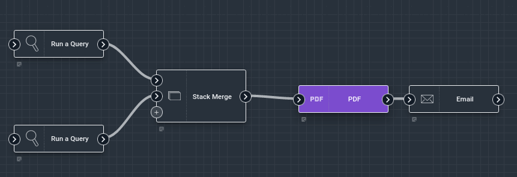
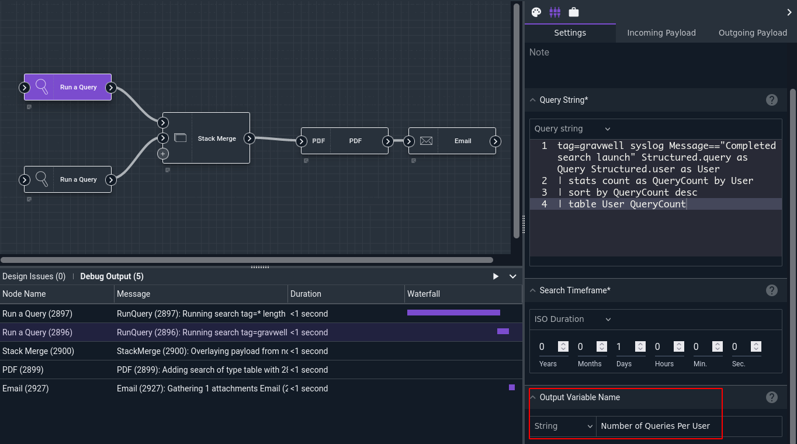
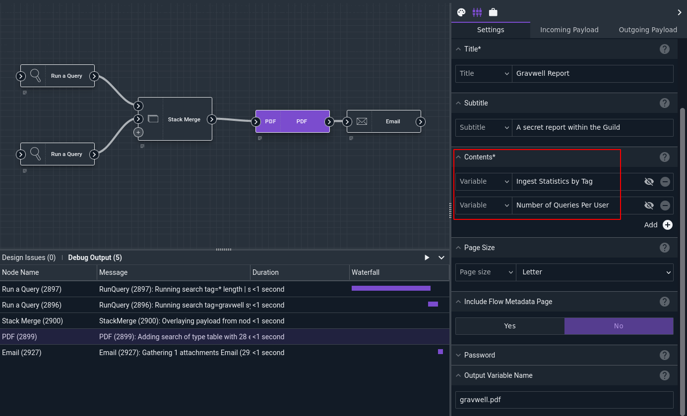
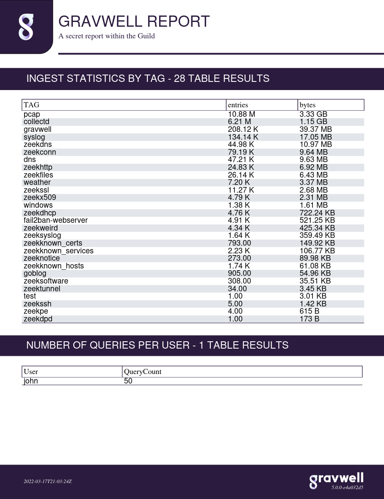

# PDF Node

The PDF node generates PDF documents based on items pulled from the payload. This allows the user to quickly put together reports based on the results of Gravwell queries and other data sources.

## Configuration

* `Title`, required: the title of the PDF.
* `Subtitle`: an optional sub-title.
* `Contents`, required: select one or more items from the payload to be included in the PDF. Query results will be automatically formatted.
* `Page Size`: change the size of the pages in the PDF.
* `Include Flow Metadata Page`: if set to true, the PDF will include a final page giving information about the execution of the flow.
* `Password`: if set, the PDF will be password-protected.
* `Output Variable Name`: sets the name for the output PDF in the payload.

## Example

This flow runs two Gravwell queries, formats the results in a PDF, and emails the PDF.

The [Run Query](runquery.md) nodes are configured to output their results into human-friendly names:

Results from the two query nodes are joined using the [Stack Merge](stackmerge.md) node, then the PDF node packages the two query results into the document:

Finally, the [Email](email.md) node sends the resulting PDF to the recipient:

