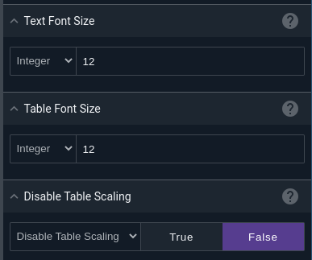
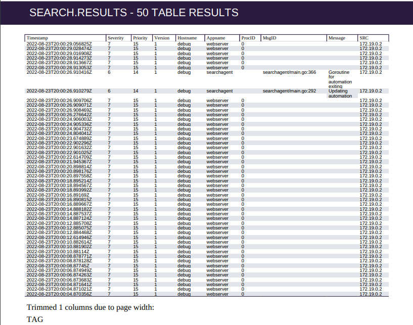

# PDF Node

The PDF node generates PDF documents based on items pulled from the payload. This allows the user to quickly put together reports based on the results of Gravwell queries and other data sources.

## Configuration

* `Title`, required: the title of the PDF.
* `Subtitle`: an optional sub-title.
* `Contents`, required: select one or more items from the payload to be included in the PDF. Query results will be automatically formatted.
* `Page Size`: change the size of the pages in the PDF.
* `Include Flow Metadata Page`: if set to true, the PDF will include a final page giving information about the execution of the flow.
* `Password`: if set, the PDF will be password-protected.
* `Output Variable Name`: sets the name for the output PDF in the payload.
* `Text Font Size`: Sets the font size for text sections in the PDF.
* `Table Font Size`: Sets the font size for text inside formatted tables in the PDF.
* `Disable Table Scaling`: Disables the automatic table scaling for tables in the PDF.

## Example

This flow runs two Gravwell queries, formats the results in a PDF, and emails the PDF.

The [Run Query](runquery.md) nodes are configured to output their results into human-friendly names:

Results from the two query nodes are joined using the [Stack Merge](stackmerge.md) node, then the PDF node packages the two query results into the document:

Finally, the [Email](email.md) node sends the resulting PDF to the recipient:

## Formatting

The PDF node is designed to perform a best effort formatting of data, this includes automatically resizing images, formatting tables to control text size, and adding headers for individual sections.  However, it may be useful to override some of the automatic formatting and force specific fonts and/or table formatting.  The two font size controls and optional table auto scaling control allow for manually setting font sizes and/or forcing table formatting.

By default, both text and tables in a PDF will use a 12 pt font.  Tables will automatically size up or down if the data within a table allows it.  For example, if a query only has two columns of data with relatively small data sizes the table will scale up the font (up to 18pt) to make the table more readable.  If a table has many columns of data or long strings in cells the table will be automatically scaled down to try and fit as much data as possible.  If the table cannot fit all of the columns, even with font scaling, the table may omit columns and add a note at the base of the table indicating that some columns were omitted due to size.  Here is an example of a PDF with a table that simply cannot fit the data:

