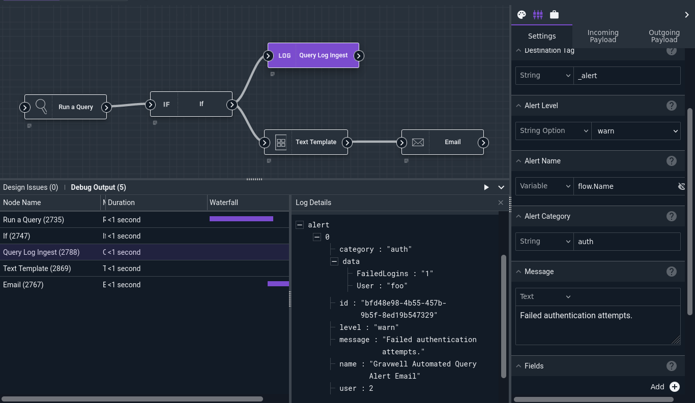
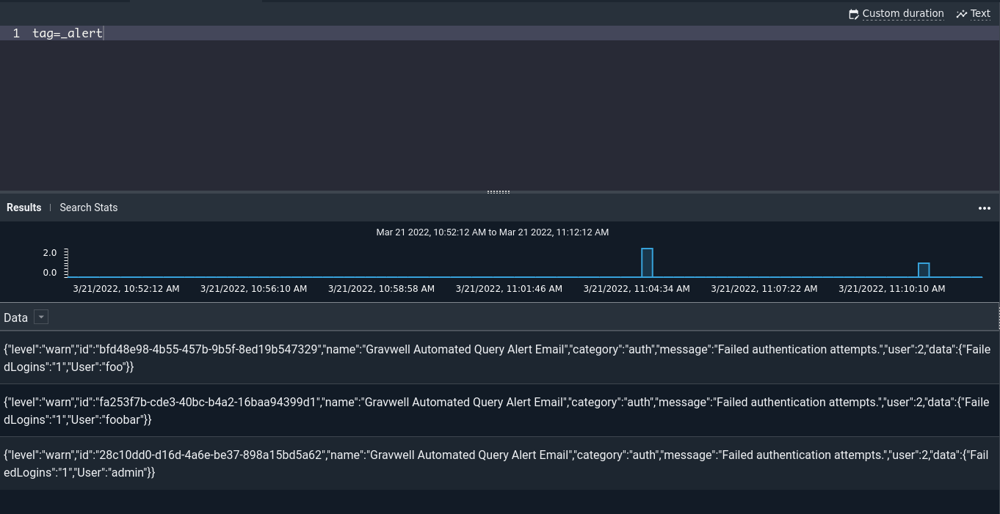

# Query Log Ingest Node

The Query Log Ingest node is an advanced node which generates *alert entries* based on the results of a previous Gravwell query, then ingests those alerts to specified tag.

## Configuration

* `Destination Tag`, required: the tag into which the alerts should be ingested. The default of `_alert` is a good choice.
* `Alert Level`: the severity level of the alert: info, warn, error, or critical.
* `Alert Name`: the name of the alert. `flow.Name` is a good choice, because it associates the alert entries with the flow.
* `Alert Category`: optional user-friendly category for the alerts.
* `Message`: text describing why the alert was generated.
* `Fields`: optional selection of "fields" to extract from the search results and included with the alert entries. For queries with the text renderer, these should be enumerated value names; for queries using the table renderer, these are table column names. If no fields are specified, *all* possible elements will be used.
* `Search`, required: the search query to pull results from.
* `Output`: the generated alerts will be placed into the output payload under this name.

### Note
The default `_alert` tag should probably used, most Gravwell kits and embedded applications expect Gravwell generated alerts to be in this tag.

## Output

The node will insert the generated alerts into the outgoing payload under the name specified in the `Output` config value.

## Example

This example runs a query counting failed login attempts by user. If there were any results, it creates alert entries and sends an alert email.



The [Run Query](runquery.md) node is configured to run the following query:

```
tag=gravwell syslog Message=="Authentication failure" user as User
| stats count as FailedLogins by User 
| table User FailedLogins
```

The [If](if.md) node checks `search.Count` against 0; if there are any results, execution continues.

The Text Template node generates a simple description of the results and sends it on to the email node.

The Query Log Ingest node is configured to pull results from the `search` item and ingest the alerts into the `_alert` tag at severity level "warn". Note that the `Fields` config is left blank; this means *all* columns of the table (User and FailedLogins) will be extracted and included in the alert entries, as seen below:


