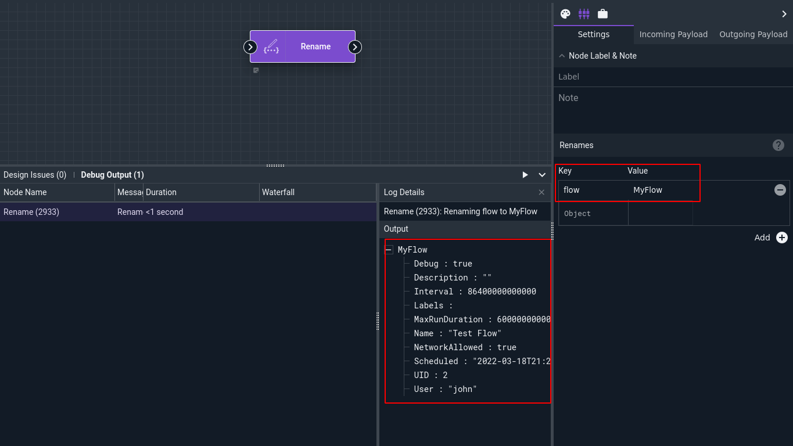

# Rename Node

The Rename node changes the names of specified variables in the input payload, then pushes that modified payload downstream. Because most nodes can specify custom output names, Rename is rarely needed.

## Configuration

* `Renames`, required: One or more pairs of strings. The first string, the key, specifies the name of the existing variable. The second string, the value, specifies the *new* name for that variable.

## Output

Depending on the configuration, the node will re-name elements of the outgoing payload.

## Example

In this very simple example, the Rename node renames the built-in default item "flow" to "MyFlow". Note the outgoing payload shown in the screenshot:

