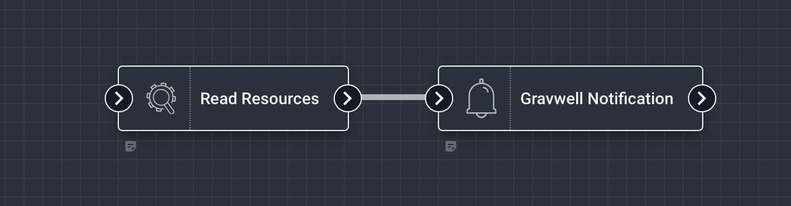
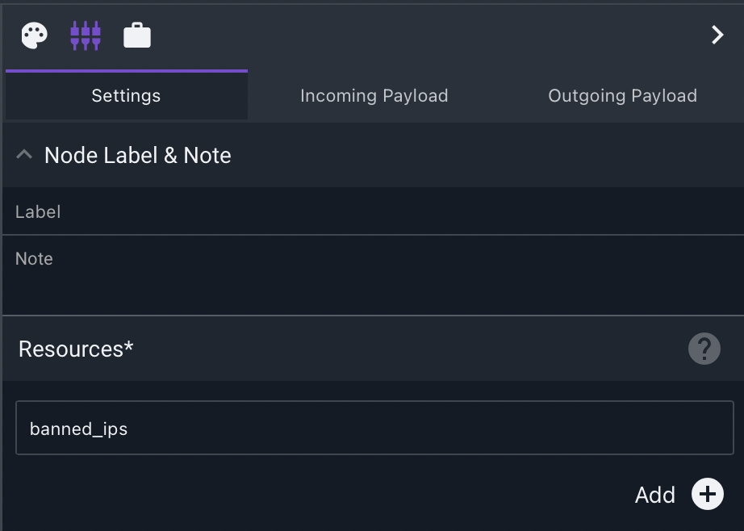

# Read Resources Node

This node reads the contents of a [Gravwell Resource](/resources/resources.md). The resource contents are put into a new payload value matching the resource name.

## Configuration

* `Resources`: A list of resources to fetch. 

## Output

The node inserts an object into the payload for each resource specified. If no such resource exists, an error will be generated.

## Example

This example reads a resource containing banned IP addresses, generating a notification with the contents of the resource.

The Read Resources node is configured to read a resource named "banned_ips":

