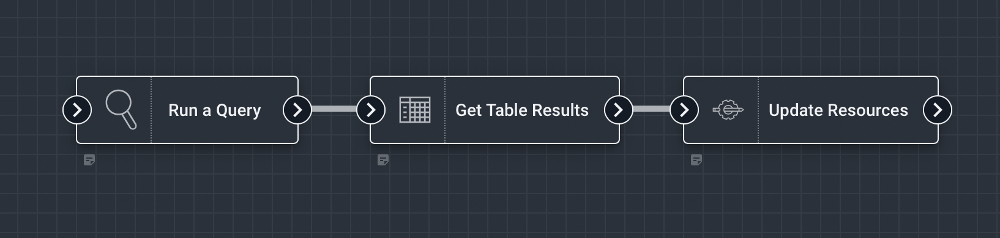
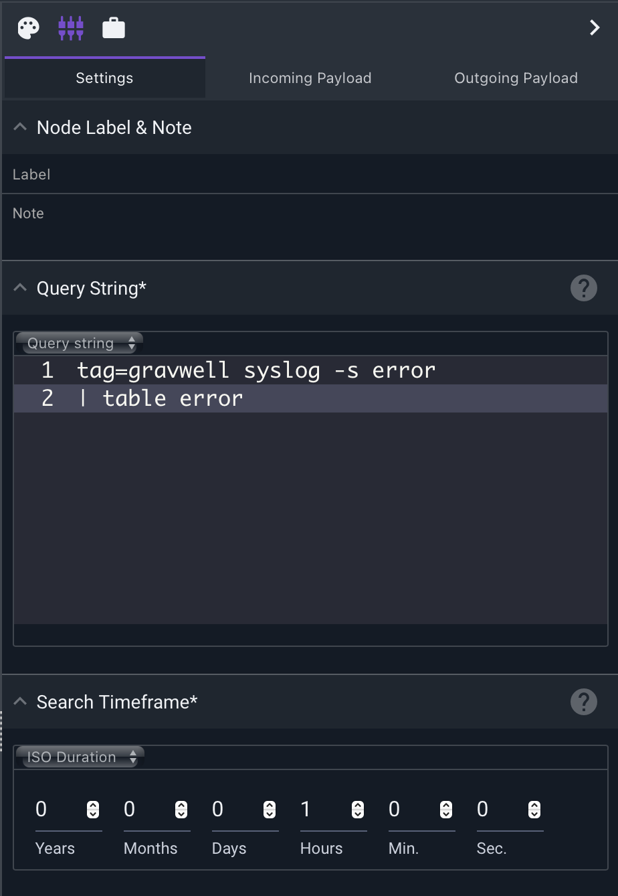
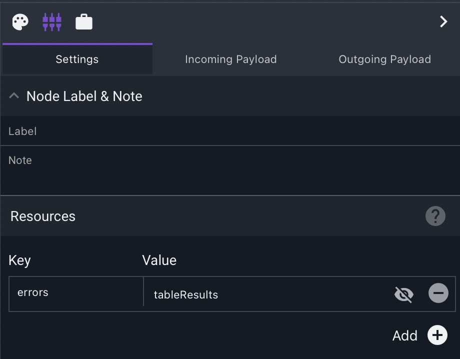
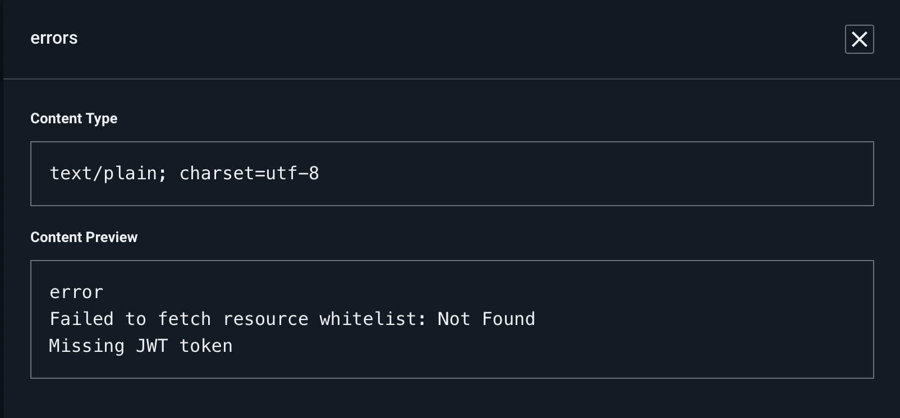

# Update Resources Node

This node creates or updates the contents of a [Gravwell Resource](/resources/resources.md). 

## Configuration

* `Resources`: A key/value list of resources to write. The key represents the resource name.

## Example

This example reads errors from the Gravwell tag over the last hour, and writing them to a resource named "errors".

The Run a Query node is configured to create a table of errors:

The Update Resources node writes a resource named "errors", using the tableResults field of the Get Table Results node.

You can preview the resource in the Resources menu:

