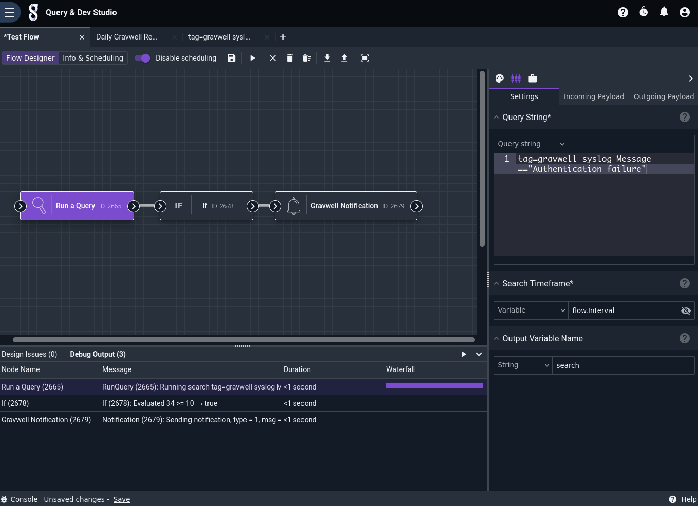
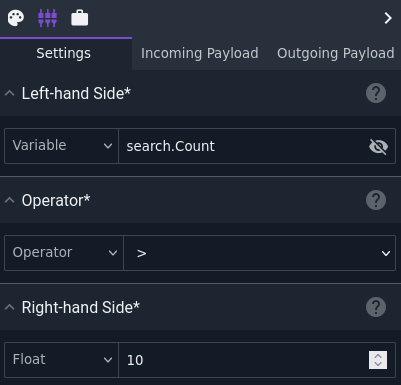
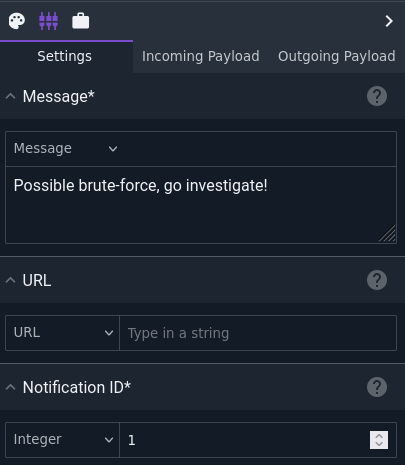
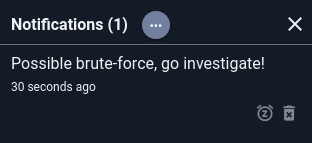

# Run Query Node

This node executes a Gravwell query. It outputs a structure into the payload (named `search` by default) which contains information about the search and allows other nodes to access the results.

## Configuration

* `Query String`, required: the Gravwell query to run.
* `Search Timeframe`, required: the timeframe over which to run. You can manually set a duration, or by selecting the variable `flow.Interval` the query will run over the scheduled timespan of the flow, e.g. if the flow is scheduled to run `@daily`, the query will run over the last 24 hours.
* `Output Variable Name`: the name to use for results in the payload, default "search".

## Output

The node inserts an object (named `search` by default) into the payload containing information about the search. The component fields are:

* `Query`: the query which was executed.
* `ID`: the numeric ID of the search.
* `Renderer`: the name of the renderer used, e.g. "table".
* `Start`: the beginning of the timespan over which the search executed.
* `End`: the end of the timespan over which the search executed.
* `Duration`: the span of time between Start and End.
* `Count`: the number of entries returned by the query.
* `Results`: the results of the query (see below).

Typically, downstream nodes will take either the `search` object itself or `search.Results` as their input; the two are interchangeable. Some nodes, such as the [PDF](pdf) node, can take the search object and perform custom formatting on the results. Others, such as the [Notification](notification) node, simply get a basic stringified version of the search results.

## Example

The Query node is used in many examples throughout the documentation for *other* nodes, usually by accessing the results of the search. This example shows how the `search.Count` variable can be useful on its own, by sending a notification if there have been many authentication failures since the last run of the script, possibly indicating a brute-force attempt.

The Query node is configured to run `tag=gravwell syslog Message=="Authentication failure"`, with the timeframe set to `flow.Interval`. This means that if the flow is set up to run every hour, the query will execute over the last hour's data.

The If node is set to check if `search.Count` is greater than 10:

The Notification node is configured to send a simple message to the user:

When run, the flow sends a notification if there have been more than 10 failed login attempts over the last hour:

