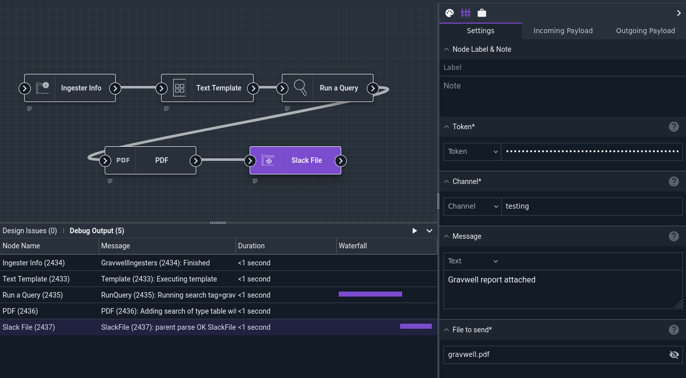
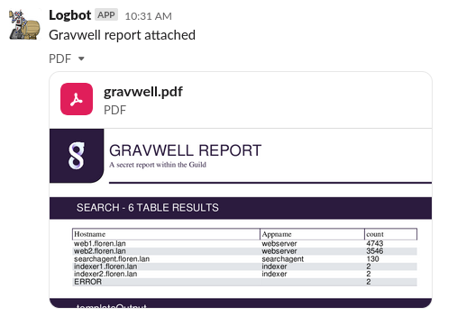

# Slack File Node

The Slack File Node uploads a file to a Slack channel.

## Configuration

* `Token`, required: a [Slack access token](https://api.slack.com/authentication/token-types) for the desired server.
* `Channel`, required: the channel that will receive the message, *without* a preceding `#` character.
* `Message`: an optional message to include with the file.
* `File to send`, required: the file to upload to Slack.

## Output

The node does not modify the payload.

## Example

This example gathers information about currently-connected ingesters and formats that information into a text representation, then runs a Gravwell query. It then combines the search output and the ingester information into a PDF file and uploads that file to a Slack channel.



The [Text Template](template) node is configured with the following template:

```
Connected Ingesters:
{{ range .gravwell_ingesters }}
{{ .Name }} {{ .Version }} {{ .RemoteAddress }} {{ .Uptime }} {{ .UUID }}
{{ end }}
```

The output in Slack looks like this:


