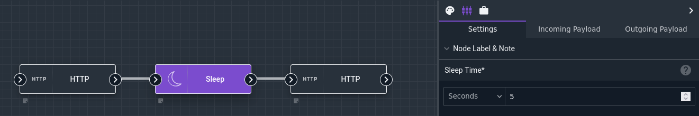

# Sleep Node

The Sleep node takes a user-configurable length of time to execute. Because flows always execute one node at a time, this means inserting a Sleep node can pause execution between two key steps, for instance to wait for a remote system to process a request after submitting a webhook.

## Configuration

* `Sleep Time`, required: specifies how many seconds the node should take to execute.

## Output

The node does not modify the payload.

## Example

This example issues an HTTP request, then waits for 5 seconds before issuing a second HTTP request.

