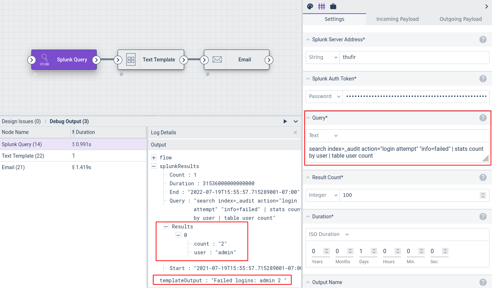

# Splunk Query Node

This node executes a Splunk query. It outputs a structure into the payload (named `splunkResults` by default) which contains information about the search and allows other nodes to access the results.

## Configuration

* `Splunk Server Address`, required: the Splunk server.
* `Splunk Auth Token`, required: a [Splunk authentication token](https://docs.splunk.com/Documentation/Splunk/9.0.0/Security/CreateAuthTokens)
* `Query`, required: the Splunk query to run (see note below).
* `Result Count`, required: the number of results to fetch.
* `Duration`, required: the timeframe over which to run. You can manually set a duration, or by selecting the variable `flow.Interval` the query will run over the scheduled timespan of the flow, e.g. if the flow is scheduled to run `@daily`, the query will run over the last 24 hours.
* `Output Name`: the name to use for results in the payload, default "splunkResults".

### Splunk Query Caveats

In the Splunk web UI, one might run the following query to see a table of failed logins:

	index=_audit action="login attempt" "info=failed" | stats count by user | table user count

However, that exact query will not work in the Splunk Query node, because the Splunk UI adds an *implicit* `search` to the start of the query. To run the same query in a Gravwell flow, you must add the `search` string explicitly:

	search index=_audit action="login attempt" "info=failed" | stats count by user | table user count

## Output

The node inserts an object (named `splunkResults` by default) into the payload containing information about the search. The component fields are:

* `Query`: the query which was executed.
* `Start`: the beginning of the timespan over which the search executed.
* `End`: the end of the timespan over which the search executed.
* `Duration`: the span of time between Start and End.
* `Count`: the number of entries returned by the query.
* `Results`: the results of the query (see below).

The `Results` field is an array of objects, each representing one line of results from the Splunk query.

Note that the top-level `splunkResults` object can be passed directly to the [Ingest](ingest) node; the results will be JSON-encoded and ingested.

## Example

This example queries a Splunk server for a table of failed logins, formats the results, and mails the results out:



The Splunk Query node is configured to run `search index=_audit action="login attempt" "info=failed" | stats count by user | table user count`, with the timeframe set to the last day.

The Text Template node does a little simple formatting of the results by iterating over `splunkResults.Results` and printing the "user" and "count" fields:

```
Failed logins:
{{range .splunkResults.Results}}{{.user}} {{.count}}
{{end}}
```

The Email node is configured to send the output of the Text Template node as the body of an email to the administrator.
