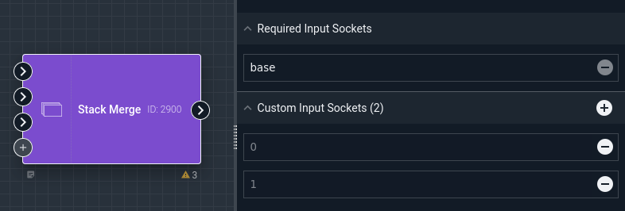
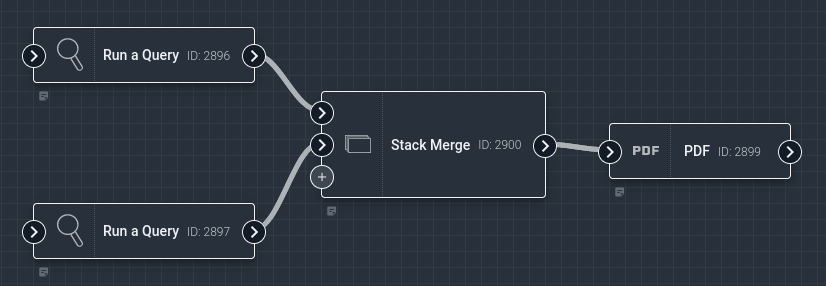
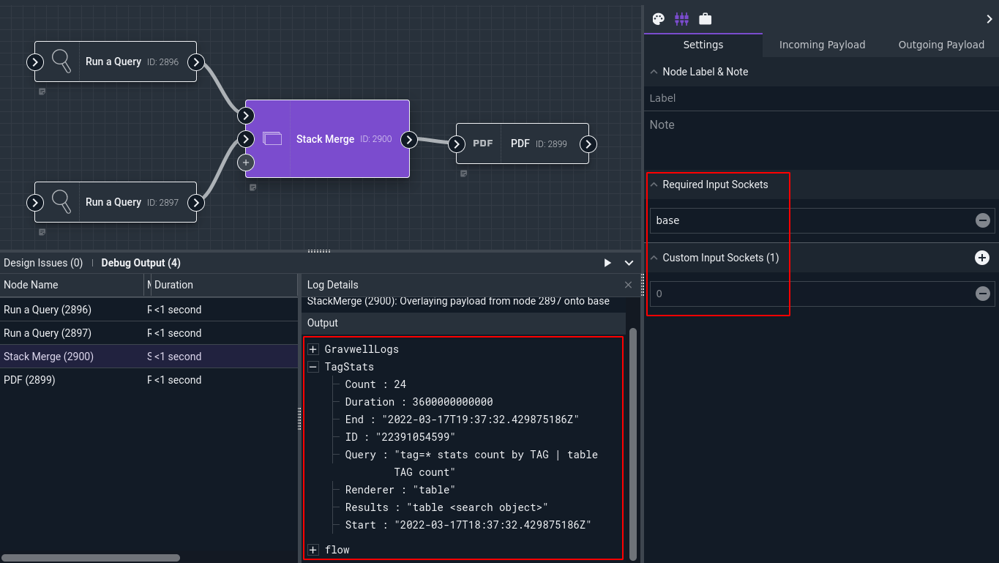
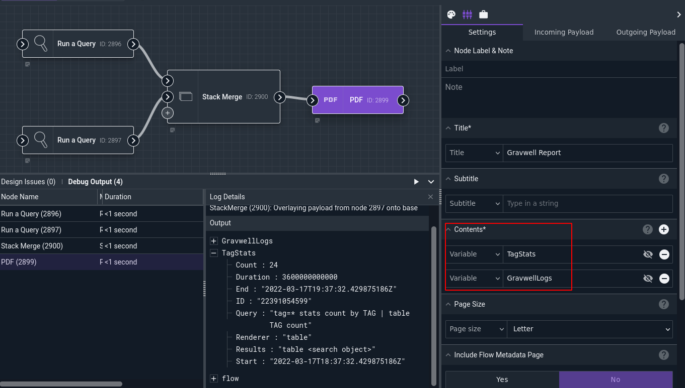

# Stack Merge Node

This node combines multiple input payloads into a single output payload. Beginning with the first payload (the "base" payload), it progressively overlays the contents of the additional payloads on top of it. If there are items with the same name in multiple payloads, the earlier values will be overwritten as later payloads are merged in--for instance, if two Run Query nodes are fed into the same Stack Merge node without renaming their output values, the output payload of the Stack Merge node will have only one `search` value (whichever node was connected to the "last" input socket).

Contrast this node to the [Nest Merge](nestmerge.md) node.

## Configuration

The Stack Merge node has no "configuration" settings in the same sense as most nodes; instead, it has a variable number of input sockets. Initially, it has a single "base" input socket:

Clicking the "+" icon will add additional sockets:

## Example

This example runs two Gravwell queries, combines the outputs via a Nest Merge node, then generates a PDF containing both searches:

The Run Query nodes are configured with unique output names ("GravwellLogs" and "TagStats"):

The Stack Merge node has two input sockets defined. Observe the output payloads of the Stack Merge node; there is a `GravwellLogs` item and a `TagStats` item, containing the results from the Run Query nodes, but only one `flow` item:

The PDF node is then configured to include `TagStats` and `GravwellLogs` in its contents:

